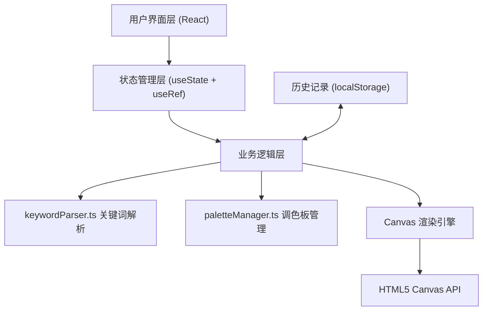

## 1. 架构设计



## 2. 技术说明

### 2.1 核心技术栈
- **前端框架**：React 18 + TypeScript
- **构建工具**：Vite 5
- **状态管理**：React Hooks (useState, useRef, useCallback, useEffect)
- **渲染技术**：HTML5 Canvas 2D API
- **工具库**：lodash（防抖）、color（HSL 颜色计算）
- **图标**：lucide-react

### 2.2 性能优化策略
- Canvas 重绘使用 `requestAnimationFrame` 限制 60fps
- 滑块拖动使用 lodash `debounce` 防抖，避免过度重绘
- 历史记录缩略图使用 `toDataURL` 缓存，避免重复渲染
- 使用 `useRef` 保存 Canvas 上下文和动画帧 ID，避免不必要的重渲染

## 3. 项目文件结构

```
|-- package.json          # 项目依赖配置
|-- vite.config.js        # Vite 构建配置
|-- tsconfig.json         # TypeScript 配置
|-- index.html            # 入口 HTML
|-- src/
    |-- main.tsx          # React 入口
    |-- App.tsx           # 根组件
    |-- ArtGenerator.tsx  # 主组件：状态管理、画布渲染
    |-- keywordParser.ts  # 关键词解析工具
    |-- paletteManager.ts # 调色板管理
    |-- types.ts          # TypeScript 类型定义
    |-- index.css         # 全局样式
```

## 4. 核心数据结构

### 4.1 生成配置
```typescript
interface ArtConfig {
  prompt: string;
  colors: string[];
  shapes: ('circle' | 'triangle' | 'wave' | 'rectangle')[];
  texture: 'smooth' | 'grainy' | 'gradient';
  hueShift: number;
  complexity: number;
  strokeWidth: number;
  seed: number;
}
```

### 4.2 历史记录
```typescript
interface HistoryItem {
  id: string;
  prompt: string;
  thumbnail: string;
  config: ArtConfig;
  timestamp: number;
}
```

### 4.3 颜色主题
```typescript
interface ColorTheme {
  name: string;
  colors: string[];
  description: string;
}
```

## 5. 核心算法

### 5.1 关键词解析流程
1. 对 Prompt 进行分词（中英文）
2. 匹配颜色关键词 → 映射到 HSL 色值
3. 匹配形状关键词 → 选择形状类型
4. 匹配纹理关键词 → 确定渲染模式
5. 未匹配到的维度使用随机默认值

### 5.2 Canvas 渲染流程
1. 清空画布，绘制背景渐变
2. 根据复杂度参数生成形状数量
3. 使用伪随机数生成器（基于 seed）确保可复现
4. 按图层顺序绘制：背景 → 大形状 → 中等形状 → 细节纹理
5. 应用色调偏移和笔触粗细参数

### 5.3 动画实现
- **生成动画**：使用 `globalCompositeOperation = 'source-atop'` 和渐变遮罩实现颜色铺开效果
- **粒子过渡**：创建粒子系统，随机位置扩散，配合透明度变化
- **淡入动画**：CSS `opacity` 从 0 到 1，配合 `requestAnimationFrame` 平滑过渡
