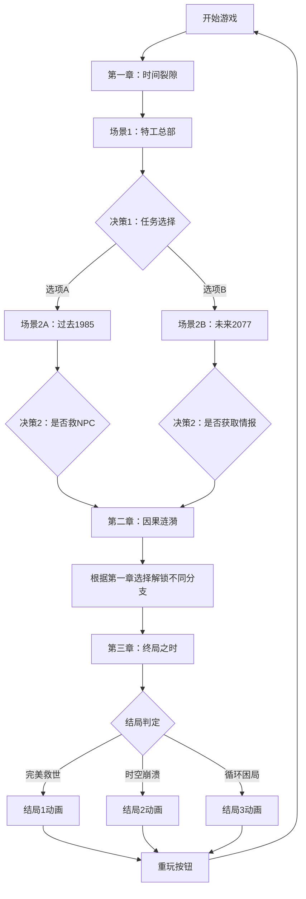

## 1. 产品概述

基于时间旅行的文字冒险游戏，玩家扮演时空特工通过对话分支选择改变历史事件，解锁多种结局。

- 核心玩法：沉浸式文本叙事 + 分支决策系统 + 时间线回溯
- 目标用户：喜欢剧情向游戏、赛博朋克风格的玩家
- 产品价值：提供高自由度的交互式叙事体验，玩家选择直接影响故事走向

## 2. 核心功能

### 2.1 用户角色

| 角色 | 注册方式 | 核心权限 |
|------|----------|----------|
| 玩家 | 无需注册，本地存储进度 | 完整游戏体验、存档读档、重玩 |

### 2.2 功能模块

1. **场景渲染模块**：文本展示、决策按钮、背景氛围变化
2. **剧情引擎模块**：章节管理、分支逻辑、状态锁定/解锁
3. **时间线面板**：历史选择记录、时间轴展示、点击回溯
4. **结局系统**：三种结局判定、全屏动画展示、重玩功能

### 2.3 页面详情

| 页面名称 | 模块名称 | 功能描述 |
|----------|----------|----------|
| 游戏主界面 | 场景渲染 | 显示当前场景文本、决策按钮，背景随氛围变化 |
| 游戏主界面 | 时间线面板 | 右侧可折叠面板，显示历史选择时间轴 |
| 结局界面 | 结局展示 | 全屏文字动画，背景渐变，重玩按钮 |

## 3. 核心流程

玩家进入游戏 → 阅读第一章场景文本 → 做出决策选择 → 页面过渡切换到下一场景 → 选择记录到时间线 → 继续阅读和选择 → 章节间根据之前选择解锁/锁定选项 → 最终章汇聚到三种结局之一 → 可点击重玩重置进度

## 4. 用户界面设计

### 4.1 设计风格

- **主题**：赛博朋克暗色主题
- **主色调**：霓虹青 `#00fff7`、紫红 `#ff00ff`
- **背景色**：深灰 `#0a0a12`、深蓝 `#0d1021`
- **氛围背景**：过去暖黄 `#3d2e10`、未来冷蓝 `#0d1535`、危机暗红 `#2d0a0a`
- **字体**：等宽科技感字体（JetBrains Mono / Fira Code）
- **按钮样式**：霓虹边框、悬停发光、点击缩放消失
- **动画效果**：粒子飞散、光晕闪烁、淡入淡出过渡
- **布局**：左侧主内容区 + 右侧可折叠时间线面板

### 4.2 页面设计概览

| 页面名称 | 模块名称 | UI元素 |
|----------|----------|---------|
| 游戏主界面 | 场景渲染 | 渐变背景、文本卡片（玻璃拟态）、霓虹按钮组 |
| 游戏主界面 | 时间线面板 | 半透明侧滑面板、垂直时间轴、圆点标记、弹性动画 |
| 结局界面 | 结局展示 | 全屏渐变背景、文字逐字放大动画、重玩按钮 |

### 4.3 响应式

- **桌面端**：时间线面板位于右侧，可折叠
- **移动端**：时间线面板改为底部抽屉式，向上滑动展开
- **触摸优化**：按钮最小尺寸48px，间距适中，支持触摸反馈

### 4.4 动画与性能

- **文字卡片过渡**：淡入淡出0.5秒，60fps
- **时间线面板**：0.3秒弹性滑入滑出
- **按钮交互**：点击缩放消失，粒子飞散效果
- **结局动画**：文字逐字放大出现，背景渐变
- **性能优化**：分支切换时未使用文本资源懒加载
