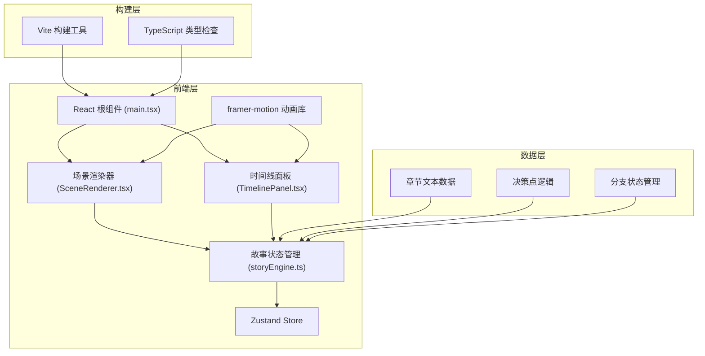

## 1. 架构设计



## 2. 技术描述

* **前端框架**: React 18 + TypeScript

* **构建工具**: Vite 5.x

* **状态管理**: Zustand (由 storyEngine.ts 导出 useStoryStore)

* **动画库**: framer-motion 11.x

* **样式方案**: CSS-in-JS + framer-motion variants

* **字体**: Google Fonts (JetBrains Mono)

* **无后端**: 纯前端应用，数据本地管理

## 3. 路由定义

这是一个单页应用，不使用传统路由，通过场景ID进行状态切换：

| 场景ID             | 说明              |
| ---------------- | --------------- |
| ch1\_scene1      | 第一章第1场景：特工总部    |
| ch1\_scene2a     | 第一章第2场景A：过去1985 |
| ch1\_scene2b     | 第一章第2场景B：未来2077 |
| ...              | 更多场景...         |
| ending\_perfect  | 结局1：完美救世        |
| ending\_collapse | 结局2：时空崩溃        |
| ending\_loop     | 结局3：循环困局        |

## 4. 数据模型

### 4.1 核心类型定义

```typescript
// 场景氛围类型
type SceneMood = 'past' | 'future' | 'crisis' | 'normal';

// 决策选项
interface DecisionOption {
  id: string;
  text: string;
  nextSceneId: string;
  requiredFlag?: string;        // 需要的状态标记
  lockedText?: string;          // 锁定时显示的文本
  setsFlag?: string;            // 设置的状态标记
}

// 场景
interface Scene {
  id: string;
  chapter: number;
  title: string;
  mood: SceneMood;
  text: string;
  decisions: DecisionOption[];
  isEnding?: boolean;
  endingType?: 'perfect' | 'collapse' | 'loop';
}

// 历史选择记录
interface HistoryEntry {
  id: string;
  sceneId: string;
  sceneTitle: string;
  choiceId: string;
  choiceText: string;
  timestamp: number;
  sceneText: string;
}

// 游戏状态
interface StoryState {
  currentSceneId: string;
  flags: Set<string>;
  history: HistoryEntry[];
  isTransitioning: boolean;
  timelineOpen: boolean;
  // actions
  makeChoice: (choiceId: string, nextSceneId: string, setsFlag?: string) => void;
  jumpToHistory: (index: number) => void;
  toggleTimeline: () => void;
  resetGame: () => void;
  getScene: (sceneId: string) => Scene | undefined;
  getAvailableDecisions: () => DecisionOption[];
}
```

### 4.2 章节数据结构

* 第一章「时间裂隙」：6个场景，6个决策点

* 第二章「因果涟漪」：7个场景，7个决策点

* 第三章「终局之时」：5个场景，5个决策点

* 3个结局场景

## 5. 文件结构

```
.
├── package.json
├── vite.config.js
├── tsconfig.json
├── index.html
└── src/
    ├── main.tsx              # React根组件
    ├── storyEngine.ts        # 故事引擎 + Zustand store
    ├── SceneRenderer.tsx     # 场景渲染组件
    ├── TimelinePanel.tsx     # 时间线面板组件
    └── index.css             # 全局样式
```

## 6. 性能优化策略

1. **懒加载**: 章节文本数据按需导入，未访问的分支不预加载
2. **动画优化**: 使用 framer-motion 的 transform 和 opacity 属性，避免重排重绘
3. **内存管理**: 历史记录限制最大条数，超出自动清理早期记录
4. **渲染优化**: React.memo 包装纯组件，避免不必要重渲染
5. **字体优化**: Google Fonts 预加载，使用 font-display: swap

