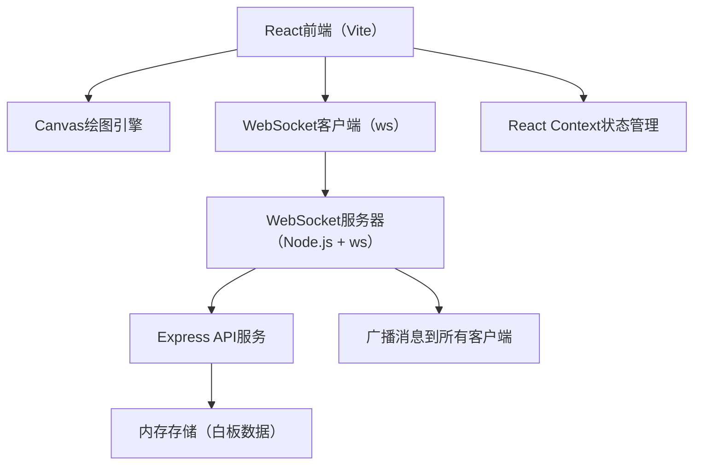
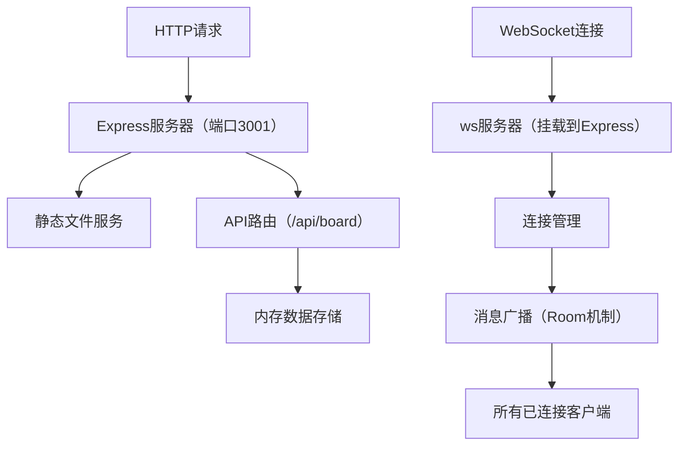
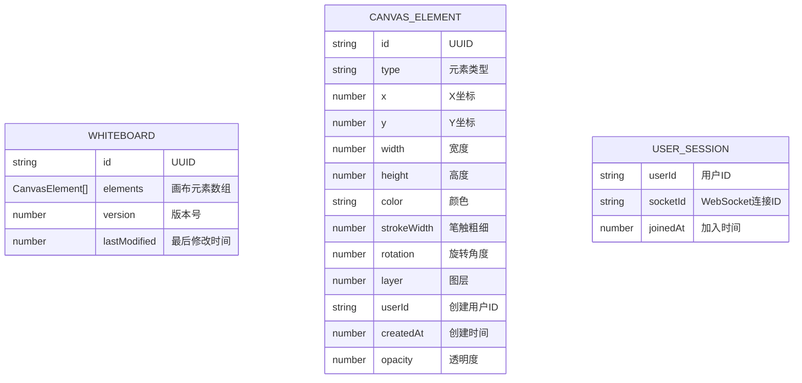

## 1. 架构设计



## 2. 技术描述

- **前端**：React@18 + TypeScript + Vite@5 + @vitejs/plugin-react
- **后端**：Node.js + Express@4 + ws@8（WebSocket）
- **绘图**：HTML5 Canvas API，requestAnimationFrame实现60fps渲染
- **状态管理**：React Context + useReducer
- **数据序列化**：uuid生成唯一ID，JSON传输绘制操作
- **类型定义**：@types/ws、@types/uuid、@types/node
- **其他依赖**：cors@2

## 3. 路由定义

| 路由 | 用途 |
|------|------|
| / | 白板主页 |
| /api/board | 获取白板数据（GET）、保存白板数据（POST） |
| /ws | WebSocket连接端点 |

## 4. API 定义

### 4.1 HTTP API

```typescript
// 获取白板数据
GET /api/board
Response: {
  elements: CanvasElement[];
  version: number;
}

// 保存白板数据
POST /api/board
Body: { elements: CanvasElement[] }
Response: { success: boolean; version: number; }
```

### 4.2 WebSocket 消息协议

```typescript
// 消息类型定义
type WSMessage = 
  | { type: 'join'; userId: string; timestamp: number }
  | { type: 'leave'; userId: string; timestamp: number }
  | { type: 'draw'; userId: string; element: CanvasElement; timestamp: number }
  | { type: 'update'; userId: string; elementId: string; updates: Partial<CanvasElement>; timestamp: number }
  | { type: 'delete'; userId: string; elementId: string; timestamp: number }
  | { type: 'users'; count: number; userIds: string[] }
  | { type: 'sync'; elements: CanvasElement[] };

// 画布元素类型
interface CanvasElement {
  id: string;
  type: 'pencil' | 'rectangle' | 'circle' | 'text' | 'image';
  x: number;
  y: number;
  width?: number;
  height?: number;
  radius?: number;
  points?: { x: number; y: number }[];
  color: string;
  strokeWidth: number;
  text?: string;
  imageData?: string;
  rotation: number;
  layer: number;
  userId: string;
  createdAt: number;
  opacity: number;
}

// 画布状态
interface CanvasState {
  zoom: number;
  panX: number;
  panY: number;
  elements: CanvasElement[];
  selectedElementId: string | null;
  currentTool: ToolType;
}
```

## 5. 服务器架构



## 6. 数据模型

### 6.1 数据模型定义



### 6.2 项目文件结构

```
.
├── package.json
├── vite.config.js
├── tsconfig.json
├── index.html
├── server.ts
└── src/
    ├── App.tsx
    ├── Toolbar.tsx
    ├── Canvas.tsx
    ├── MiniMap.tsx
    └── types.ts (内部类型定义)
```

## 7. 性能优化策略

1. **Canvas渲染优化**：使用离屏Canvas，脏矩形重绘，requestAnimationFrame
2. **WebSocket节流**：批量发送连续绘制点，防抖处理
3. **元素池化**：复用已删除元素的内存
4. **虚拟视口**：只渲染可视区域内的元素
5. **消息合并**：短时间内的多个相同元素更新合并为一条消息
6. **图像压缩**：上传图片自动压缩到合适尺寸
