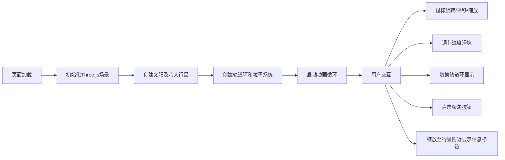

## 1. 产品概述

太阳系3D交互可视化工具，为天文爱好者提供直观的行星运行动态体验。通过3D渲染技术真实模拟太阳和八大行星的公转、自转规律，支持自由视角探索，解决传统天文学习中缺乏动态直观体验的痛点。

- 目标用户：天文爱好者、学生、教育工作者
- 核心价值：将抽象的天文规律转化为可交互、可探索的3D视觉体验
- 市场定位：教育类天文可视化工具，兼具科普和交互娱乐价值

## 2. 核心功能

### 2.1 用户角色

| 角色 | 注册方式 | 核心权限 |
|------|----------|----------|
| 访客用户 | 无需注册 | 浏览3D场景、调整控制参数、聚焦行星查看详情 |

### 2.2 功能模块

1. **3D场景渲染**：太阳发光球体、八大行星（含真实光谱色彩）、动态轨道、粒子系统
2. **交互控制**：鼠标旋转/平移/缩放、自动信息标签、平滑动画过渡
3. **控制面板**：速度调节、轨道环显示切换、行星聚焦功能
4. **视觉效果**：深空渐变背景、行星光晕、毛玻璃UI、微交互动画

### 2.3 页面详情

| 页面名称 | 模块名称 | 功能描述 |
|----------|----------|----------|
| 主页面 | 3D场景渲染模块 | 渲染太阳、八大行星、轨道环线、小行星带粒子系统 |
| 主页面 | 相机控制模块 | 鼠标拖拽旋转、右键平移、滚轮缩放、平滑过渡动画 |
| 主页面 | 信息标签模块 | 缩放至行星附近自动显示名称、直径、公转周期、距日距离 |
| 主页面 | 控制面板模块 | 速度滑块(0.5-5倍速)、轨道环切换、聚焦按钮 |
| 主页面 | 视觉效果模块 | 深空背景、光晕效果、毛玻璃UI、按钮悬停/点击动画 |

## 3. 核心流程

用户打开页面后，3D场景自动加载并开始运行。用户可通过鼠标自由探索太阳系，拖动右侧控制面板的速度滑块调整运行速度，点击轨道环按钮切换轨道显示，选择行星后点击聚焦按钮平滑飞向目标。当缩放至行星附近时，自动显示该行星的详细信息标签。

## 4. 用户界面设计

### 4.1 设计风格

- **设计基调**：深空科幻风格，沉浸式宇宙探索体验
- **主色调**：深空黑(#0a0a1a)、星空蓝(#1a1a3e)、太阳金(#ffcc33)
- **辅助色**：行星光谱色（水星灰、金星金、地球蓝、火星红、木星橙、土星黄、天王星青、海王星蓝）
- **按钮样式**：圆角毛玻璃效果，悬停时从半透白渐变到半透亮蓝，点击时缩放至0.95再弹回
- **字体**：使用 Orbitron 作为标题字体（科幻感），Source Han Sans 作为正文字体
- **布局风格**：全屏3D画布 + 右上角固定控制面板 + 自适应信息标签

### 4.2 页面设计概述

| 页面名称 | 模块名称 | UI元素 |
|----------|----------|--------|
| 主页面 | 3D场景 | 深空渐变背景（黑到深蓝径向渐变）、发光太阳、带光晕的行星、虚线椭圆轨道环、黄白色粒子环 |
| 主页面 | 信息标签 | 圆角半透明卡片（背景rgba(255,255,255,0.15)，白色文字，padding 8px），始终朝向相机 |
| 主页面 | 控制面板 | 右上角固定，毛玻璃效果(backdrop-filter: blur(8px))，背景rgba(255,255,255,0.1)，白色边框1px |
| 主页面 | 控制面板组件 | 速度滑块（自定义轨道样式）、开关按钮、聚焦下拉选择器、操作按钮 |

### 4.3 响应式设计

- **桌面端（1920x1080）**：控制面板完整展开于右上角，宽度280px
- **平板端（768x768）**：控制面板折叠为圆形图标按钮，点击后展开
- **触控优化**：支持触摸手势操作，按钮最小尺寸48x48px
- **断点**：≤768px时启用移动端布局

### 4.4 3D场景指导

- **环境背景**：深空径向渐变，从中心深蓝到边缘纯黑，添加微弱星空噪点
- **光照设置**：太阳作为点光源（强度2.0），添加环境光（强度0.15）确保行星暗面可见
- **相机设置**：PerspectiveCamera，fov 60度，初始位置(0, 30, 80)，看向原点
- **相机运动**：OrbitControls控制，缩放过渡0.3秒，聚焦动画1秒平滑过渡
- **交互**：鼠标左键旋转、右键平移、滚轮缩放；缩放至行星距离<15时显示信息标签
- **后处理效果**：轻微Bloom效果增强太阳发光感，FXAA抗锯齿
- **性能预算**：帧率≥30fps，视口内行星≤15个，粒子数≤300，Draw Call≤50
