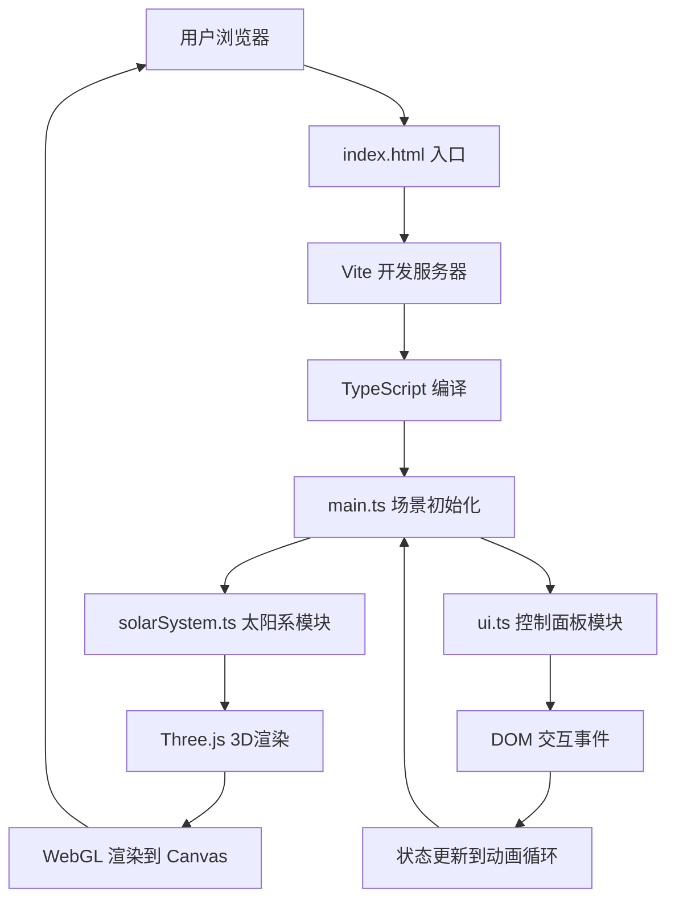

## 1. 架构设计



## 2. 技术描述

- **前端框架**：原生 TypeScript（无React/Vue，按用户要求直接使用Three.js）
- **3D引擎**：Three.js @0.160.0 + OrbitControls
- **构建工具**：Vite @5.0.0
- **类型支持**：@types/three @0.160.0
- **语言**：TypeScript @5.3.0，严格模式，ESNext模块解析

## 3. 目录结构

```
auto21/
├── index.html              # 入口HTML，全屏Canvas，深空背景
├── package.json            # 依赖配置，启动脚本
├── vite.config.js          # Vite配置，ES模块+TypeScript
├── tsconfig.json           # TypeScript配置，严格模式
└── src/
    ├── main.ts             # 入口：场景、相机、渲染器、OrbitControls、动画循环
    ├── solarSystem.ts      # 太阳系模块：行星数据、网格创建、轨道、粒子系统
    └── ui.ts               # UI模块：控制面板DOM、事件监听、状态管理
```

## 4. 模块接口定义

### 4.1 solarSystem.ts 导出接口

```typescript
// 行星数据类型
export interface PlanetData {
  name: string;
  nameCn: string;
  radius: number;           // 行星半径（相对比例）
  distance: number;         // 轨道半径（相对比例）
  orbitSpeed: number;       // 公转速度
  rotationSpeed: number;    // 自转速度
  color: number;            // 表面颜色
  realDiameter: string;     // 真实直径（显示用）
  realOrbitPeriod: string;  // 真实公转周期（显示用）
  realDistance: string;     // 真实距太阳距离（显示用）
  hasRings?: boolean;       // 是否有行星环（土星）
}

// 太阳系实例类型
export interface SolarSystem {
  sun: THREE.Mesh;
  planets: Array<{
    mesh: THREE.Mesh;
    data: PlanetData;
    orbit: THREE.Line;
    angle: number;
    label: HTMLElement;
  }>;
  particles: THREE.Points;
  group: THREE.Group;
}

// 创建太阳系
export function createSolarSystem(scene: THREE.Scene): SolarSystem;

// 更新动画（每帧调用）
export function updateSolarSystem(
  system: SolarSystem,
  delta: number,
  speedMultiplier: number,
  camera: THREE.Camera,
  showOrbits: boolean
): void;

// 聚焦行星计算目标位置
export function getPlanetFocusPosition(
  system: SolarSystem,
  planetName: string,
  camera: THREE.Camera
): THREE.Vector3 | null;
```

### 4.2 ui.ts 导出接口

```typescript
// UI状态
export interface UIState {
  speed: number;           // 0.5 - 5.0
  showOrbits: boolean;
  selectedPlanet: string;
}

// UI控制器
export interface UIController {
  container: HTMLElement;
  state: UIState;
  onSpeedChange: (cb: (speed: number) => void) => void;
  onOrbitToggle: (cb: (show: boolean) => void) => void;
  onFocus: (cb: (planetName: string) => void) => void;
  updatePlanetOptions: (planets: string[]) => void;
}

// 创建UI
export function createUI(container: HTMLElement): UIController;
```

### 4.3 main.ts 导出接口

```typescript
// 帧更新回调
export type FrameCallback = (delta: number, elapsed: number) => void;

// 场景控制器
export interface SceneController {
  scene: THREE.Scene;
  camera: THREE.PerspectiveCamera;
  renderer: THREE.WebGLRenderer;
  controls: THREE.OrbitControls;
  useFrame: (cb: FrameCallback) => void;
  start: () => void;
  stop: () => void;
}

// 初始化场景
export function initScene(container: HTMLElement): SceneController;

// 默认导出
export default initScene;
```

## 5. 关键技术实现

### 5.1 性能优化

- **LOD策略**：行星根据距离自动切换几何细节
- **视锥体剔除**：Three.js内置，超出视口的对象自动跳过渲染
- **粒子优化**：使用BufferGeometry，Single Draw Call
- **标签优化**：仅在距离足够近时显示，使用CSS3DRenderer或DOM元素+raycaster

### 5.2 动画系统

- **requestAnimationFrame** 驱动的主循环
- **THREE.Clock** 计算delta时间，确保速度与帧率无关
- **平滑插值**：相机聚焦使用THREE.MathUtils.lerp，过渡时间1秒
- **缓动函数**：使用easeInOutCubic实现自然的加速减速

### 5.3 视觉效果

- **太阳发光**：MeshBasicMaterial + 动态噪波Shader + PointLight
- **行星光晕**：使用Sprite + 渐变纹理实现
- **动态纹理**：太阳表面使用Simplex噪声实现流动效果
- **轨道环**：BufferGeometry绘制虚线椭圆，使用LineDashedMaterial

### 5.4 响应式UI

- **CSS Media Queries** 处理不同分辨率
- **ResizeObserver** 监听窗口变化，自动调整渲染器和相机
- **触控检测**：使用'ontouchstart' in window检测触控设备
