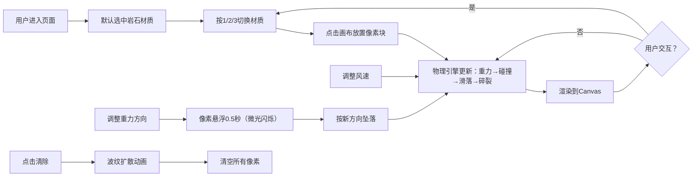

## 1. 产品概述

像素物理沙盒实验项目，玩家在漂浮的星云碎片上放置不同材质的像素块，观察它们在重力影响下的物理行为，模拟简单的地质沉积过程。

- 核心目标：提供一个交互式物理模拟实验平台，让用户直观理解不同材质在重力作用下的行为差异
- 目标用户：对物理模拟、像素艺术、沙盒游戏感兴趣的玩家和学习者
- 产品价值：通过可视化的物理实验，寓教于乐地展示重力、摩擦力、安息角等物理概念

## 2. 核心功能

### 2.2 功能模块

1. **主画布区域**：600x600像素网格，星云渐变背景，支持点击放置像素块
2. **材质切换系统**：三种材质（岩石、沙粒、轻质土），支持键盘快捷键1/2/3切换
3. **物理引擎**：重力模拟、碰撞检测、安息角滑落、压力碎裂、风力影响
4. **左侧工具栏**：清除全部按钮、重力方向切换、风速调节滑块

### 2.3 页面详情

| 页面名称 | 模块名称 | 功能描述 |
|-----------|-------------|---------------------|
| 主页面 | 画布区域 | 60x60网格（每格10x10像素），星云紫色渐变背景，点击放置像素块 |
| 主页面 | 材质指示器 | 右上角显示当前选中材质图标，切换时有0.2秒缩放弹入动画 |
| 主页面 | 工具栏 | 左侧垂直排列，包含清除按钮、重力方向开关、风速滑块 |
| 主页面 | 物理系统 | 实时重力模拟，支持上下左右四个重力方向，像素块悬浮过渡动画 |
| 主页面 | 碎裂效果 | 堆叠超过180层时底部像素碎裂，4x4小颗粒飞溅，白色闪光反馈 |

## 3. 核心流程

## 4. 用户界面设计

### 4.1 设计风格

- **主色调**：深空紫色系，从深紫 `#1a0030` 到亮紫 `#4a0080` 的星云渐变背景
- **点缀色**：荧光绿 `#00ff88`（用于激活状态、成功反馈）、荧光橙 `#ff6600`（用于警告、交互高亮）
- **材质颜色**：岩石灰色 `#888888`、沙粒黄色 `#e6c84a`、轻质土棕色 `#a0522d`
- **背景**：纯黑 `#000000` 页面背景，画布区域为星云渐变
- **按钮风格**：圆润边角（8px），深色填充，荧光色边框，悬停时边缘发光动画
- **字体**：复古像素风格字体 `'Press Start 2P'` 或等宽像素字体，配合现代圆润无衬线字体作为辅助
- **整体风格**：复古像素游戏风格但细节圆润，深空科幻氛围

### 4.2 页面设计概述

| 页面名称 | 模块名称 | UI 元素 |
|-----------|-------------|-------------|
| 主页面 | 画布区域 | 600x600像素居中显示，星云渐变背景，网格线（可选显示），像素块方形绘制 |
| 主页面 | 材质指示器 | 右上角固定位置，32x32像素图标，当前材质放大显示，切换时scale动画（0.9→1.1→1.0） |
| 主页面 | 工具栏 | 左侧垂直布局，宽度120px，半透明深色背景（`rgba(20, 0, 40, 0.9)`），圆角边框 |
| 主页面 | 清除按钮 | 荧光绿边框，悬停时绿色发光动画，点击后触发Canvas波纹动画 |
| 主页面 | 重力开关 | 四向箭头图标（上下左右），点击循环切换，激活方向用荧光绿高亮 |
| 主页面 | 风速滑块 | 自定义样式滑块，轨道为深紫色，滑块为荧光橙色，数值显示在下方 |
| 主页面 | 碎裂效果 | 白色径向渐变闪光，持续0.1秒，小颗粒以随机速度向两侧飞溅 |
| 主页面 | 悬浮效果 | 像素块上下轻微浮动（±1px），周围有淡紫色微光（opacity 0.3） |

### 4.3 响应性

- **桌面优先**：主要面向桌面浏览器，固定600x600画布尺寸
- **居中布局**：画布在页面中水平居中，工具栏在画布左侧
- **触摸优化**：支持触摸设备点击放置，但不保证移动端完整体验

### 4.4 视觉动效

| 动效名称 | 触发条件 | 时长 | 效果描述 |
|-----------|----------|------|----------|
| 材质切换 | 按1/2/3键或点击图标 | 0.2秒 | 图标scale从0.9→1.1→1.0，透明度0→1 |
| 放置像素 | 鼠标点击画布 | 0.05秒 | 像素块轻微放大后恢复（弹性反馈） |
| 重力切换 | 点击重力方向开关 | 0.5秒（悬浮）+ 坠落 | 所有像素块停止运动，上下浮动+微光闪烁，然后按新方向加速 |
| 清除动画 | 点击清除按钮 | 0.8秒 | 从点击位置向外扩散的半透明圆形波纹，覆盖整个画布 |
| 碎裂闪光 | 底部像素被压碎 | 0.1秒 | 白色径向渐变从碎裂点向外扩散 |
| 按钮悬停 | 鼠标悬停按钮 | 持续 | 边框荧光色发光（box-shadow），亮度增强 |
| 悬浮微光 | 重力切换过渡期间 | 0.5秒 | 像素块周围淡紫色光晕，轻微上下浮动 |

