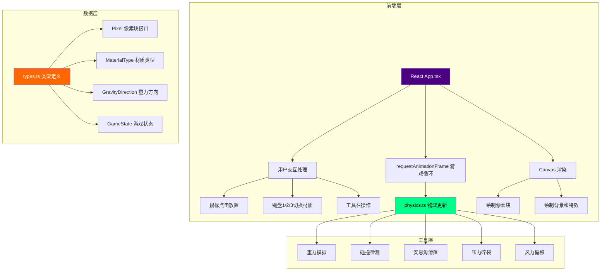

## 1. 架构设计



## 2. 技术描述

- **前端框架**：React 18 + TypeScript
- **构建工具**：Vite 5 + @vitejs/plugin-react
- **渲染方式**：HTML5 Canvas 2D（高性能像素级渲染）
- **样式方案**：内联 CSS + CSS 动画（无需额外 CSS 框架）
- **字体**：Google Fonts - Press Start 2P（复古像素字体）
- **性能优化**：
  - 固定时间步长物理更新
  - 空间网格碰撞检测（60x60 网格空间分区）
  - requestAnimationFrame 驱动渲染循环
  - 像素块数量上限 2000，超出自动移除最老像素

## 3. 项目文件结构

| 文件路径 | 用途 |
|-------|---------|
| `package.json` | 项目依赖配置，包含 React、TypeScript、Vite |
| `vite.config.js` | Vite 构建配置，启用 React 插件 |
| `tsconfig.json` | TypeScript 严格模式配置 |
| `index.html` | 入口页面，全屏 Canvas 容器，黑色背景 |
| `src/types.ts` | 类型定义：Pixel、MaterialType、GravityDirection、GameState |
| `src/physics.ts` | 物理引擎：重力、碰撞、滑落、碎裂、风力 |
| `src/App.tsx` | 主组件：游戏循环、渲染、交互、工具栏 |

## 4. 核心数据模型

### 4.1 像素块数据结构

```typescript
type MaterialType = 'rock' | 'sand' | 'lightSoil';
type GravityDirection = 'down' | 'up' | 'left' | 'right';

interface Pixel {
  id: number;
  x: number;           // 网格坐标 X (0-59)
  y: number;           // 网格坐标 Y (0-59)
  vx: number;          // 水平速度 (像素/帧)
  vy: number;          // 垂直速度 (像素/帧)
  material: MaterialType;
  isStatic: boolean;   // 是否静止
  isFragment: boolean; // 是否为碎裂小颗粒
  fragmentSize: number;// 碎裂颗粒大小 (4 或 10)
  createdAt: number;   // 创建时间戳
}

interface GameState {
  pixels: Pixel[];
  currentMaterial: MaterialType;
  gravityDirection: GravityDirection;
  windSpeed: number;   // 0-10
  isSuspended: boolean;// 是否处于悬浮过渡状态
  suspendStartTime: number;
  flashEffects: FlashEffect[];
  rippleEffect: RippleEffect | null;
}

interface FlashEffect {
  x: number;
  y: number;
  startTime: number;
  duration: number;
}

interface RippleEffect {
  x: number;
  y: number;
  startTime: number;
  duration: number;
  maxRadius: number;
}
```

### 4.2 材质属性

| 材质 | 颜色 | 密度 | 安息角 | 受风影响 |
|------|------|------|--------|----------|
| rock | `#888888` | 高 | 90°（不滑动） | 否 |
| sand | `#e6c84a` | 中 | 45° | 否 |
| lightSoil | `#a0522d` | 低 | 45° | 是 |

## 5. 物理引擎核心算法

### 5.1 重力模拟
- 加速度：0.3 像素/帧²
- 根据重力方向（down/up/left/right）应用加速度
- 最大速度限制：8 像素/帧（防止穿透）

### 5.2 碰撞检测
- 空间网格：60x60 布尔数组标记占用状态
- 连续碰撞检测：每帧多次细分检测
- 边界检测：画布四边（0, 0）到（600, 600）

### 5.3 安息角滑落
- 沙粒和轻质土：检查下方两侧 45° 位置是否为空
- 如果下方被阻挡但两侧有空位，沿 45° 方向滑落
- 岩石：不滑落，直接静止

### 5.4 压力碎裂
- 检测每列堆叠高度
- 超过 180 像素（18 层）时，底部像素碎裂
- 碎裂为 4x4 小颗粒，向两侧随机速度飞溅
- 触发白色闪光效果（0.1 秒）

### 5.5 风力影响
- 仅影响轻质土
- 横向偏移 = 风速 × 0.1 像素/帧
- 随机方向变化模拟阵风

## 6. 性能优化策略

1. **固定时间步长**：物理更新与渲染帧率解耦
2. **空间分区**：使用 grid 数组快速查找相邻像素
3. **静止优化**：静止像素跳过物理计算
4. **数量限制**：最多 2000 个像素，超出移除最早的
5. **批量渲染**：使用 Canvas 批量绘制，减少 API 调用
6. **对象池**：复用碎裂颗粒对象，减少 GC 压力

