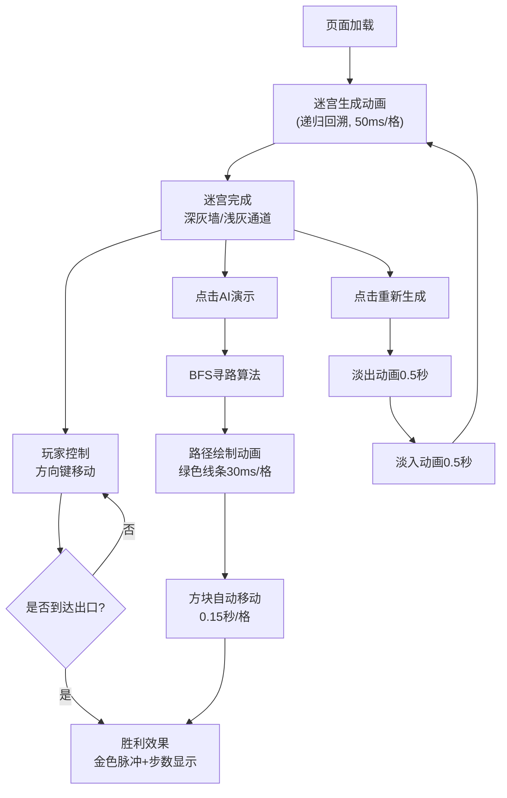

## 1. 产品概述

迷宫生成与路径寻路交互式游戏应用，让玩家体验随机迷宫生成的视觉过程，并支持手动探索与AI自动寻路演示，解决无法预览迷宫结构和AI寻路过程的问题。

- 核心功能：递归回溯算法迷宫生成、玩家手动控制探索、BFS算法AI寻路演示
- 目标用户：算法学习者、迷宫游戏爱好者、对路径搜索可视化感兴趣的用户

## 2. 核心功能

### 2.2 功能模块

1. **迷宫生成模块**：递归回溯算法随机生成15×15迷宫，支持逐格动画展示
2. **玩家控制模块**：键盘方向键控制蓝色方块移动，含碰撞检测与胜利判定
3. **AI寻路模块**：BFS算法自动寻找最短路径，绿色线条逐步绘制演示
4. **UI控制模块**：重新生成、AI演示按钮，状态显示与重置逻辑

### 2.3 页面详情

| 页面名称 | 模块名称 | 功能描述 |
|---------|---------|----------|
| 主游戏页面 | 迷宫渲染区 | Canvas渲染迷宫墙体、通道、玩家方块、路径线条 |
| 主游戏页面 | 控制按钮区 | "AI演示"按钮、"重新生成"按钮，磨砂玻璃效果 |
| 主游戏页面 | 状态显示区 | 步数统计、胜利提示文字、金色脉冲动画 |

## 3. 核心流程

## 4. 用户界面设计

### 4.1 设计风格

- **主色调**：深海蓝背景 #0a0a2e，营造科技感
- **对比色**：墙体灰色 #555，通道白色 #fff，玩家方块蓝色带呼吸光晕
- **强调色**：绿色路径线条，金色胜利脉冲
- **按钮风格**：圆角磨砂玻璃效果（backdrop-filter: blur），点击时缩放0.95再弹回
- **字体**：现代无衬线字体，数字等宽显示步数

### 4.2 页面设计概述

| 页面名称 | 模块名称 | UI元素 |
|---------|---------|--------|
| 主游戏页面 | 迷宫画布 | 300×300像素Canvas，居中显示，深灰墙体/白色通道 |
| 主游戏页面 | 玩家方块 | 蓝色方块，RGBA 0.3呼吸光晕效果，平滑移动动画0.2秒 |
| 主游戏页面 | 路径线条 | 绿色线条，逐步绘制动画，每帧间隔30ms |
| 主游戏页面 | 控制按钮 | 两个圆角按钮，磨砂玻璃效果，悬停/点击动效 |
| 主游戏页面 | 胜利效果 | 出口格子金色脉冲动画，"你赢了!"文字+步数统计 |

### 4.3 响应式

- 桌面端优先设计，最小宽度800px
- 内容自动居中，迷宫画布保持固定尺寸
- 按钮容器自适应宽度，保持在画布下方居中

### 4.4 动画与交互

- 迷宫生成：根茎生长效果，逐格生成，50ms每步
- 玩家移动：0.2秒平滑过渡，撞墙0.1秒震动反馈
- AI寻路：30ms每格路径绘制，方块0.15秒每格自动移动
- 重置：0.5秒淡出 + 0.5秒淡入过渡
- 胜利：出口金色脉冲动画（持续2秒），文字淡入
- 按钮：悬停亮度提升，点击scale(0.95)回弹
