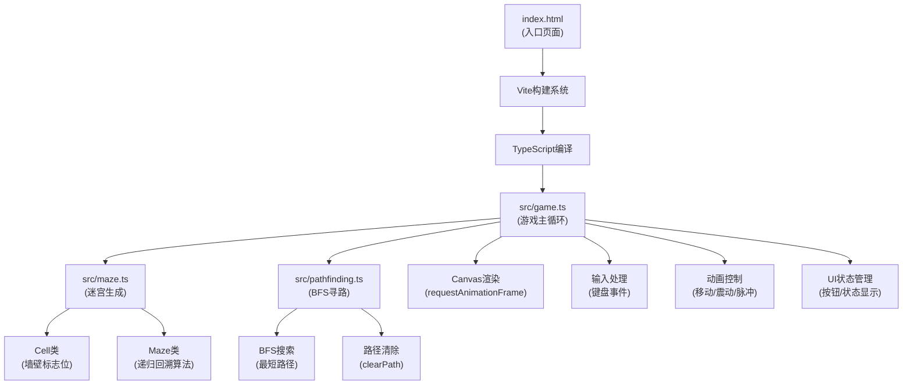

## 1. 架构设计



## 2. 技术说明

* **前端框架**：无额外框架，使用原生Canvas API + TypeScript

* **构建工具**：<Vite@5.x> + <TypeScript@5.x>

* **渲染方式**：Canvas 2D上下文，requestAnimationFrame驱动60fps渲染循环

* **包管理**：npm

### 核心技术选型理由

1. **原生Canvas**：直接操作像素，性能最优，适合迷宫和动画渲染
2. **TypeScript**：严格类型检查，确保代码质量，符合用户要求
3. **Vite**：快速开发服务器，HMR支持，TypeScript开箱即用
4. **无额外依赖**：保持轻量，性能最佳，迷宫生成和寻路均在10ms内完成

## 3. 文件结构

```
auto25/
├── index.html              # 入口HTML，全屏深色背景，Canvas+UI容器
├── package.json            # 依赖：typescript、vite，启动脚本
├── vite.config.js          # Vite配置，启用TypeScript
├── tsconfig.json           # TypeScript配置，严格模式，ESNext目标
└── src/
    ├── maze.ts             # 迷宫数据结构和生成算法
    │   ├── Cell类          # 墙壁上下左右标志位
    │   └── Maze类          # generate方法（递归回溯+动画回调）
    ├── pathfinding.ts      # BFS搜索算法
    │   ├── bfs()           # 接受迷宫网格和起止坐标，返回路径数组
    │   └── clearPath()     # 清除路径线条
    └── game.ts             # 游戏主循环
        ├── Canvas初始化    # 300×300像素画布
        ├── 键盘事件绑定    # 方向键控制
        ├── 动画控制        # 移动、震动、脉冲效果
        ├── AI演示逻辑      # BFS寻路+路径绘制+自动移动
        ├── UI状态管理      # 按钮交互、胜利效果
        └── requestAnimationFrame渲染循环
```

## 4. 核心数据结构

### Cell类（maze.ts）

```typescript
class Cell {
  x: number;
  y: number;
  walls: { top: boolean; right: boolean; bottom: boolean; left: boolean };
  visited: boolean;
}
```

### Maze类（maze.ts）

```typescript
class Maze {
  size: number;
  cellSize: number;
  grid: Cell[][];
  generate(onStep: (x: number, y: number) => void): Promise<void>;
  isWall(x: number, y: number, direction: string): boolean;
  isExit(x: number, y: number): boolean;
  reset(): void;
}
```

### 路径搜索（pathfinding.ts）

```typescript
function bfs(
  grid: Cell[][],
  start: { x: number; y: number },
  end: { x: number; y: number }
): { x: number; y: number }[] | null;

function clearPath(): void;
```

## 5. 性能指标

| 操作          | 时间目标  | 实现方式                        |
| ----------- | ----- | --------------------------- |
| 迷宫生成（15×15） | <10ms | 递归回溯算法，栈实现避免递归溢出            |
| BFS路径搜索     | <10ms | 队列实现，访问标记数组                 |
| 渲染帧率        | 60fps | requestAnimationFrame，脏矩形渲染 |
| 动画平滑度       | 无卡顿   | 缓动函数插值，CSS transition辅助     |
| 内存占用        | <10MB | 简单数组结构，无额外资源                |

## 6. 动画时间线配置

| 动画     | 时长      | 帧率      | 实现方式                      |
| ------ | ------- | ------- | ------------------------- |
| 迷宫生成步长 | 50ms/格  | 20fps   | setTimeout链式调用            |
| 玩家移动   | 200ms/格 | 60fps   | requestAnimationFrame线性插值 |
| 撞墙震动   | 100ms   | 60fps   | 正弦波偏移                     |
| 路径绘制   | 30ms/格  | \~33fps | setTimeout链式调用            |
| AI方块移动 | 150ms/格 | 60fps   | requestAnimationFrame线性插值 |
| 淡出/淡入  | 500ms   | 60fps   | Canvas globalAlpha渐变      |
| 胜利脉冲   | 2000ms  | 60fps   | 正弦波透明度变化                  |

