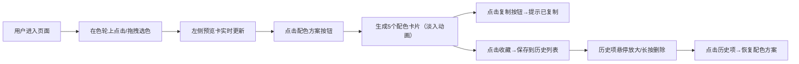

## 1. 产品概述

交互式在线颜色调色盘与配色方案生成器，为设计师和前端开发者提供可视化的颜色选择与和谐配色方案生成工具，支持一键获取专业级配色组合并快速复制分享。

- 核心价值：降低配色门槛，提供直观的色彩探索体验
- 目标用户：UI/UX设计师、前端开发者、创意工作者
- 市场定位：轻量、专业、高颜值的在线配色工具

## 2. 核心功能

### 2.1 功能模块

1. **主调色界面**：色轮选色、颜色预览、实时数值显示
2. **配色方案生成**：互补、类比、三等分、单色、四色五种配色模式
3. **历史收藏管理**：方案收藏、缩略图展示、恢复、删除
4. **颜色值复制**：HEX/RGB/HSL多格式复制到剪贴板

### 2.2 页面详情

| 页面名称 | 模块名称 | 功能描述 |
|-----------|-------------|---------------------|
| 主页面 | 色轮组件 | Canvas绘制圆形色轮，12个主色标记点，拖拽选色，60fps流畅交互 |
| 主页面 | 颜色预览卡片 | 左侧展示选中色，背景随选色变化，显示HEX/RGB/HSL数值 |
| 主页面 | 配色方案按钮 | 5种配色模式按钮，毛玻璃效果，圆角12px |
| 主页面 | 配色方案卡片 | 5个色块卡片，淡入滑入动画，复制按钮带闪烁反馈 |
| 主页面 | 收藏与历史 | 收藏按钮，历史列表最多20条，悬停放大，长按删除抖动动画 |

## 3. 核心流程

## 4. 用户界面设计

### 4.1 设计风格

**设计基调：深色豪华科技风**

- **主背景**：#1a1a2e 深空蓝紫色，营造沉浸式创作环境
- **色轮光晕**：柔和白色box-shadow光晕，突出视觉焦点
- **按钮风格**：圆角12px + 毛玻璃效果(backdrop-filter: blur(10px))，半透明背景
- **卡片风格**：深色半透明背景 + 柔和阴影 + 悬浮感，hover时轻微上浮
- **字体选择**：
  - 标题：JetBrains Mono 等宽字体，突出技术感
  - 正文：Inter 现代无衬线，保证可读性
- **动画**：所有过渡0.2-0.3秒缓动，卡片逐个淡入间隔0.2秒

### 4.2 页面设计概述

| 页面名称 | 模块名称 | UI元素 |
|-----------|-------------|-------------|
| 主页面 | 色轮组件 | 圆形Canvas，12个主色标记点，渐变边缘描边，抓手光标 |
| 主页面 | 预览卡片 | 背景色随选色变化，色值文字自适应对比度，复制图标 |
| 主页面 | 配色按钮 | 横向排列，毛玻璃质感，选中态高亮边框 |
| 主页面 | 配色卡片 | 等宽排列，悬浮阴影，底部色值，右上角复制按钮 |
| 主页面 | 历史列表 | 横向滚动，缩略色块条(高60px)，悬停放大带阴影 |

### 4.3 交互细节

- **色轮拖拽**：cursor: grab/grabbing，mousedown→mousemove→mouseup，requestAnimationFrame保证60fps
- **复制反馈**：点击后卡片边框闪绿色0.3秒，显示"已复制"提示
- **历史删除**：长按≥800ms触发红色抖动警告，松手删除
- **方案切换**：5个卡片从左侧依次滑入，animation-delay: 0s, 0.2s, 0.4s, 0.6s, 0.8s

### 4.4 响应式

桌面端优先布局，色轮居中，预览卡左侧，配色区下方，历史区底部。移动端自适应堆叠。
