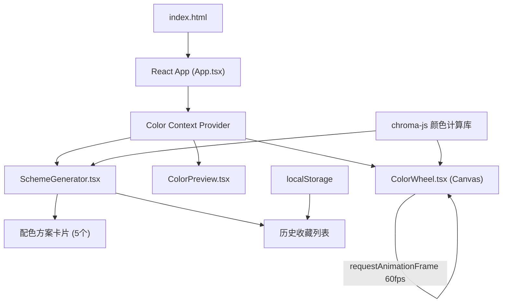

## 1. 架构设计



## 2. 技术描述

* **前端框架**：React 18 + TypeScript 5

* **构建工具**：Vite 5 + @vitejs/plugin-react

* **颜色计算**：chroma-js (HSL/HEX/RGB转换，配色方案生成)

* **画布渲染**：HTML5 Canvas API + requestAnimationFrame

* **状态管理**：React Context + useReducer

* **持久化存储**：localStorage (历史收藏)

* **样式方案**：CSS Modules + CSS Variables

## 3. 文件结构定义

| 文件路径                           | 职责描述                      |
| ------------------------------ | ------------------------- |
| `package.json`                 | 依赖配置与启动脚本                 |
| `vite.config.js`               | Vite构建配置，React插件          |
| `tsconfig.json`                | TypeScript严格模式配置          |
| `index.html`                   | 入口页面，全屏布局，挂载根节点           |
| `src/main.tsx`                 | React应用入口                 |
| `src/App.tsx`                  | 主组件，布局组合，Context Provider |
| `src/context/ColorContext.tsx` | 全局颜色状态管理                  |
| `src/ColorWheel.tsx`           | Canvas色轮绘制与鼠标交互           |
| `src/ColorPreview.tsx`         | 选中色预览与数值显示                |
| `src/SchemeGenerator.tsx`      | 配色方案生成与历史管理               |
| `src/types/color.ts`           | 颜色相关类型定义                  |
| `src/utils/colorUtils.ts`      | 颜色计算工具函数                  |
| `src/App.css`                  | 全局样式与CSS变量                |

## 4. 核心数据模型

### 4.1 颜色类型定义

```typescript
interface ColorValue {
  hex: string;
  rgb: { r: number; g: number; b: number };
  hsl: { h: number; s: number; l: number };
}

interface SchemeColors {
  mode: 'complementary' | 'analogous' | 'triadic' | 'monochromatic' | 'tetradic';
  baseColor: ColorValue;
  colors: ColorValue[];
}

interface HistoryItem {
  id: string;
  timestamp: number;
  scheme: SchemeColors;
}
```

### 4.2 Context 状态定义

```typescript
interface ColorState {
  selectedColor: ColorValue;
  currentScheme: SchemeColors | null;
  history: HistoryItem[];
}

type ColorAction =
  | { type: 'SET_COLOR'; payload: ColorValue }
  | { type: 'SET_SCHEME'; payload: SchemeColors }
  | { type: 'SAVE_TO_HISTORY'; payload: HistoryItem }
  | { type: 'DELETE_FROM_HISTORY'; payload: string }
  | { type: 'LOAD_HISTORY'; payload: HistoryItem[] };
```

## 5. 配色算法说明

| 配色模式                    | 算法原理 (基于HSL色相H)                    |
| ----------------------- | ---------------------------------- |
| **互补色 (Complementary)** | \[H, H+180°] 取5个中间渐变色              |
| **类比色 (Analogous)**     | \[H-30°, H-15°, H, H+15°, H+30°]   |
| **三等分 (Triadic)**       | \[H, H+120°, H+240°] 取5个均匀分布色      |
| **单色 (Monochromatic)**  | 保持H不变，S/L在\[0.2, 0.8]间取5档          |
| **四色 (Tetradic)**       | \[H, H+90°, H+180°, H+270°] 取5个调和色 |

## 6. 性能优化策略

1. **Canvas渲染优化**：

   * 使用 `requestAnimationFrame` 而非 `setTimeout`

   * 仅在拖拽时重绘，空闲时暂停渲染

   * 色轮预渲染至离屏Canvas，拖拽时只重绘选择指示器

2. **React重渲染优化**：

   * 使用 `React.memo` 包裹子组件

   * Context拆分，避免不必要的全局重渲染

   * 颜色计算结果缓存（useMemo）

3. **事件处理优化**：

   * 鼠标移动事件节流（throttle 16ms ≈ 60fps）

   * 使用 passive 事件监听提升滚动性能

## 7. 依赖版本

```json
{
  "react": "^18.3.0",
  "react-dom": "^18.3.0",
  "typescript": "^5.4.0",
  "vite": "^5.2.0",
  "@vitejs/plugin-react": "^4.2.0",
  "chroma-js": "^2.4.0"
}
```

