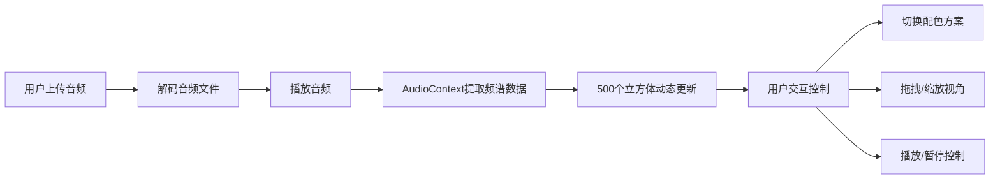

## 1. 产品概述
面向艺术家和音乐制作人的沉浸式3D音画同步可视化工具，将抽象的声音波形转化为动态的3D雕塑，用于现场表演或数字艺术作品展示。
- 核心价值：通过实时音频分析驱动3D视觉效果，创造音画合一的沉浸式体验
- 目标用户：艺术家、音乐制作人、VJ、数字艺术创作者

## 2. 核心功能

### 2.1 用户角色
| 角色 | 注册方式 | 核心权限 |
|------|----------|----------|
| 创作者 | 无需注册 | 上传音频、控制播放、调整可视化效果、切换配色方案 |

### 2.2 功能模块
1. **音频控制模块**：文件上传、播放/暂停、进度条、音量显示
2. **3D可视化模块**：500个立方体组成的动态粒子环、高度/颜色/旋转随音乐变化
3. **相机控制模块**：拖拽旋转、滚轮缩放、缩放提示
4. **配色方案模块**：6种预置配色、平滑颜色过渡动画

### 2.3 页面详情
| 页面名称 | 模块名称 | 功能描述 |
|---------|----------|----------|
| 主页面 | 左侧控制面板 | 文件上传区域（虚线边框）、播放/暂停按钮、进度条、配色方案下拉菜单 |
| 主页面 | 右侧3D场景 | 全屏3D画布、动态粒子环、缩放提示文本 |

## 3. 核心流程
用户上传本地音频文件 → 系统自动解码并播放 → 音频分析模块实时提取频谱和波形数据 → 3D可视化模块根据数据动态渲染粒子环 → 用户可拖拽旋转视角、滚轮缩放、切换配色方案 → 播放/暂停控制音频与动画同步启停

## 4. 用户界面设计

### 4.1 设计风格
- 主色调：深黑色背景 (#0a0a0a)，营造沉浸式暗色调氛围
- 强调色：渐变色彩（#ff3366 到 #33ccff）用于进度条和交互元素
- 按钮样式：圆角胶囊按钮，半透明背景，悬停时变为实色 (#333)，点击时有轻微下压效果
- 字体：现代无衬线字体，简洁科技感
- 布局：左侧固定控制面板 (280px) + 右侧全屏3D场景
- 视觉细节：毛玻璃效果、微妙的阴影、淡入淡出动画

### 4.2 页面设计概述
| 页面名称 | 模块名称 | UI元素 |
|---------|----------|--------|
| 主页面 | 控制面板 | 圆角胶囊按钮、渐变进度条、虚线边框上传区域、下拉菜单 |
| 主页面 | 3D场景 | 深黑色渐变背景、动态粒子环、半透明缩放提示 |

### 4.3 响应式
- 桌面端 (≥768px)：左侧固定控制面板 + 右侧3D场景
- 移动端 (<768px)：控制面板折叠为底部浮动条 (高度60px)，按钮图标简化

### 4.4 3D场景指导
- 环境：纯黑背景，无HDRI，营造深空沉浸感
- 光照：环境光 + 方向光，柔和照亮立方体边缘
- 相机：PerspectiveCamera，初始距离10个单位，视野60度
- 构图：粒子环位于场景中心，半径5个单位
- 交互：OrbitControls支持拖拽旋转、滚轮缩放（范围3-20）
- 动画：立方体高度随频段能量变化、环体缓慢自转、整体随RMS缩放、颜色平滑过渡
- 性能：500个InstancedMesh优化渲染，目标60fps
