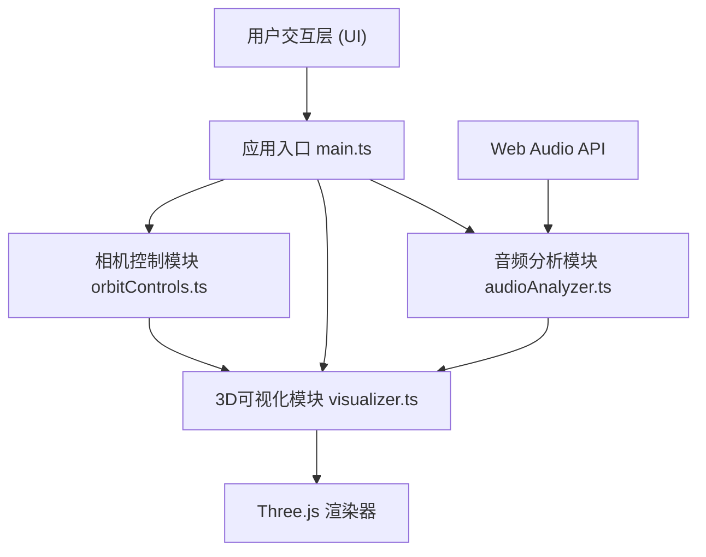

## 1. 架构设计



**模块调用关系和数据流向：**
1. `main.ts` → 初始化Three.js场景、相机、渲染器；创建AudioContext；协调各模块
2. `audioAnalyzer.ts` → 接收AudioContext，使用AnalyserNode提取频谱和波形数据，输出256频段Float32Array
3. `visualizer.ts` → 接收频谱数据，更新500个立方体的高度、颜色、旋转；控制环体缩放和自转
4. `orbitControls.ts` → 接收相机和渲染器DOM元素，处理用户交互（拖拽、缩放）

## 2. 技术描述
- 前端：TypeScript 5.x + Three.js 0.160.x + Web Audio API
- 构建工具：Vite 5.x
- 无后端、无数据库，纯客户端应用
- 无外部服务依赖，所有功能在浏览器端实现

## 3. 文件结构
| 文件路径 | 职责描述 |
|---------|----------|
| `package.json` | 项目依赖：three、@types/three、typescript、vite |
| `vite.config.js` | Vite构建配置，启用ES模块和TypeScript支持 |
| `tsconfig.json` | TypeScript配置，严格模式，ESNext模块解析 |
| `index.html` | 入口页面，全屏Canvas容器，深黑色渐变背景 |
| `src/main.ts` | 入口文件，初始化场景、相机、渲染器，加载音频资源 |
| `src/audioAnalyzer.ts` | 音频分析模块，提取实时频域和时域数据 |
| `src/visualizer.ts` | 3D可视化模块，生成动态粒子环 |
| `src/orbitControls.ts` | 相机控制模块，处理拖拽旋转和缩放 |
| `src/types.ts` | 类型定义文件（配色方案、音频数据等） |

## 4. 核心数据结构

```typescript
// 音频数据接口
interface AudioData {
  frequencyData: Float32Array;  // 256个频段的能量值 (0-255)
  timeDomainData: Float32Array; // 时域波形数据
  rms: number;                  // 总音量 (0-1)
}

// 配色方案接口
interface ColorScheme {
  name: string;
  lowFrequency: THREE.Color;   // 低频段颜色
  midFrequency: THREE.Color;   // 中频段颜色
  highFrequency: THREE.Color;  // 高频段颜色
}

// 立方体实例数据
interface CubeInstance {
  index: number;
  angle: number;
  baseHeight: number;
  rotationSpeed: number;
}
```

## 5. 性能优化策略
1. **InstancedMesh**：使用Three.js的InstancedMesh渲染500个立方体，减少Draw Call
2. **Float32Array复用**：音频分析缓冲区复用，避免频繁GC
3. **requestAnimationFrame节流**：确保60fps稳定渲染
4. **颜色插值优化**：使用预计算的颜色渐变数组，每帧直接查找
5. **缓动函数**：使用lerp函数实现平滑过渡，避免跳变

## 6. 配色方案定义
| 方案名称 | 低频色 | 中频色 | 高频色 |
|---------|--------|--------|--------|
| 彩虹渐变 | #ff0000 | #00ff00 | #0000ff |
| 火红落日 | #ff3300 | #ff9900 | #ffff00 |
| 深海蓝绿 | #006666 | #00cccc | #66ffff |
| 赛博朋克 | #ff00ff | #00ffff | #ffff00 |
| 莫兰迪柔和 | #b8a08a | #a0b8a0 | #8aa0b8 |
| 黑白极简 | #ffffff | #888888 | #333333 |
