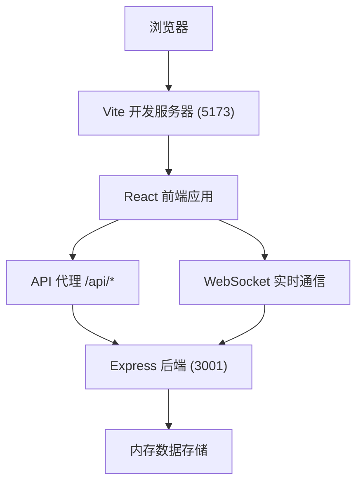
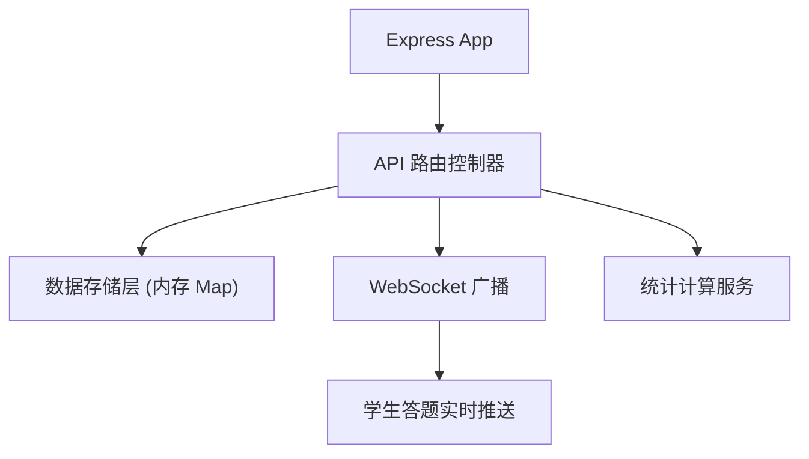

## 1. 架构设计



## 2. 技术栈

- 前端：React 18 + TypeScript + Vite
- 后端：Express 4 + TypeScript
- 实时通信：WebSocket
- 图表绘制：原生 Canvas API
- HTTP 客户端：fetch API
- 状态管理：React useState/useReducer
- 唯一 ID：uuid

## 3. 项目结构

```
auto28/
├── index.html
├── package.json
├── tsconfig.json
├── vite.config.js
├── server/
│   └── server.ts
└── src/
    ├── main.tsx
    ├── App.tsx
    ├── types.ts
    ├── components/
    │   ├── QuizCreator.tsx
    │   ├── StudentView.tsx
    │   ├── Dashboard.tsx
    │   └── ReportGenerator.tsx
    └── styles/
        └── global.css
```

## 4. API 定义

### 类型定义

```typescript
interface Question {
  id: string;
  question: string;
  options: string[];
  correctAnswer: string;
}

interface Quiz {
  id: string;
  code: string;
  title: string;
  description: string;
  questions: Question[];
  status: 'active' | 'ended';
  createdAt: number;
}

interface Student {
  id: string;
  name: string;
  quizId: string;
  answers: Record<string, string>;
  submittedAt?: number;
  joinedAt: number;
}

interface QuizStats {
  quizId: string;
  totalStudents: number;
  submittedCount: number;
  questionStats: {
    questionId: string;
    optionCounts: Record<string, number>;
  }[];
  studentStatuses: {
    studentId: string;
    name: string;
    submitted: boolean;
  }[];
}

interface QuizReport {
  quizId: string;
  overallAccuracy: number;
  questionReports: {
    questionId: string;
    accuracy: number;
    correctCount: number;
    wrongCount: number;
  }[];
  topStudents: {
    name: string;
    duration: number;
    score: number;
  }[];
}
```

### API 接口

| 方法 | 路径 | 描述 |
|------|------|------|
| POST | /api/quizzes | 创建测验 |
| GET | /api/quizzes/:id | 获取测验信息 |
| POST | /api/quizzes/:id/submit | 提交答案 |
| GET | /api/quizzes/:id/stats | 获取实时统计 |
| GET | /api/quizzes/:id/report | 获取报告数据 |
| POST | /api/quizzes/:id/end | 结束测验 |

## 5. 服务端架构



## 6. 核心组件说明

### QuizCreator 组件
- 管理向导步骤状态（步骤1: 基本信息，步骤2: 题目编辑
- 题目列表动态增删
- 动画滑入效果（CSS transition）
- 提交创建请求

### StudentView 组件
- WebSocket 连接管理
- 实时接收题目状态更新
- 选项锁定与提交
- 得分展示

### Dashboard 组件
- 2秒轮询统计数据
- Canvas 柱状图绘制
- requestAnimationFrame 动画更新
- 学生状态列表

### ReportGenerator 组件
- Canvas 圆环图绘制
- 导出 HTML（Blob + URL.createObjectURL）
- 数据展示

## 7. 性能优化要点

- Canvas 绘图避免 DOM 重排
- 数据差异更新使用 requestAnimationFrame
- 合理使用 useMemo/useCallback
- 避免不必要的重渲染
- 动画使用 CSS transform 而非 JS
