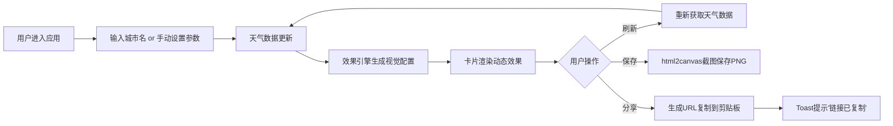

## 1. 产品概述

交互式天气卡片生成与分享应用，让用户根据实时或自定义天气数据，生成具有动态视觉效果的个性化天气卡片。支持卡片保存为图片和分享链接，满足用户展示和社交分享需求。

## 2. 核心功能

### 2.1 功能模块
1. **天气数据输入模块**：城市名搜索获取实时天气、手动设置天气参数（温度、湿度、天气类型、风速）
2. **天气卡片渲染模块**：动态渐变背景、SVG天气图标动画、粒子效果、温度符号动画、风速弧形动画
3. **操作按钮模块**：刷新天气、保存卡片为PNG、生成分享链接并复制
4. **动画效果引擎**：根据天气类型生成视觉效果配置

### 2.2 页面详情
| 页面名称 | 模块名称 | 功能描述 |
|----------|----------|----------|
| 主页面 | 天气数据输入区 | 城市搜索框、温度滑块、湿度滑块、天气类型下拉、风速滑块，切换时有0.3秒平滑过渡动画，滑块和下拉菜单交互时有变色放大反馈 |
| 主页面 | 天气卡片展示区 | 320x440px圆角矩形卡片，根据天气类型（晴/多云/雨/雪/雷暴）展示动态渐变背景、粒子效果、SVG图标动画、温度数字动画、风速弧形动画，卡片悬停时上浮4px |
| 主页面 | 操作按钮区 | 三个胶囊样式按钮（刷新/保存/分享），刷新按钮点击旋转90度，保存/分享时卡片边框产生发光脉冲动画，分享成功后底部滑入Toast提示2秒后消失 |

## 3. 核心流程

## 4. 用户界面设计

### 4.1 设计风格
- **主色调**：深色主题，背景#121212
- **按钮样式**：圆角胶囊，背景#333，悬停变亮
- **字体**：选用现代无衬线字体，温度数字大号加粗显示
- **布局风格**：Flex垂直居中布局，卡片居中展示，周围柔和阴影
- **视觉特色**：天气类型对应不同渐变配色，雷暴天气伴有1-2秒间隔的半透明白色闪光效果

### 4.2 页面设计概述
| 页面名称 | 模块名称 | UI元素 |
|----------|----------|--------|
| 主页面 | 天气数据输入区 | 城市输入框、范围滑块（温度/湿度/风速）、下拉选择（天气类型），所有控件有焦点和交互状态动画 |
| 主页面 | 天气卡片展示区 | 圆角16px卡片，动态渐变背景，浮动SVG图标，旋转温度符号，弧形风速指示器，粒子效果层 |
| 主页面 | 操作按钮区 | 三个水平排列胶囊按钮，带图标和文字，点击有微交互 |

### 4.3 响应式设计
- **桌面端**：卡片固定320x440px，输入区和按钮区水平/垂直居中布局
- **移动端**：卡片宽度自适应（min-width 280px，max-width 90%），按钮改用图标+文字紧凑布局，输入控件尺寸适配触屏操作
- **触摸优化**：增大点击热区，滑动操作流畅

### 4.4 动画与性能
- 数据切换过渡动画0.3秒
- 卡片内容切换流畅不闪白，帧率保持60fps
- 雷暴天气闪光效果每1-2秒一次
- 天气图标动画：晴天太阳旋转、雨天雨滴下落、雪天雪花飘落、云朵水平浮动
- 刷新按钮点击旋转90度
- 保存/分享时卡片边框0.5秒发光脉冲
- Toast从底部滑入，2秒后消失
