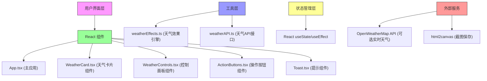

## 1. 架构设计



## 2. 技术描述

* **前端框架**：React 18 + TypeScript

* **构建工具**：Vite 5.x + @vitejs/plugin-react

* **日期处理**：dayjs

* **截图功能**：html2canvas

* **样式方案**：CSS Modules + CSS Variables，内联样式处理动态效果

* **动画方案**：CSS Animations + Transitions，requestAnimationFrame处理粒子效果

* **状态管理**：React Hooks (useState, useEffect, useCallback, useRef)

## 3. 文件结构

```
auto29/
├── package.json
├── vite.config.js
├── tsconfig.json
├── index.html
└── src/
    ├── main.tsx              # 应用入口
    ├── App.tsx               # 主应用组件
    ├── types/
    │   └── weather.ts        # 类型定义
    ├── components/
    │   ├── WeatherCard.tsx   # 天气卡片组件
    │   ├── WeatherControls.tsx # 控制面板
    │   ├── ActionButtons.tsx # 操作按钮
    │   └── Toast.tsx         # 提示组件
    ├── utils/
    │   ├── weatherEffects.ts # 天气效果引擎
    │   └── weatherAPI.ts     # 天气API（模拟）
    └── styles/
        ├── global.css        # 全局样式
        └── animations.css    # 动画关键帧
```

## 4. 核心类型定义

```typescript
// 天气类型
type WeatherType = 'sunny' | 'cloudy' | 'rainy' | 'snowy' | 'thunderstorm';

// 天气数据
interface WeatherData {
  city: string;
  temperature: number;
  humidity: number;
  weatherType: WeatherType;
  windSpeed: number;
  timestamp: number;
}

// 天气效果配置
interface WeatherEffects {
  backgroundGradient: string;
  particleConfig: ParticleConfig;
  animationDuration: number;
  iconAnimation: string;
  hasLightning: boolean;
}

// 粒子配置
interface ParticleConfig {
  type: 'rain' | 'snow' | 'none';
  count: number;
  speed: number;
  size: number;
  opacity: number;
}
```

## 5. 性能优化策略

1. **组件优化**

   * 使用 React.memo 包裹子组件避免不必要重渲染

   * 使用 useCallback 缓存事件处理函数

   * 使用 useRef 保存动画帧ID和DOM引用

2. **动画优化**

   * 使用 transform 和 opacity 属性实现动画，触发 GPU 加速

   * 粒子效果使用 requestAnimationFrame 统一调度

   * 雷暴闪光效果使用 CSS 动画而非 JavaScript 定时器

3. **渲染优化**

   * 数据切换时使用 CSS transition 实现平滑过渡

   * 卡片内容使用绝对定位分层，避免布局抖动

   * 使用 will-change 提示浏览器优化动画元素

4. **资源优化**

   * SVG 图标内联，避免额外网络请求

   * 动画关键帧集中管理，复用动画定义

