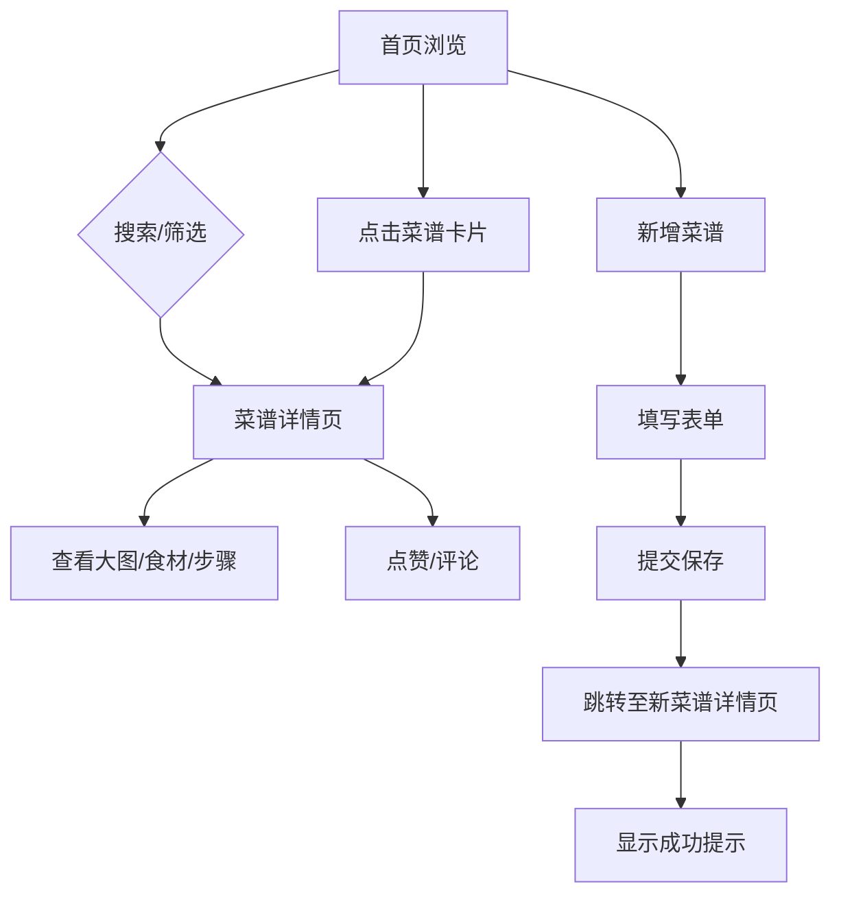

## 1. 产品概述

在线食谱分享与社交发现应用，让用户能够发布自己的创意菜谱、浏览他人作品并互动点赞评论。
- 主要目的：为美食爱好者提供一个分享、发现和交流烹饪创意的平台
- 目标用户：家庭厨师、美食爱好者、烹饪初学者
- 市场价值：连接美食创作者与爱好者，构建活跃的美食社区

## 2. 核心功能

### 2.1 用户角色

| 角色 | 注册方式 | 核心权限 |
|------|----------|----------|
| 普通用户 | 无需注册，匿名浏览和互动 | 浏览菜谱、点赞、评论、发布新菜谱 |

### 2.2 功能模块

1. **首页**：瀑布流菜谱展示、搜索栏、分类筛选、导航栏
2. **菜谱详情页**：大图展示、食材列表、烹饪步骤、评论区、点赞功能
3. **新增菜谱页**：富文本编辑器、表单提交、图片上传

### 2.3 页面详情

| 页面名称 | 模块名称 | 功能描述 |
|---------|---------|----------|
| 首页 | 瀑布流网格 | 展示所有菜谱卡片，支持响应式布局 |
| 首页 | 搜索栏 | 按菜名或食材关键词实时搜索，即时过滤 |
| 首页 | 分类筛选 | 按菜系分类筛选（中餐、西餐、日料等） |
| 首页 | 导航栏 | 顶部导航，包含Logo和新增菜谱入口 |
| 菜谱详情页 | 大图展示 | 顶部大图带视差滚动效果 |
| 菜谱详情页 | 食材列表 | 带checkbox勾选，支持标记已准备 |
| 菜谱详情页 | 烹饪步骤 | 分步骤说明，带进度标记和展开/收起动画 |
| 菜谱详情页 | 评论区 | 支持用户输入昵称和评论内容，提交后平滑插入 |
| 菜谱详情页 | 点赞按钮 | 点赞功能，点击时有弹跳动画 |
| 新增菜谱页 | 富文本编辑器 | 支持插入图片和格式化文本 |
| 新增菜谱页 | 表单提交 | 提交数据到后端，完成后跳转详情页 |

## 3. 核心流程

用户在首页浏览菜谱卡片，可通过搜索栏搜索或分类筛选找到感兴趣的菜谱，点击进入详情页查看完整信息，可对菜谱点赞和发表评论。用户也可通过导航栏进入新增菜谱页面，填写菜谱信息并提交，发布新的菜谱分享给社区。

## 4. 用户界面设计

### 4.1 设计风格

- 主色调：#E67E22（暖橙色）
- 辅助色：#F39C12（金黄色）
- 背景色：#FFF8E7（浅奶油色）
- 卡片样式：白底圆角设计，阴影柔和
- 按钮样式：圆角胶囊按钮
- 字体：使用 Playfair Display（标题）+ Noto Sans SC（正文）
- 布局风格：卡片式瀑布流布局，顶部导航
- 图标风格：简洁线性图标

### 4.2 页面设计概述

| 页面名称 | 模块名称 | UI元素 |
|---------|---------|--------|
| 首页 | 瀑布流网格 | 卡片悬停上浮效果、交错飞入动画、缩放淡入动画 |
| 首页 | 搜索栏 | 实时过滤、无结果空状态插画 |
| 首页 | 分类筛选 | 圆角胶囊按钮、选中高亮、其他置灰 |
| 菜谱详情页 | 大图展示 | 视差滚动效果（滚动时轻微放大模糊） |
| 菜谱详情页 | 食材列表 | 带checkbox勾选、已准备状态标记 |
| 菜谱详情页 | 烹饪步骤 | 进度标记、展开/收起动画 |
| 菜谱详情页 | 评论区 | 输入框聚焦发光动画、评论平滑插入 |
| 菜谱详情页 | 点赞按钮 | 弹跳动画（scale 1.3 -> 1.0，0.3秒） |
| 新增菜谱页 | 富文本编辑器 | 图片插入、文本格式化 |
| 新增菜谱页 | 提交按钮 | 成功toast提示 |

### 4.3 响应式设计

- 桌面端（>=1200px）：四列瀑布流
- 平板端（>=768px）：两列布局
- 移动端（<768px）：单列布局
- 触摸优化：增大点击区域，优化移动端体验

### 4.4 动画效果

- 卡片悬停：上浮3px，增加投影深度
- 搜索结果：卡片缩放淡入动画
- 分类切换：菜谱卡片交错飞入动画（从底部）
- 评论提交：评论列表平滑插入
- 点赞按钮：弹跳动画
- 输入框聚焦：边框发光动画（0.2秒）
- 详情页大图：视差滚动效果
