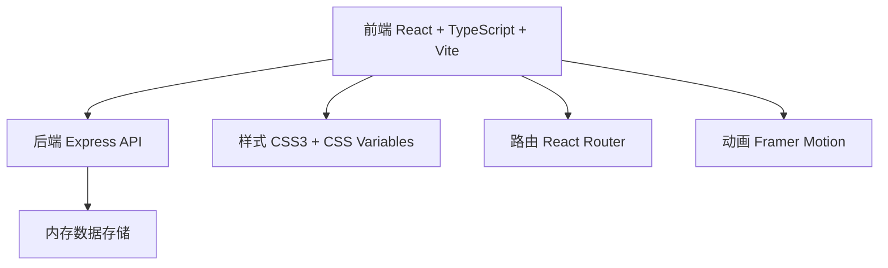
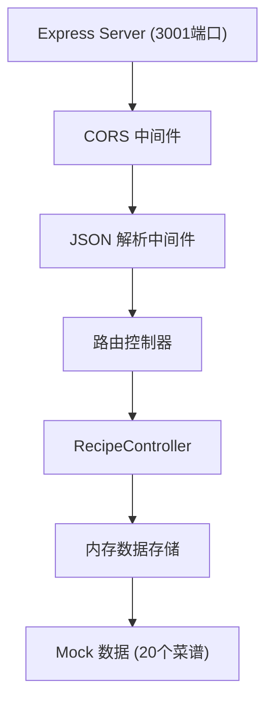
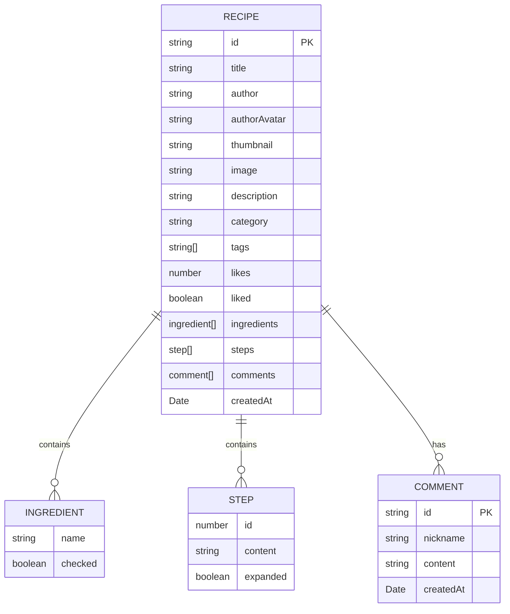

## 1. 架构设计



## 2. 技术描述

- 前端：React@18 + TypeScript@5 + Vite@5
- 构建工具：Vite@5 + @vitejs/plugin-react
- 后端：Express@4 + TypeScript
- 数据存储：内存存储（模拟20个菜谱数据）
- 路由：react-router-dom@6
- 动画：framer-motion@11
- 跨域：cors@2
- ID生成：uuid@9

## 3. 路由定义

| 路由 | 页面 | 用途 |
|------|------|------|
| / | 首页 | 瀑布流展示菜谱卡片、搜索、分类筛选 |
| /recipe/:id | 菜谱详情页 | 展示菜谱详情、食材、步骤、评论 |
| /add-recipe | 新增菜谱页 | 富文本编辑、提交新菜谱 |

## 4. API 定义

### TypeScript 类型定义

```typescript
interface Recipe {
  id: string;
  title: string;
  author: string;
  authorAvatar: string;
  thumbnail: string;
  image: string;
  description: string;
  category: string;
  tags: string[];
  likes: number;
  liked: boolean;
  ingredients: { name: string; checked: boolean }[];
  steps: { id: number; content: string; expanded: boolean }[];
  comments: { id: string; nickname: string; content: string; createdAt: Date }[];
  createdAt: Date;
}
```

### API 接口

| 方法 | 路径 | 描述 | 请求体 | 响应 |
|------|------|------|--------|------|
| GET | /api/recipes | 获取所有菜谱 | - | Recipe[] |
| GET | /api/recipes/:id | 获取单个菜谱详情 | - | Recipe |
| POST | /api/recipes | 创建新菜谱 | Omit<Recipe, 'id' \| 'likes' \| 'liked' \| 'comments' \| 'createdAt'> | Recipe |
| PUT | /api/recipes/:id/like | 点赞/取消点赞 | { liked: boolean } | { likes: number; liked: boolean } |
| POST | /api/recipes/:id/comments | 添加评论 | { nickname: string; content: string } | Comment |
| PUT | /api/recipes/:id/ingredients | 更新食材勾选状态 | { ingredientIndex: number; checked: boolean } | { success: boolean } |
| PUT | /api/recipes/:id/steps | 更新步骤展开状态 | { stepIndex: number; expanded: boolean } | { success: boolean } |

## 5. 服务器架构图



## 6. 数据模型

### 6.1 数据模型定义



### 6.2 初始 Mock 数据

应用启动时，服务器会生成20个模拟菜谱数据，包含不同菜系（中餐、西餐、日料、韩餐、甜点等），每个菜谱包含完整的食材、步骤和评论数据。

## 7. 前端组件结构

```
src/
├── App.tsx                    # 主应用组件，路由管理
├── components/
│   ├── RecipeCard.tsx         # 菜谱卡片组件
│   ├── RecipeDetail.tsx       # 菜谱详情组件
│   ├── RecipeList.tsx         # 瀑布流列表组件
│   ├── SearchBar.tsx          # 搜索栏组件
│   ├── CategoryFilter.tsx     # 分类筛选组件
│   ├── Navbar.tsx             # 导航栏组件
│   ├── AddRecipe.tsx          # 新增菜谱组件
│   ├── CommentSection.tsx     # 评论区组件
│   └── Toast.tsx              # Toast提示组件
├── types/
│   └── index.ts               # TypeScript类型定义
├── utils/
│   └── api.ts                 # API请求工具
├── main.tsx                   # 入口文件
└── index.css                  # 全局样式
```

## 8. 性能优化策略

1. **瀑布流加载**：初始加载20个菜谱，滚动时延迟<300ms
2. **图片优化**：使用适当尺寸图片，懒加载
3. **动画性能**：使用transform和opacity属性，避免布局抖动
4. **搜索防抖**：搜索输入使用防抖处理，减少不必要的过滤
5. **状态管理**：合理使用React状态，避免不必要的重渲染
6. **点赞响应**：本地乐观更新，<100ms响应时间
