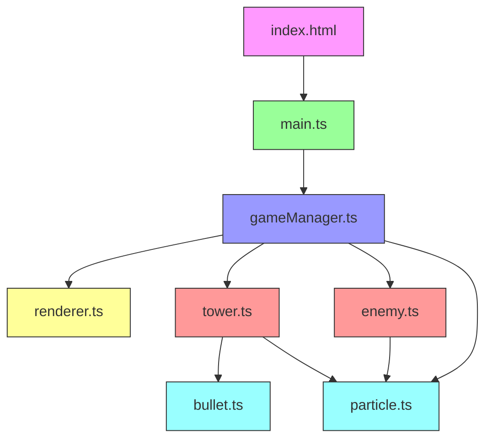

## 1. 架构设计



## 2. 技术描述
- **前端**：TypeScript + Vite + HTML5 Canvas API（无第三方游戏引擎）
- **构建工具**：Vite 5.x
- **语言**：TypeScript 5.x（严格模式）
- **渲染**：纯Canvas 2D API绘制所有像素图形
- **状态管理**：GameManager类统一管理游戏状态

### 文件结构与职责
```
src/
├── main.ts              # 游戏循环入口，初始化场景、启动requestAnimationFrame
├── gameManager.ts       # 游戏状态管理器，管理波次、塔、敌人、分数、生命值
├── renderer.ts          # 渲染器，绘制所有像素图形到Canvas
├── tower.ts             # 防御塔类，包含攻击逻辑、升级系统
├── enemy.ts             # 敌人类，包含路径跟随、生命值、死亡效果
├── bullet.ts            # 子弹类，线性飞行、碰撞检测
├── particle.ts          # 粒子系统，火花、碎片效果
└── types.ts             # 类型定义（TowerType, EnemyType, Position等）
```

### 数据流向
1. `main.ts` → 调用 `gameManager.update()` 和 `gameManager.render()`
2. `gameManager.ts` → 管理 `enemyList`、`towerList`、`bulletList`、`particleList`
3. `gameManager.ts` → 调用 `renderer.ts` 绘制所有元素
4. `tower.ts` → 检测敌人、生成 `bullet`、产生攻击粒子
5. `enemy.ts` → 沿路径移动、接收伤害、死亡时产生碎片粒子
6. `bullet.ts` → 线性飞行、碰撞检测、击中后产生爆炸粒子

## 3. 核心配置

### 游戏常量
| 常量 | 值 | 说明 |
|------|----|------|
| GRID_WIDTH | 20 | 网格宽度（格） |
| GRID_HEIGHT | 15 | 网格高度（格） |
| CELL_SIZE | 32 | 每格像素大小 |
| TOTAL_WAVES | 5 | 总波次数 |
| WAVE_INTERVAL | 5000 | 波次间隔（毫秒） |
| MAX_ENEMIES | 30 | 最大同时在线敌人数 |
| MAX_PARTICLES | 200 | 最大粒子/子弹数 |
| INITIAL_GOLD | 200 | 初始金币 |
| INITIAL_LIVES | 20 | 初始生命值 |

### 防御塔配置
| 塔类型 | 伤害 | 射程 | 攻速 | 价格 | 特效 |
|--------|------|------|------|------|------|
| 机枪塔 | 10 | 120 | 0.2s | 50 | 快速子弹，黄色火花 |
| 激光塔 | 25 | 150 | 0.8s | 100 | 穿透激光，蓝色光束 |
| 炮塔 | 40 | 100 | 1.5s | 150 | 范围爆炸，橙色碎片 |

### 敌人配置
| 敌人类型 | 生命值 | 速度 | 金币 | 颜色 |
|----------|--------|------|------|------|
| 普通 | 100 | 0.5px/帧 | 10 | 绿色 |
| 快速 | 50 | 1.0px/帧 | 15 | 蓝色 |
| 重甲 | 300 | 0.25px/帧 | 25 | 红色 |

## 4. 核心类定义

### Tower 类
```typescript
class Tower {
  type: TowerType;
  level: number;
  gridX: number;
  gridY: number;
  damage: number;
  range: number;
  fireRate: number;
  lastFireTime: number;
  target: Enemy | null;
  
  update(enemies: Enemy[], deltaTime: number): Bullet | null;
  upgrade(): boolean;
  getUpgradeCost(): number;
}
```

### Enemy 类
```typescript
class Enemy {
  type: EnemyType;
  health: number;
  maxHealth: number;
  speed: number;
  pathIndex: number;
  x: number;
  y: number;
  isHit: boolean;
  hitTimer: number;
  
  update(path: Position[], deltaTime: number): boolean;
  takeDamage(damage: number): boolean;
  getDeathParticles(): Particle[];
}
```

### GameManager 类
```typescript
class GameManager {
  towers: Tower[];
  enemies: Enemy[];
  bullets: Bullet[];
  particles: Particle[];
  gold: number;
  lives: number;
  score: number;
  currentWave: number;
  waveState: WaveState;
  
  update(deltaTime: number): void;
  render(renderer: Renderer): void;
  placeTower(gridX: number, gridY: number, type: TowerType): boolean;
  upgradeTower(tower: Tower): boolean;
  selectTower(gridX: number, gridY: number): Tower | null;
}
```

## 5. 性能优化策略
1. **对象池模式**：Bullet和Particle使用对象池，避免频繁创建销毁
2. **空间分区**：使用网格索引加速敌人查找
3. **渲染优化**：只渲染视口内元素，使用离屏Canvas缓存静态元素
4. **内存管理**：每波结束清理销毁的敌人，定期清理过期粒子
5. **帧率控制**：使用deltaTime实现与帧率无关的游戏逻辑
