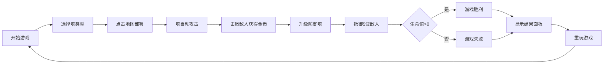

## 1. 产品概述
一款复古风格的像素塔防游戏，玩家在网格地图上部署防御塔阻止敌人突破防线。面向独立游戏爱好者，提供经典塔防玩法的同时展现精致的像素艺术风格。

- 核心玩法：策略性部署防御塔，抵御5波敌人进攻
- 目标用户：复古游戏爱好者、塔防游戏玩家
- 市场价值：展示纯Canvas API游戏开发能力，提供可扩展的塔防游戏原型

## 2. 核心功能

### 2.1 用户角色
| 角色 | 注册方式 | 核心权限 |
|------|----------|----------|
| 玩家 | 无需注册 | 部署防御塔、升级塔、查看游戏状态、重玩游戏 |

### 2.2 功能模块
1. **游戏主界面**：游戏画布、资源显示、波次信息、塔选择栏
2. **塔防系统**：3种防御塔（机枪塔、激光塔、炮塔），可升级至3级
3. **敌人波次系统**：5波敌人，3种敌人类型（普通、快速、重甲）
4. **资源系统**：金币获取与消耗、生命值管理
5. **粒子特效系统**：攻击火花、死亡碎片、建造动画
6. **游戏结束系统**：结束界面、分数统计、重玩功能

### 2.3 页面详情
| 页面名称 | 模块名称 | 功能描述 |
|----------|----------|----------|
| 游戏主界面 | 游戏画布 | 20x15网格地图，32x32像素每格，显示路径、塔、敌人、粒子 |
| 游戏主界面 | 资源面板 | 左上角显示金币和生命值，带数值变化动画 |
| 游戏主界面 | 波次信息 | 右下角显示当前波次/总波次，波次开始前3秒倒计时 |
| 游戏主界面 | 塔选择栏 | 底部中央显示3种塔图标，点击选择后点击地图部署 |
| 游戏主界面 | 信息面板 | 选中塔时右侧显示塔信息和升级按钮 |
| 结束界面 | 结果面板 | 显示最终分数、波次通过数，提供重玩按钮 |

## 3. 核心流程
玩家选择防御塔类型 → 点击地图空地部署 → 塔自动攻击范围内敌人 → 击败敌人获得金币 → 使用金币升级塔 → 抵御5波敌人进攻 → 生命值归零或通关 → 查看结果并重玩

## 4. 用户界面设计

### 4.1 设计风格
- **主色调**：深棕（#2a1a0a）、草绿（#3a7a2a）、土黄（#d4a843）
- **像素风格**：所有图形以像素块绘制，单像素黑色描边
- **字体**：monospace像素字体，14px字号
- **按钮风格**：矩形像素按钮，悬停时背景变为浅黄色
- **动画**：平滑过渡动画，粒子效果，数值变化动画

### 4.2 页面设计概述
| 页面名称 | 模块名称 | UI元素 |
|----------|----------|--------|
| 游戏主界面 | 游戏画布 | 深绿/浅绿交替网格，预设路径，像素塔、敌人、粒子特效 |
| 游戏主界面 | 资源面板 | 金币图标+数字（弹簧动画）、红心图标+数字（受伤红边闪烁） |
| 游戏主界面 | 波次信息 | "Wave X/5"文本，倒计时脉冲动画 |
| 游戏主界面 | 塔选择栏 | 3个塔图标+描述，选中高亮，描述卡片淡入动画 |
| 游戏主界面 | 信息面板 | 塔属性显示，升级按钮（点击缩放反馈） |
| 结束界面 | 结果面板 | 半透明遮罩，面板从下方滑入，分数统计，重玩按钮 |

### 4.3 响应式设计
- 桌面优先设计，适配1280x720和1920x1080分辨率
- 游戏区域保持16:9比例，等比缩放居中显示
- UI元素位置相对固定，随画布缩放

### 4.4 性能优化
- requestAnimationFrame实现60fps游戏循环
- 粒子和子弹对象池，上限200个，超出回收最早对象
- 敌人同时在线不超过30个
- 每波结束清理销毁的敌人实例，防止内存泄露
