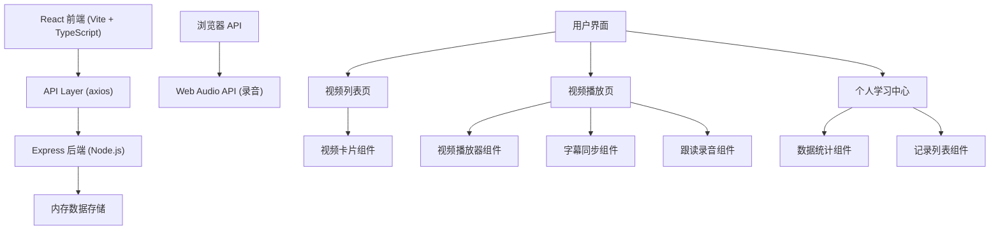
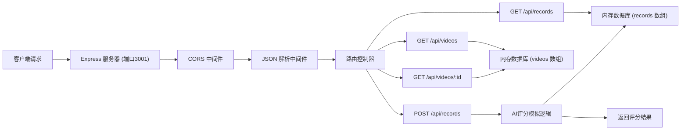
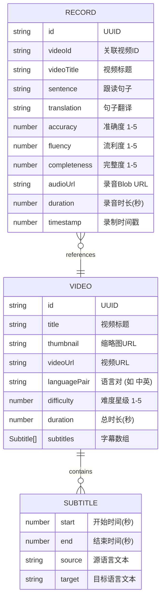

## 1. 架构设计



## 2. 技术描述

* **前端**：React 18 + TypeScript + Vite + React Router DOM + Axios

* **前端构建**：Vite 5（热更新、快速构建）

* **后端**：Node.js + Express 4 + CORS + UUID

* **数据存储**：内存数组模拟数据库（videos、records）

* **浏览器API**：HTML5 Video、MediaRecorder API、Web Audio API

* **状态管理**：React useState/useEffect + localStorage（用户记录本地持久化）

* **样式方案**：原生CSS + CSS Variables + Media Queries（无Tailwind，按需求自定义）

## 3. 路由定义

| 路由路径       | 页面组件          | 用途        |
| ---------- | ------------- | --------- |
| /          | VideoList     | 视频列表首页    |
| /video/:id | VideoPlayer   | 视频播放与跟读页面 |
| /profile   | RecordHistory | 个人学习中心    |

## 4. API 定义

### TypeScript 类型定义

```typescript
interface Subtitle {
  start: number;
  end: number;
  source: string;
  target: string;
}

interface Video {
  id: string;
  title: string;
  thumbnail: string;
  videoUrl: string;
  languagePair: string;
  difficulty: number;
  duration: number;
  subtitles: Subtitle[];
}

interface Record {
  id: string;
  videoId: string;
  videoTitle: string;
  sentence: string;
  translation: string;
  accuracy: number;
  fluency: number;
  completeness: number;
  audioUrl: string;
  duration: number;
  timestamp: number;
}

interface VideoListResponse {
  videos: Video[];
  total: number;
  page: number;
  limit: number;
}

interface RecordListResponse {
  records: Record[];
  total: number;
}
```

### API 端点

| 方法   | 路径              | 请求参数                                                               | 响应                 | 用途           |
| ---- | --------------- | ------------------------------------------------------------------ | ------------------ | ------------ |
| GET  | /api/videos     | page: number, limit: number                                        | VideoListResponse  | 获取视频列表（分页）   |
| GET  | /api/videos/:id | -                                                                  | Video              | 获取单视频详情（含字幕） |
| GET  | /api/records    | -                                                                  | RecordListResponse | 获取用户跟读记录     |
| POST | /api/records    | { videoId, videoTitle, sentence, translation, audioUrl, duration } | Record             | 提交跟读记录并返回评分  |

## 5. 服务器架构图



## 6. 数据模型

### 6.1 数据模型定义



### 6.2 初始化数据

后端启动时硬编码3段短剧示例数据：

```javascript
const videos = [
  {
    id: '1',
    title: '咖啡馆偶遇',
    thumbnail: 'https://trae-api-cn.mchost.guru/api/ide/v1/text_to_image?prompt=cozy%20cafe%20scene%20two%20people%20talking&image_size=landscape_16_9',
    videoUrl: 'https://www.w3schools.com/html/mov_bbb.mp4',
    languagePair: '中英',
    difficulty: 2,
    duration: 45,
    subtitles: [
      { start: 0, end: 3.5, source: 'Hi, long time no see!', target: '嗨，好久不见！' },
      { start: 3.5, end: 7, source: 'Wow, it is you! How have you been?', target: '哇，是你啊！你最近怎么样？' },
      { start: 7, end: 11, source: 'Pretty good, thanks. Working on a new project.', target: '挺好的，谢谢。在做一个新项目。' },
      { start: 11, end: 15, source: 'That sounds exciting! What is it about?', target: '听起来很令人兴奋！是关于什么的？' },
      { start: 15, end: 19, source: 'It is a language learning app actually.', target: '其实是一个语言学习应用。' },
      { start: 19, end: 23, source: 'No way! I have been looking for something like that.', target: '不会吧！我一直在找这样的东西。' },
      { start: 23, end: 27, source: 'Really? I can send you the beta link later.', target: '真的吗？我稍后可以把测试版链接发给你。' },
      { start: 27, end: 31, source: 'That would be amazing! Thank you so much.', target: '那太好了！太感谢你了。' },
      { start: 31, end: 35, source: 'No problem. Let us exchange WeChat.', target: '不客气。我们加个微信吧。' },
      { start: 35, end: 40, source: 'Sure! Here is my QR code. Scan me.', target: '好的！这是我的二维码。扫我吧。' },
    ]
  },
  {
    id: '2',
    title: '机场接机',
    thumbnail: 'https://trae-api-cn.mchost.guru/api/ide/v1/text_to_image?prompt=airport%20arrival%20hall%20people%20meeting&image_size=landscape_16_9',
    videoUrl: 'https://www.w3schools.com/html/movie.mp4',
    languagePair: '日英',
    difficulty: 3,
    duration: 38,
    subtitles: [
      { start: 0, end: 4, source: 'Welcome to Japan! Did you have a good flight?', target: '日本へようこそ！フライトは良かったですか？' },
      { start: 4, end: 8, source: 'Yes, thank you. It was very smooth.', target: 'はい、ありがとうございます。とても快適でした。' },
      { start: 8, end: 12, source: 'Great! Let me help you with your luggage.', target: 'よかった！お荷物をお持ちしましょう。' },
      { start: 12, end: 16, source: 'That is very kind of you. I really appreciate it.', target: 'ご親切にありがとうございます。本当に感謝します。' },
      { start: 16, end: 20, source: 'Not at all. The car is waiting outside.', target: 'いえいえ。車が外で待っています。' },
      { start: 20, end: 24, source: 'Perfect. How long does it take to the hotel?', target: '素晴らしい。ホテルまでどのくらいかかりますか？' },
      { start: 24, end: 28, source: 'About 45 minutes depending on traffic.', target: '交通状況によりますが、約45分です。' },
      { start: 28, end: 32, source: 'I see. I am looking forward to my stay.', target: 'そうですか。滞在が楽しみです。' },
      { start: 32, end: 36, source: 'You will love Tokyo this time of year.', target: 'この季節の東京はきっと気に入りますよ。' },
    ]
  },
  {
    id: '3',
    title: '办公室会议',
    thumbnail: 'https://trae-api-cn.mchost.guru/api/ide/v1/text_to_image?prompt=modern%20office%20meeting%20room%20business%20discussion&image_size=landscape_16_9',
    videoUrl: 'https://www.w3schools.com/html/mov_bbb.mp4',
    languagePair: '中英',
    difficulty: 4,
    duration: 52,
    subtitles: [
      { start: 0, end: 4, source: 'Good morning everyone, let us get started.', target: '大家早上好，我们开始吧。' },
      { start: 4, end: 8, source: 'First, I would like to review our Q3 results.', target: '首先，我想回顾一下我们第三季度的业绩。' },
      { start: 8, end: 12, source: 'Overall, we exceeded our targets by 15 percent.', target: '总体而言，我们超额完成了15%的目标。' },
      { start: 12, end: 16, source: 'That is excellent news! Congratulations team.', target: '这真是好消息！祝贺大家。' },
      { start: 16, end: 20, source: 'Thank you. Now let us discuss the Q4 roadmap.', target: '谢谢。现在让我们讨论第四季度的路线图。' },
      { start: 20, end: 24, source: 'We have three major features planned for release.', target: '我们计划发布三个主要功能。' },
      { start: 24, end: 28, source: 'The first one is the new dashboard redesign.', target: '第一个是新的仪表板重新设计。' },
      { start: 28, end: 32, source: 'When is the expected launch date for that?', target: '预计什么时候上线？' },
      { start: 32, end: 36, source: 'We are targeting mid-October for the beta release.', target: '我们的目标是十月中旬发布测试版。' },
      { start: 36, end: 40, source: 'That sounds ambitious but achievable.', target: '听起来很有挑战性，但应该可以实现。' },
      { start: 40, end: 44, source: 'Exactly. We have allocated extra resources.', target: '没错。我们已经调配了额外的资源。' },
      { start: 44, end: 48, source: 'Great. Are there any questions before we move on?', target: '很好。在继续之前，大家有什么问题吗？' },
      { start: 48, end: 52, source: 'No questions here. Let us proceed.', target: '没有问题。我们继续吧。' },
    ]
  }
];

const records = [];
```

## 7. 项目目录结构

```
auto31/
├── package.json (根目录，concurrent启动脚本)
├── client/
│   ├── package.json
│   ├── vite.config.js
│   ├── tsconfig.json
│   ├── index.html
│   └── src/
│       ├── App.tsx
│       ├── main.tsx
│       ├── index.css
│       ├── types/
│       │   └── index.ts
│       ├── pages/
│       │   ├── VideoList.tsx
│       │   └── VideoPlayer.tsx
│       └── components/
│           ├── NavBar.tsx
│           ├── VideoCard.tsx
│           ├── VideoPlayerComponent.tsx
│           ├── SubtitleDisplay.tsx
│           ├── FollowReadComponent.tsx
│           ├── RecordHistory.tsx
│           └── ScoreModal.tsx
└── server/
    ├── package.json
    └── index.js
```

