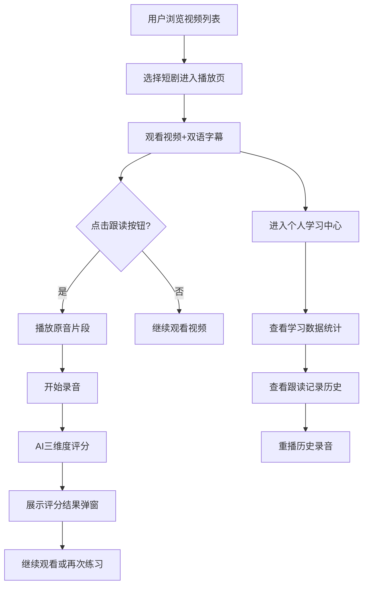

## 1. 产品概述

沉浸式双语短剧学习平台，为多语言学习者提供真实对话场景的视频素材与口语跟读练习，解决学习者缺乏针对性练习素材和即时反馈的痛点。

- 核心目标：通过短剧视频+AI评分的方式，让学习者在真实语境中提升口语表达能力
- 目标用户：正在学习第二语言的学习者，尤其是需要提升口语对话能力的用户
- 市场价值：填补传统语言学习工具在真实对话场景练习上的空白

## 2. 核心功能

### 2.1 用户角色

| 角色 | 注册方式 | 核心权限 |
|------|----------|----------|
| 普通用户 | 无需注册（本地存储） | 浏览视频、播放跟读、查看学习记录 |

### 2.2 功能模块

1. **视频列表页**：短剧视频网格展示、筛选、无限滚动加载
2. **视频播放页**：视频播放器、双语字幕同步、口语跟读练习、AI评分反馈
3. **个人学习中心**：学习数据统计、跟读记录历史、录音重播

### 2.3 页面详情

| 页面名称 | 模块名称 | 功能描述 |
|----------|----------|----------|
| 视频列表页 | 视频卡片网格 | 展示缩略图、标题、语言对、难度星级，点击跳转播放页 |
| 视频列表页 | 无限滚动 | 滚动到底部自动加载更多视频 |
| 视频播放页 | 视频播放器 | 播放/暂停、进度条拖动、音量调节 |
| 视频播放页 | 双语字幕 | 同步显示、当前句高亮、点击跳转 |
| 视频播放页 | 跟读练习 | 截取句子、原音播放、录音、AI三维度评分 |
| 个人学习中心 | 数据统计 | 总学习时长、掌握词汇数、完成度进度环 |
| 个人学习中心 | 跟读记录 | 最近20条记录列表、重播录音 |

## 3. 核心流程

用户浏览视频列表 → 选择感兴趣的短剧 → 观看视频并同步查看双语字幕 → 点击跟读按钮练习口语 → 系统播放原音并录音 → AI从准确度/流利度/完整度评分 → 查看评分结果 → 进入个人中心查看学习进度和历史记录

## 4. 用户界面设计

### 4.1 设计风格

- **主色调**：#1a1a2e（深色背景）
- **辅色调**：#16213e（卡片/区块背景）
- **强调色**：#e94560（按钮、高亮、进度环）
- **字体**：Inter（全局），标题加粗，正文常规
- **整体风格**：深色沉浸式、现代化、科技感、毛玻璃效果
- **动画风格**：平滑过渡、微交互、淡入淡出、脉冲效果

### 4.2 页面设计概述

| 页面名称 | 模块名称 | UI元素 |
|----------|----------|--------|
| 视频列表页 | 导航栏 | 深色背景、Logo、导航链接、悬停效果 |
| 视频列表页 | 视频卡片 | 圆角卡片、悬停上浮6px、阴影加深、过渡0.3s |
| 视频列表页 | 网格布局 | PC端3列、平板2列、手机1列、间距24px |
| 视频播放页 | 视频区域 | 视口宽度70%、居中、自适应高度 |
| 视频播放页 | 字幕区域 | 半透明黑色底rgba(0,0,0,0.6)、圆角8px、当前句黄色高亮+1.1倍放大动画 |
| 视频播放页 | 跟读按钮 | 录制时脉冲红点动画 |
| 视频播放页 | 评分弹窗 | 半透明毛玻璃背景、星星逐个弹出动画（间隔0.1秒） |
| 个人学习中心 | 进度环 | SVG绘制、绿色渐变弧形、0.6秒缓动展开动画 |
| 个人学习中心 | 记录列表 | 按日期倒序、每条显示评分、点击重播 |

### 4.3 响应式设计

- **桌面端（>1024px）**：视频列表3列网格，视频区域70%宽度
- **平板端（768px-1024px）**：视频列表2列网格，视频区域85%宽度
- **移动端（<768px）**：视频列表1列网格，视频区域100%宽度，两侧间距缩小
- 所有页面切换使用淡入淡出过渡（0.3秒）

### 4.4 交互细节

- 视频卡片悬停：上浮6px + 阴影加深 + 过渡0.3s ease-out
- 字幕高亮：黄色背景 + transform: scale(1.1) + 过渡动画
- 跟读按钮录制状态：脉冲动画（scale 1-1.2 循环）
- 星星评分：逐个弹出动画（每个间隔0.1秒，transform: translateY(-10px) → 0）
- 进度环：stroke-dashoffset 动画，0.6秒缓动展开
- 页面切换：opacity 0→1，过渡0.3秒
