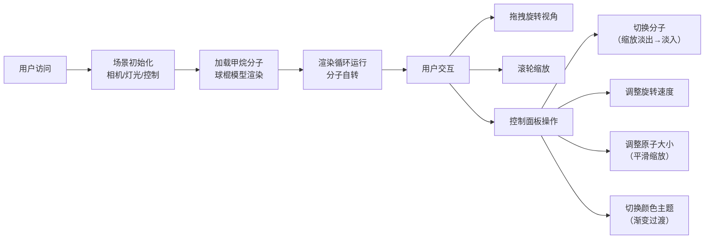

## 1. 产品概述

3D交互式分子结构查看与编辑应用，面向化学教育和科研人员，提供直观的分子模型可视化体验。用户可加载、旋转和编辑简单有机分子的三维模型，通过精细的交互控制和美观的视觉呈现，降低分子结构理解门槛。

## 2. 核心功能

### 2.1 用户角色

| 角色 | 注册方式 | 核心权限 |
|------|----------|----------|
| 普通用户 | 无需注册 | 浏览分子模型、调整视图参数、切换分子和主题 |

### 2.2 功能模块

1. **3D渲染视图**：实时WebGL渲染、球棍分子模型展示、轨道控制交互
2. **分子管理模块**：预定义分子数据、分子切换动画、原子/键动态生成
3. **控制面板**：分子选择下拉、旋转速度滑块、原子大小滑块、颜色主题单选
4. **动画系统**：分子切换缩放淡入淡出、原子大小平滑过渡、颜色渐变动画

### 2.3 页面详情

| 页面名称 | 模块名称 | 功能描述 |
|----------|----------|----------|
| 主页面 | 3D渲染区域 | 全屏Canvas渲染分子模型，支持鼠标旋转/缩放交互，背景深蓝渐变 |
| 主页面 | 右侧控制面板 | 浮动半透明面板，包含分子选择、参数调节、主题切换控件 |
| 主页面 | 动画系统 | 处理所有平滑过渡效果，确保60fps流畅运行 |

## 3. 核心流程

用户打开应用 → 自动加载甲烷分子并开始旋转 → 拖拽鼠标旋转视角/滚轮缩放 → 通过控制面板切换分子（带缩放淡入动画）→ 调整旋转速度和原子大小 → 切换颜色主题（带颜色渐变动画）

## 4. 用户界面设计

### 4.1 设计风格

- **主色调**：深蓝色渐变背景（#0a1628 → #1a2a4a），营造科技感和沉浸感
- **强调色**：青色 #00e5ff，用于滑块高亮、按钮激活状态
- **面板背景**：半透明深色 rgba(20,20,30,0.85)，圆角12px，模糊效果
- **字体**：白色 #ffffff，字号14px，简洁现代无衬线字体
- **交互反馈**：滑块细长条（4px高）+ 圆形手柄光晕，按钮点击微缩+亮度提升

### 4.2 页面设计概述

| 页面名称 | 模块名称 | UI元素 |
|----------|----------|--------|
| 主页面 | 3D渲染区域 | 全屏Canvas，深蓝渐变背景，居中分子模型，无多余UI |
| 主页面 | 控制面板 | 260px宽浮动面板，距顶部20px，垂直排列：分子选择下拉、旋转速度滑块、原子大小滑块、颜色主题单选组 |
| 主页面 | 动效系统 | 分子切换0.5秒缩放淡入淡出，原子大小平滑过渡，颜色0.3秒渐变，UI微交互 |

### 4.3 响应性

- 桌面端优先设计，全屏3D视图自适应窗口大小
- 控制面板固定宽度260px，右侧浮动，不随窗口缩放改变宽度
- 触控设备支持触摸旋转和捏合缩放

### 4.4 3D场景设计

- **环境**：深蓝渐变背景，AmbientLight + DirectionalLight + PointLight三点布光
- **灯光**：环境光0.6强度，主平行光1.0强度45度角，辅助点光0.5强度补光
- **相机**：PerspectiveCamera，fov 60，初始位置(3,3,3)，看向原点，45度俯视
- **控制**：OrbitControls，enableDamping开启，阻尼系数0.05，缩放范围0.5-3倍
- **模型**：球棍模型，原子球体+圆柱体化学键，半透明材质
- **后处理**：Three.js默认抗锯齿，无额外后处理以保证性能
- **性能预算**：单分子≤100原子≤200键，目标帧率60fps，每帧响应<16ms
