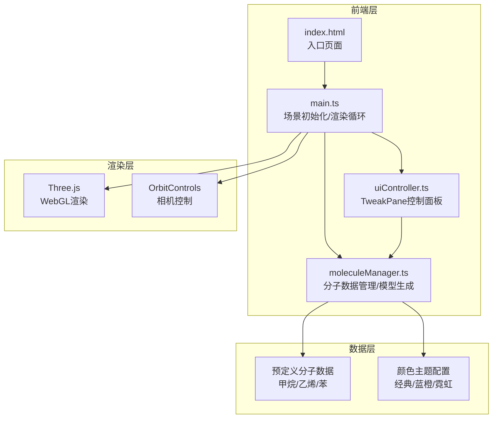

## 1. 架构设计



## 2. 技术描述

* **前端核心**：TypeScript + Three.js + OrbitControls

* **构建工具**：Vite 5.x，启用ES模块和TypeScript支持

* **UI框架**：TweakPane（控制面板）

* **渲染引擎**：Three.js r160+，WebGLRenderer抗锯齿

* **无后端**：纯前端应用，所有数据内置

### 关键技术选型理由

1. **Three.js**：成熟的WebGL封装，提供完整的3D渲染能力，支持OrbitControls轨道控制
2. **TypeScript**：强类型保证代码质量，便于维护原子/键数据结构
3. **Vite**：极速开发体验，原生ES模块支持，热更新流畅
4. **TweakPane**：轻量级参数控制面板，专为创意编程设计，样式可定制

## 3. 目录结构

```
auto32/
├── index.html              # 入口HTML，全屏Canvas
├── package.json            # 依赖配置
├── vite.config.js          # Vite构建配置
├── tsconfig.json           # TypeScript配置
└── src/
    ├── main.ts             # 场景初始化、渲染循环、相机控制
    ├── moleculeManager.ts  # 分子数据、模型创建、增删改接口
    └── uiController.ts     # TweakPane面板、参数绑定、事件处理
```

## 4. 核心数据结构

### 原子数据结构

```typescript
interface Atom {
  element: 'C' | 'H' | 'O' | 'N';
  position: { x: number; y: number; z: number };
  radius: number;
  color: number;
  mesh?: THREE.Mesh;
}
```

### 化学键数据结构

```typescript
interface Bond {
  atom1Index: number;
  atom2Index: number;
  type: 'single' | 'double' | 'triple';
  mesh?: THREE.Mesh;
}
```

### 分子数据结构

```typescript
interface Molecule {
  name: string;
  formula: string;
  atoms: Atom[];
  bonds: Bond[];
}
```

### 配置参数接口

```typescript
interface AppConfig {
  currentMolecule: 'methane' | 'ethylene' | 'benzene';
  rotationSpeed: number;  // 0-5，度/帧
  atomScale: number;      // 0.5-2
  colorTheme: 'classic' | 'science' | 'neon';
}
```

## 5. 预定义分子数据

### 甲烷 (CH₄)

* 1个碳原子，4个氢原子，4个单键

* 碳原子位于原点，氢原子构成正四面体

### 乙烯 (C₂H₄)

* 2个碳原子，4个氢原子，1个双键，4个单键

* 平面结构，C=C双键，键角约120度

### 苯 (C₆H₆)

* 6个碳原子，6个氢原子，6个碳碳键，6个碳氢键

* 平面正六边形结构，共轭双键

## 6. 性能优化策略

1. **对象复用**：分子切换时复用几何体和材质，避免频繁创建销毁
2. **矩阵更新优化**：仅在参数变化时更新矩阵，减少计算量
3. **动画系统**：使用requestAnimationFrame + deltaTime计算，保证动画速度一致
4. **材质共享**：同类型原子共享材质，减少Draw Call
5. **几何体缓存**：基础球体和圆柱体几何体缓存复用
6. **透明度处理**：化学键使用半透明材质，开启alphaTest优化排序

