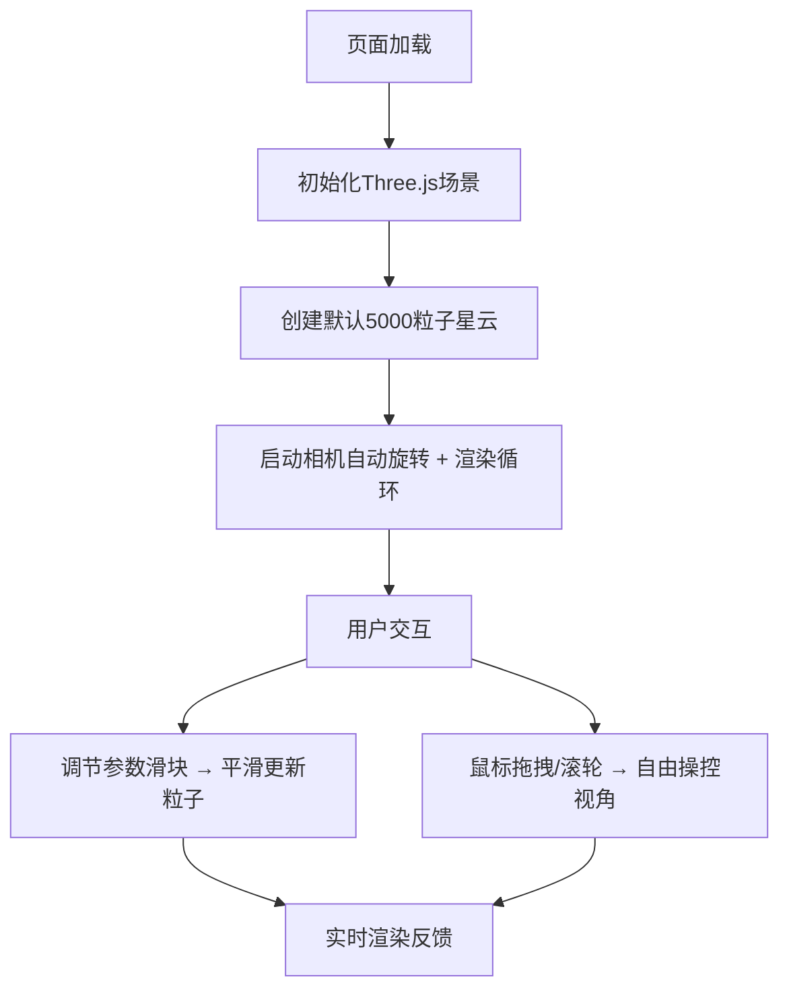

## 1. 产品概述
3D交互式星云粒子生成器，用户可通过调整参数实时生成并漫游在绚丽的星云粒子系统中，模拟宇宙中的彩色星云效果。面向天文爱好者、视觉设计师和创意开发者，提供沉浸式的宇宙视觉体验。

## 2. 核心功能

### 2.1 功能模块
1. **3D星云粒子系统**：高性能粒子渲染，支持5000+粒子实时渲染
2. **参数控制面板**：右侧悬浮面板，实时调节粒子系统核心参数
3. **相机交互系统**：自动旋转 + 鼠标自由操控（旋转/平移/缩放）
4. **视觉效果系统**：深空渐变背景、毛玻璃UI、渐变色彩粒子

### 2.2 页面详情
| 页面名称 | 模块名称 | 功能描述 |
|-----------|-------------|---------------------|
| 主页面 | 3D场景渲染 | 全屏Canvas渲染星云粒子系统，深空径向渐变背景 |
| 主页面 | 粒子系统 | 球壳分布粒子，颜色渐变（橙红→蓝紫），透明度和大小随机 |
| 主页面 | 控制面板 | 四个滑块控制：粒子数量、色相偏移、扩散半径、旋转速度 |
| 主页面 | 相机控制 | 自动环绕旋转（60秒/周），支持鼠标拖拽旋转、右键平移、滚轮缩放 |

## 3. 核心流程
用户进入页面即可看到默认5000粒子的星云系统，相机自动缓慢环绕。用户可通过右侧滑块实时调整参数，粒子系统平滑重绘；通过鼠标拖拽/滚轮自由探索星云。

## 4. 用户界面设计

### 4.1 设计风格
- **主色调**：深空黑 `#000000` → 深蓝 `#0a0a2e` 径向渐变背景
- **粒子色彩**：中心暖色（橙红 `#ff6b35`）向外过渡到冷色（蓝紫 `#6366f1`）
- **UI风格**：半透明毛玻璃效果（`backdrop-filter: blur(10px)`），科技感深色主题
- **字体**：参数标签使用等宽字体（`JetBrains Mono` / `Consolas`）
- **滑块样式**：轨道渐变色（紫→蓝），圆形滑块拇指带柔和阴影

### 4.2 页面设计概述
| 页面名称 | 模块名称 | UI元素 |
|-----------|-------------|-------------|
| 主页面 | 3D场景 | 全屏Canvas，深空径向渐变背景，无边界沉浸式体验 |
| 主页面 | 控制面板 | 右侧固定宽度320px，半透明黑色背景（rgba(10,10,30,0.7)），毛玻璃模糊，圆角16px，内边距24px |
| 主页面 | 滑块控件 | 自定义渐变轨道，圆形滑块拇指（直径18px），数值显示使用等宽字体 |
| 主页面 | 交互反馈 | 滑块hover时缩放1.05，参数变化时粒子平滑过渡 |

### 4.3 响应性
桌面端优先设计，全屏Canvas自适应窗口大小，控制面板固定在右侧，不支持移动端触控操作。

### 4.4 3D场景指导
- **环境**：纯深空背景，无雾效，高对比度突出粒子
- **光照**：使用粒子自发光（`AdditiveBlending`），无需额外光源
- **相机设置**：PerspectiveCamera，fov=75，near=0.1，far=1000，初始位置(0, 0, 25)
- **相机运动**：自动环绕Y轴旋转，角速度`2π/60`弧度/秒
- **交互**：`OrbitControls`，enableDamping=true，dampingFactor=0.05，zoomSpeed=0.9
- **粒子材质**：`PointsMaterial`，`AdditiveBlending`，`depthWrite=false`，圆形精灵贴图
- **性能优化**：使用`BufferGeometry`，单`Points`对象渲染所有粒子，避免频繁重建几何体
