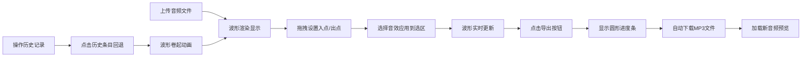

## 1. 产品概述

播客创作工具是一款面向播客创作者的在线轻量级音频编辑平台，解决当前浏览器中缺乏免费且功能完整的音频编辑平台，创作者往往需要安装复杂桌面软件的痛点。

- **核心价值**：提供一站式音频剪辑、音效添加和导出分享的完整工作流
- **目标用户**：播客创作者、音频内容制作者、自媒体人
- **市场定位**：浏览器即可使用的免费专业级音频编辑工具

## 2. 核心功能

### 2.1 功能模块
1. **波形编辑器**：音频上传、波形显示、缩放控制、入点出点标记、选区高亮
2. **音效处理**：淡入、淡出、回声、变速、翻转五种预设音效
3. **导出分享**：音频合成、MP3导出、下载、进度显示
4. **历史管理**：操作记录、撤销/重做、状态回退

### 2.3 页面详情
| 页面名称 | 模块名称 | 功能描述 |
|-----------|-------------|---------------------|
| 主编辑页 | 左侧控制栏 | 上传按钮、导出按钮、撤销/重做按钮 |
| 主编辑页 | 波形编辑区 | 蓝色渐变波形显示、滚轮缩放、入出点三角形标记、选区绿色高亮 |
| 主编辑页 | 右侧面板 | 音效库（5种彩色图标按钮）、历史时间线（可点击回退） |

## 3. 核心流程

## 4. 用户界面设计

### 4.1 设计风格
- **主背景**：#1a1a2e（深蓝黑色）
- **卡片背景**：#16213e（深海军蓝）
- **文字颜色**：#e0e0e0（浅灰色）
- **强调色**：#0f3460（深蓝）、#53a8b6（青蓝色）
- **音效图标颜色**：淡入#22c55e（绿）、淡出#ef4444（红）、回声#a855f7（紫）、变速#f97316（橙）、翻转#3b82f6（蓝）
- **按钮风格**：圆角8px，悬停时轻微上浮，按下时有下压阴影
- **字体**：使用现代无衬线字体，标题16px粗体，正文14px常规
- **布局**：左中右三栏布局，中间波形区占主体宽度，右侧面板固定300px

### 4.2 页面设计概述
| 页面名称 | 模块名称 | UI元素 |
|-----------|-------------|-------------|
| 主编辑页 | 左侧控制栏 | 上传拖拽区、导出按钮、撤销/重做按钮组 |
| 主编辑页 | 波形编辑区 | Canvas绘制蓝色渐变波形、细网格背景、三角形标记、时间戳显示 |
| 主编辑页 | 右侧面板 | 音效按钮网格、历史时间线列表、回退动画效果 |

### 4.3 响应式设计
- **桌面端**（≥768px）：左中右三栏标准布局
- **移动端**（<768px）：右侧面板折叠为底部抽屉，向上箭头按钮展开/收起，0.3秒滑入滑出动画
- **触摸优化**：增加按钮点击区域，优化拖拽操作手感

### 4.4 动画与交互
- **音效按钮**：点击时弹性缩小动画（0.15秒）
- **历史回退**：波形卷起动画（0.3秒）
- **抽屉面板**：底部滑入滑出（0.3秒）
- **导出进度**：圆形进度条动画，与编码时间同步
- **标记悬停**：三角形标记悬停变为黄色
