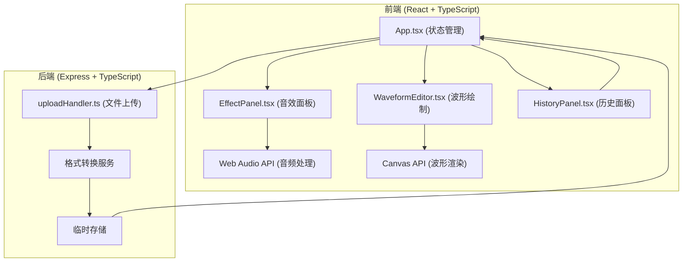

## 1. 架构设计



## 2. 技术描述

- **前端框架**：React 18 + TypeScript
- **构建工具**：Vite
- **后端框架**：Express 4
- **音频处理**：Web Audio API（浏览器端）
- **波形渲染**：Canvas API
- **状态管理**：React useState/useReducer（内置）
- **文件上传**：Multer
- **音频编码**：wav-encoder、mp3-encoder
- **中间件**：CORS

## 3. 项目结构

```
project-root/
├── package.json
├── vite.config.js
├── tsconfig.json
├── index.html
├── src/
│   ├── App.tsx
│   └── components/
│       ├── WaveformEditor.tsx
│       ├── EffectPanel.tsx
│       └── HistoryPanel.tsx
└── server/
    └── uploadHandler.ts
```

## 4. 路由定义

| 路由 | 方法 | 用途 |
|-------|------|---------|
| /upload | POST | 音频文件上传，返回处理后的文件URL |
| /convert | POST | 音频格式转换（WAV ↔ MP3） |
| /health | GET | 服务健康检查 |

## 5. API 定义

### 5.1 上传接口
```typescript
interface UploadRequest {
  file: File; // mp3 或 wav 格式
}

interface UploadResponse {
  success: boolean;
  fileUrl: string;
  duration: number;
  sampleRate: number;
  channels: number;
}
```

### 5.2 转换接口
```typescript
interface ConvertRequest {
  audioData: Float32Array[];
  sampleRate: number;
  format: 'mp3' | 'wav';
}

interface ConvertResponse {
  success: boolean;
  blob: Blob;
  filename: string;
}
```

## 6. 核心数据模型

### 6.1 应用状态
```typescript
interface AppState {
  audioBuffer: AudioBuffer | null;
  audioData: Float32Array | null;
  inPoint: number;
  outPoint: number;
  zoomLevel: number;
  effects: AppliedEffect[];
  history: HistoryEntry[];
  historyIndex: number;
  isExporting: boolean;
  exportProgress: number;
  isPanelOpen: boolean;
}

interface AppliedEffect {
  type: 'fadeIn' | 'fadeOut' | 'echo' | 'speed' | 'reverse';
  startTime: number;
  endTime: number;
  params: Record<string, number>;
}

interface HistoryEntry {
  id: string;
  timestamp: number;
  type: string;
  description: string;
  icon: string;
  state: Partial<AppState>;
}
```

### 6.2 音效参数
```typescript
interface EffectConfig {
  fadeIn: { duration: number; startGain: number; endGain: number };
  fadeOut: { duration: number; startGain: number; endGain: number };
  echo: { delay: number; decay: number };
  speed: { minRate: number; maxRate: number; defaultRate: number };
  reverse: {};
}
```

## 7. 性能指标

- **波形渲染延迟**：≤ 200ms
- **音效应用延迟**：≤ 200ms
- **播放帧率**：≥ 30fps
- **拖拽帧率**：≥ 30fps
- **响应时间**：用户操作反馈 ≤ 100ms

## 8. 状态管理数据流

```
用户操作 → App.tsx 状态更新 → 子组件重新渲染
    ↑                          ↓
    └── 历史记录写入 ← 音效应用 ← 波形更新
```
