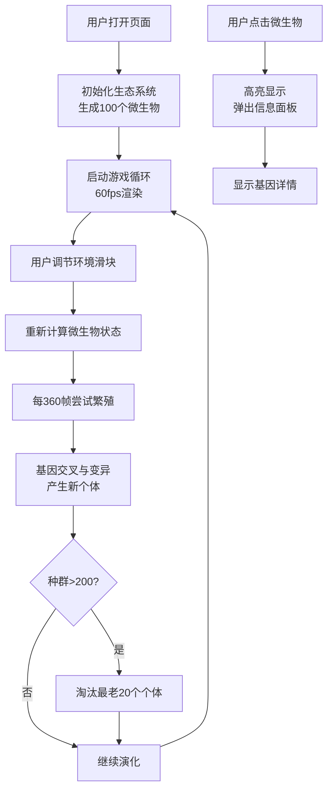

## 1. 产品概述

本产品是一个基于生物发光机制的模拟进化游戏应用，让玩家通过调整环境压力参数，驱动虚拟微生物群落在屏幕上自主进化出不同的发光模式和行为策略。

- 主要用途：科学教育与娱乐结合，让用户直观理解环境压力对生物进化的影响
- 目标用户：对生物学、进化理论感兴趣的学生、教育工作者和游戏玩家
- 产品价值：将抽象的进化概念可视化，通过互动方式展示自然选择机制

## 2. 核心功能

### 2.1 功能模块

1. **主画布区域**：600x600 Canvas，展示微生物群落动态演化
2. **环境控制面板**：温度和营养浓度两个滑块，调节环境压力
3. **实时统计面板**：显示种群数量、平均发光强度、变异发生率
4. **微生物信息面板**：点击单个微生物查看详细基因信息
5. **繁殖与进化系统**：每3秒尝试繁殖，基因交叉与变异机制

### 2.2 页面详情

| 页面名称 | 模块名称 | 功能描述 |
|---------|---------|----------|
| 主页面 | Canvas 渲染引擎 | 绘制发光微生物、粒子拖尾、光晕效果、背景星空 |
| 主页面 | 生态系统模拟器 | 管理微生物种群、繁殖、碰撞检测、环境压力计算 |
| 主页面 | 环境控制面板 | 温度滑块(10-40℃)、营养浓度滑块(0-100%)、参数标签显示 |
| 主页面 | 统计信息展示 | 种群数量、平均发光强度、变异发生率实时更新 |
| 主页面 | 交互系统 | 点击微生物查看详情、响应式布局适配 |

## 3. 核心流程

## 4. 用户界面设计

### 4.1 设计风格

- **设计理念**：深海神秘氛围，有机生物发光美学
- **主色调**：深黑色背景(#0a0a0a)，微生物发光色基于HSL色相(0-360°)
- **辅助色**：深蓝色渐变光晕、浅灰色文字(#cccccc)、白色高亮
- **字体**：采用 'Space Mono' 等宽字体搭配 'Orbitron' 科技感字体
- **视觉元素**：径向渐变光晕、粒子拖尾、玻璃态面板、微光效果
- **动效风格**：平滑过渡、弹性动画、淡入淡出、发光脉冲

### 4.2 页面设计概述

| 页面名称 | 模块名称 | UI 元素 |
|---------|---------|---------|
| 主页面 | Canvas 画布 | 600x600 居中显示，四周深蓝渐变光晕，深黑背景模拟深海 |
| 主页面 | 右侧控制面板 | 玻璃态半透明(rgba(20,20,30,0.7))，圆角，细边框，模糊背景 |
| 主页面 | 滑块控件 | 圆角自定义样式，半透明背景，圆形滑块带微光效果 |
| 主页面 | 统计卡片 | 等宽排列，深色半透明圆角容器，文字发光阴影 |
| 主页面 | 信息面板 | 半透明深色背景，圆角，阴影，左侧滑入动画 |
| 主页面 | 参数标签 | 右下角淡入动画显示当前参数组合 |

### 4.3 响应式设计

- **桌面端(≥768px)**：画布居中，控制面板在右侧水平布局
- **移动端(<768px)**：垂直布局，控制面板移至底部，画布自适应缩放
- **触控优化**：滑块和点击区域增大，确保触控操作流畅

### 4.4 视觉特效

- **微生物渲染**：核心圆形 + 径向渐变光晕，透明度随发光强度变化
- **粒子拖尾**：移动时留下淡出粒子，寿命30帧
- **繁殖闪光**：新个体诞生时画布闪烁微弱白光
- **出生动画**：子代从0.5倍缩放到1倍的弹入动画
- **死亡动画**：被淘汰个体淡出消失
- **高亮效果**：选中微生物外围白色圆弧闪烁，周期1.5秒
- **背景效果**：星空渐变，四周微弱光晕
