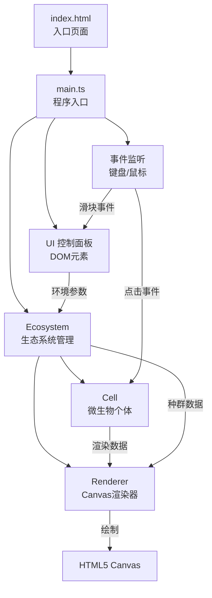

## 1. 架构设计



## 2. 技术描述

* **前端框架**：原生 TypeScript + HTML5 Canvas API（无第三方游戏引擎）

* **构建工具**：Vite 5.x，启用 ES 模块和 TypeScript 支持

* **开发语言**：TypeScript 5.x，严格模式

* **样式方案**：原生 CSS + CSS 变量，实现玻璃态、动画效果

* **无后端**：纯前端应用，所有逻辑在客户端运行

## 3. 文件结构

| 文件路径               | 用途                             |
| ------------------ | ------------------------------ |
| `package.json`     | 项目依赖管理（typescript、vite），启动脚本   |
| `vite.config.js`   | Vite 构建配置，ES 模块支持              |
| `tsconfig.json`    | TypeScript 配置，严格模式，ESNext 模块解析 |
| `index.html`       | 入口页面，全屏深黑背景，Canvas 和控制面板       |
| `src/cell.ts`      | 微生物类：位置、基因、行为、繁殖逻辑             |
| `src/ecosystem.ts` | 生态系统管理：种群、更新、繁殖、统计             |
| `src/renderer.ts`  | Canvas 渲染：光晕、粒子、背景、动画          |
| `src/main.ts`      | 程序入口：初始化、游戏循环、事件绑定             |

## 4. 核心数据模型

### 4.1 基因结构 (Gene)

```typescript
interface Gene {
  glowIntensity: number;      // 发光强度 0-255
  moveSpeed: number;          // 移动速度 0.5-2.5 像素/帧
  colorHue: number;           // 颜色色相 0-360 度
  reproductionThreshold: number; // 繁殖阈值 0-100
}
```

### 4.2 微生物类 (Cell)

```typescript
class Cell {
  id: number;
  x: number;                  // X 坐标
  y: number;                  // Y 坐标
  radius: number;             // 核心半径 3-5 像素
  angle: number;              // 移动方向角度
  gene: Gene;                 // 基因数据
  life: number;               // 当前生命值
  age: number;                // 存活帧数
  isSelected: boolean;        // 是否被选中
  birthAnimation: number;     // 出生动画进度 0-1
  deathAnimation: number;     // 死亡动画进度 0-1
  trailParticles: Particle[]; // 拖尾粒子

  update(envParams: EnvParams): void;
  tryReproduce(partner: Cell): Cell | null;
  containsPoint(px: number, py: number): boolean;
}
```

### 4.3 环境参数 (EnvParams)

```typescript
interface EnvParams {
  temperature: number;        // 温度 10-40℃
  nutrition: number;          // 营养浓度 0-100%
}
```

### 4.4 粒子 (Particle)

```typescript
interface Particle {
  x: number;
  y: number;
  life: number;               // 剩余寿命 0-30 帧
  maxLife: number;            // 最大寿命
  size: number;
}
```

## 5. 核心算法

### 5.1 环境压力计算

* 温度影响：每升高 1℃，发光强度 +5%，移动速度 -0.03 像素/帧

* 营养影响：每降低 10%，繁殖阈值 +10%

```
effectiveGlow = baseGlow * (1 + (temperature - 25) * 0.05)
effectiveSpeed = baseSpeed - (temperature - 25) * 0.03
effectiveThreshold = baseThreshold * (1 + (50 - nutrition) / 100 * 0.1)
```

### 5.2 繁殖逻辑

* 每 360 帧（3秒）触发一次繁殖尝试

* 随机选择 30 像素内的邻近个体

* 双方生命值 > 繁殖阈值才能繁殖

* 基因交叉：子代基因 = 亲本A基因 × 0.5 + 亲本B基因 × 0.5

* 随机变异：±10% 范围内随机调整

### 5.3 种群控制

* 种群上限：200 个

* 超过上限时淘汰最老的 20 个个体

* 粒子拖尾上限：500 个，超过时淘汰最旧粒子

## 6. 性能优化策略

1. **对象池模式**：复用粒子对象，避免频繁 GC
2. **分层渲染**：先绘制背景，再绘制粒子，最后绘制微生物
3. **空间分区**：繁殖检测时使用网格空间分区减少碰撞检测次数
4. **帧率控制**：使用 `requestAnimationFrame` 确保 60fps
5. **状态缓存**：计算结果缓存，避免重复计算

