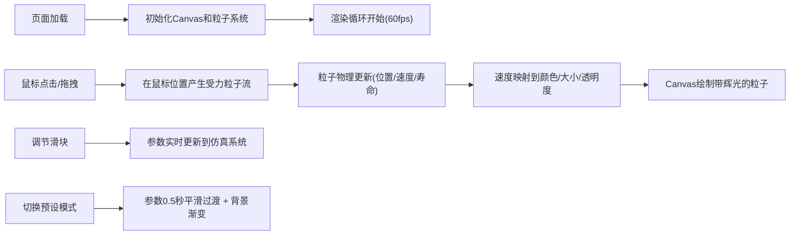

## 1. 产品概述
交互式流体仿真沙盒是一款基于浏览器的动态视觉艺术创作工具，让艺术家和前端爱好者通过鼠标交互塑造流动的彩色粒子流，模拟火焰、烟雾或水流等自然流体效果。
- 核心价值：提供直观、高性能的粒子流体交互体验，激发创意灵感
- 目标用户：艺术家、视觉设计师、前端开发者、创意编程爱好者

## 2. 核心功能

### 2.1 功能模块
1. **粒子仿真系统**：2000-5000个粒子的实时物理模拟，速度驱动的颜色渐变、大小和透明度动态变化
2. **鼠标交互系统**：点击/拖拽产生受力粒子流，拖拽轨迹留下彩色尾迹，松开后粒子自然消散
3. **控制面板**：半透明毛玻璃效果面板，可拖拽移动，三个滑块调节粒子参数
4. **预设模式系统**：火焰模式和烟云模式一键切换，参数平滑过渡，背景渐变切换
5. **渲染引擎**：Canvas 2D API 手动绘制，60fps流畅更新，霓虹辉光视觉效果

### 2.2 页面详情
| 页面名称 | 模块名称 | 功能描述 |
|---------|----------|---------|
| 主画布 | 粒子仿真渲染 | 全屏深灰背景，实时渲染2000-5000个彩色粒子，响应鼠标交互产生流体效果 |
| 控制面板 | 参数调节 | 三个滑块分别控制粒子寿命(2-10秒)、扩散速度(1-5)、颜色偏移(0-360度)，实时数值显示 |
| 预设模式 | 模式切换 | 火焰/烟云模式按钮，点击后所有参数0.5秒平滑过渡，背景色渐变切换 |

## 3. 核心流程
用户打开页面后看到全屏粒子背景，通过点击或拖拽鼠标与粒子交互产生流体效果；可通过左下角控制面板调节粒子参数，或切换预设模式快速改变整体视觉风格；所有交互实时反馈，松开鼠标后粒子自然消散。

## 4. 用户界面设计

### 4.1 设计风格
- **主色调**：深灰背景(#1a1a2e)，霓虹粒子色（蓝紫→橙红渐变）
- **控制面板**：半透明毛玻璃效果(backdrop-filter: blur(8px))，深色半透明背景
- **滑块风格**：霓虹光效滑块，阻尼过渡动画(0.2秒)，实时数值显示
- **按钮风格**：圆角按钮，hover时发光效果，点击时微缩放
- **字体**：现代无衬线字体，清晰易读，配合霓虹光效
- **布局**：全屏Canvas + 左下角浮动控制面板，支持面板拖拽移动
- **视觉特效**：粒子辉光(shadowBlur)、拖拽光晕动画、背景渐变过渡

### 4.2 页面设计概述
| 页面名称 | 模块名称 | UI元素 |
|---------|----------|--------|
| 主画布 | 粒子渲染 | 全屏Canvas，深灰背景，动态彩色粒子，鼠标位置光晕，拖拽尾迹 |
| 控制面板 | 参数滑块 | 毛玻璃面板，三个带数值显示的滑块，阻尼过渡动画 |
| 控制面板 | 模式按钮 | 火焰/烟云两个预设按钮，平滑过渡动画 |

### 4.3 响应式
- 桌面端优先设计，最小适配1024x768分辨率
- Canvas自适应窗口大小变化
- 控制面板位置可拖拽，避免遮挡交互区域
- 移动端适配触摸事件支持

### 4.4 性能优化
- 粒子数量动态平衡在2000-5000之间
- 采用Canvas 2D硬件加速绘制
- 使用requestAnimationFrame高效渲染循环
- 对象池复用粒子实例，减少GC开销
- 主流笔记本拖拽时保持≥45fps
