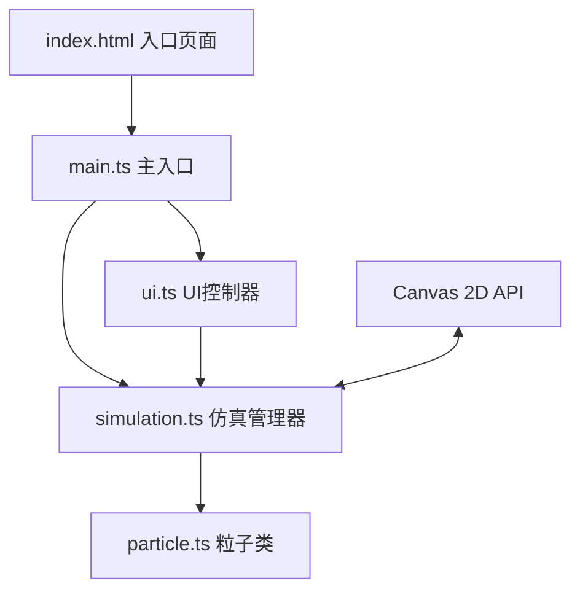

## 1. 架构设计

本项目为纯前端Canvas粒子仿真应用，采用模块化分层架构，分离粒子逻辑、仿真管理、UI控制和入口初始化，便于维护和扩展。



## 2. 技术描述

* **前端**：TypeScript + Vite + Canvas 2D API

* **构建工具**：Vite 5.x（启用TypeScript支持）

* **编程语言**：TypeScript 5.x（严格模式）

* **无第三方图形库**：所有图形绘制通过原生Canvas API手动实现

* **依赖包**：typescript、vite（仅开发依赖）

* **启动方式**：npm run dev

### 文件结构

```
/
├── package.json          # 项目配置和依赖
├── vite.config.js        # Vite构建配置
├── tsconfig.json         # TypeScript配置（严格模式）
├── index.html            # 入口HTML页面
└── src/
    ├── particle.ts       # 粒子类定义
    ├── simulation.ts     # 仿真系统（粒子管理+物理+渲染）
    ├── ui.ts             # 控制面板UI逻辑
    └── main.ts           # 应用入口（初始化+事件绑定）
```

## 3. 核心类与方法

### 3.1 Particle 类 (src/particle.ts)

| 方法/属性                                   | 类型      | 描述                 |
| --------------------------------------- | ------- | ------------------ |
| x, y                                    | number  | 粒子位置               |
| vx, vy                                  | number  | 粒子速度               |
| life                                    | number  | 当前寿命（秒）            |
| maxLife                                 | number  | 最大寿命               |
| baseHue                                 | number  | 基础色相               |
| constructor(x, y, vx, vy, maxLife, hue) | 方法      | 创建新粒子              |
| update(dt, diffusion)                   | boolean | 更新物理状态，返回是否存活      |
| getSpeed()                              | number  | 获取当前速度             |
| getColor(hueOffset)                     | string  | 获取颜色（基于速度映射从蓝紫到橙红） |
| getSize()                               | number  | 获取大小（速度映射）         |
| getAlpha()                              | number  | 获取透明度（速度+寿命映射）     |

### 3.2 Simulation 类 (src/simulation.ts)

| 方法/属性                             | 类型          | 描述            |
| --------------------------------- | ----------- | ------------- |
| particles                         | Particle\[] | 粒子数组          |
| particleLife                      | number      | 粒子寿命参数        |
| diffusion                         | number      | 扩散速度参数        |
| hueOffset                         | number      | 颜色偏移参数        |
| mouseX, mouseY                    | number      | 鼠标位置          |
| isMouseDown                       | boolean     | 鼠标是否按下        |
| constructor(canvas)               | 方法          | 初始化仿真系统       |
| setParticleLife(value)            | void        | 设置粒子寿命（带平滑过渡） |
| setDiffusion(value)               | void        | 设置扩散速度（带平滑过渡） |
| setHueOffset(value)               | void        | 设置颜色偏移（带平滑过渡） |
| applyPreset(mode)                 | void        | 应用预设模式（火焰/烟云） |
| emitParticles(x, y, count, force) | void        | 发射新粒子         |
| update(dt)                        | void        | 更新所有粒子物理      |
| render(ctx)                       | void        | 渲染所有粒子        |
| resize(width, height)             | void        | 处理窗口大小变化      |

### 3.3 UIController 类 (src/ui.ts)

| 方法/属性                                          | 类型          | 描述         |
| ---------------------------------------------- | ----------- | ---------- |
| panel                                          | HTMLElement | 控制面板DOM元素  |
| constructor(simulation)                        | 方法          | 初始化UI控制器   |
| createSlider(label, min, max, value, onChange) | HTMLElement | 创建带数值显示的滑块 |
| createPresetButton(label, mode)                | HTMLElement | 创建预设模式按钮   |
| enableDrag()                                   | void        | 启用面板拖拽功能   |
| updateDisplay()                                | void        | 更新UI显示值    |

## 4. 性能优化策略

### 4.1 渲染优化

* 使用单个Canvas元素，避免频繁DOM操作

* 采用`requestAnimationFrame`驱动渲染循环，与显示器刷新率同步

* 粒子数量动态调整，保持在2000-5000之间

* 使用对象池模式复用粒子对象，减少GC压力

* 批量绘制同类型粒子，减少状态切换开销

### 4.2 物理优化

* 使用简单高效的物理模型（阻尼运动+随机扰动）

* 每帧粒子更新采用增量时间(dt)，保证不同帧率下表现一致

* 死亡粒子立即回收复用，避免数组频繁扩容

### 4.3 视觉优化

* 使用Canvas `shadowBlur`实现辉光效果，避免后处理开销

* 颜色预计算，减少每帧HSL转换计算

* 背景使用CSS渐变，Canvas仅绘制粒子

## 5. 交互设计

### 5.1 鼠标事件

* `mousedown`：激活粒子发射，记录起始位置

* `mousemove`：更新鼠标位置，拖拽时持续发射粒子并生成尾迹

* `mouseup`/`mouseleave`：停止粒子发射

* `click`：单次发射一组粒子

### 5.2 UI交互

* 滑块：`input`事件实时更新参数，`transition: 0.2s`实现阻尼感

* 预设按钮：点击后参数在0.5秒内平滑过渡，背景色同步渐变

* 面板拖拽：`mousedown`记录偏移，`mousemove`更新位置，边界检测防止移出屏幕

