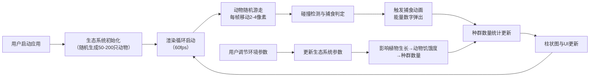

## 1. 产品概述

本产品是一个交互式生态系统能量流动模拟游戏，通过动态可视化方式展示食物链与能量传递过程，解决生态学学习中抽象概念难以直观理解的问题。

- 核心价值：将复杂的生态系统能量流动转化为直观的动态模拟，帮助学生和爱好者理解捕食关系、环境参数对生态平衡的影响
- 目标用户：生物学学习者、教师、生态系统爱好者
- 主要功能：800x800像素地图上的动物行为模拟、捕食关系动画、环境参数调节、种群数量实时统计

## 2. 核心特性

### 2.1 功能模块

1. **生态模拟主画布**：800x800像素草地渐变背景，动物随机游走与捕食交互
2. **环境参数控制面板**：温度、降水量、光照强度、污染指数的滑块调节
3. **食物链关系树状图**：可折叠的捕食关系可视化展示
4. **种群数量柱状图**：实时统计并展示各物种数量变化

### 2.2 页面详情

| 页面名称 | 模块名称 | 功能描述 |
|-----------|-------------|---------------------|
| 主页面 | 生态模拟画布 | 8种植食/肉食动物随机游走，捕食动画效果，饥饿度显示 |
| 主页面 | 环境控制面板 | 4个参数滑块，渐变轨道，实时影响生态系统 |
| 主页面 | 食物链树状图 | 可折叠，彩色节点，捕食方向箭头，0.3s平滑动画 |
| 主页面 | 种群柱状图 | 底部实时显示，0.5s高度过渡动画，颜色与动物一致 |

## 3. 核心流程

## 4. 用户界面设计

### 4.1 设计风格

- **主色调**：草地绿色渐变背景（#2d5016 → #7cb342），蓝灰半透明控制面板（rgba(30, 58, 95, 0.7)）
- **动物配色**：兔子（白色椭圆）、羊（米白菱形）、鹿（棕色矩形）、仓鼠（橙色圆）、松鼠（红棕色五边形）、狼（灰色三角）、鹰（深蓝梯形）、蛇（绿色波浪）
- **字体**：展示字体用 Noto Sans SC Display，正文用 Noto Sans SC
- **布局**：主画布70%宽度，右侧控制面板30%宽度，左侧悬浮食物链树状图，底部种群柱状图
- **动效**：捕食闪烁动画、能量数字上浮消失、滑块渐变轨道、树状图0.3s展开动画、柱状图0.5s高度过渡

### 4.2 界面布局

| 区域 | 位置 | 关键元素 |
|-----------|-------------|-------------|
| 主画布 | 左侧70% | 800x800 Canvas，草地渐变，动物图形，捕食动画，饥饿条 |
| 控制面板 | 右侧30% | 毛玻璃效果，圆角16px，4个带SVG图标的参数滑块，渐变轨道 |
| 食物链图 | 左侧悬浮 | 可折叠按钮，彩色节点，绿色箭头，平滑展开/收缩 |
| 柱状图 | 画布底部 | 8个彩色柱子，实时数值，0.5s过渡动画 |

### 4.3 响应式设计

- 桌面端（≥1280px）：主画布70% + 控制面板30% 并排布局
- iPad横屏（1024-1279px）：主画布65% + 控制面板35%，保持800x800画布居中
- 触控优化：滑块增加触控热区，按钮最小尺寸44x44px

### 4.4 交互细节

- 滑块拖动时：参数值实时更新，Web Audio API发出正弦波提示音（音高随参数变化）
- 捕食发生时：被捕食者闪烁3次变暗消失，捕食者上方弹出"+N能量"数字向上浮动消失
- 树状图点击：0.3s平滑展开/收缩，节点间绿色箭头指示捕食方向
- 柱状图更新：高度变化使用0.5s ease-out过渡动画
