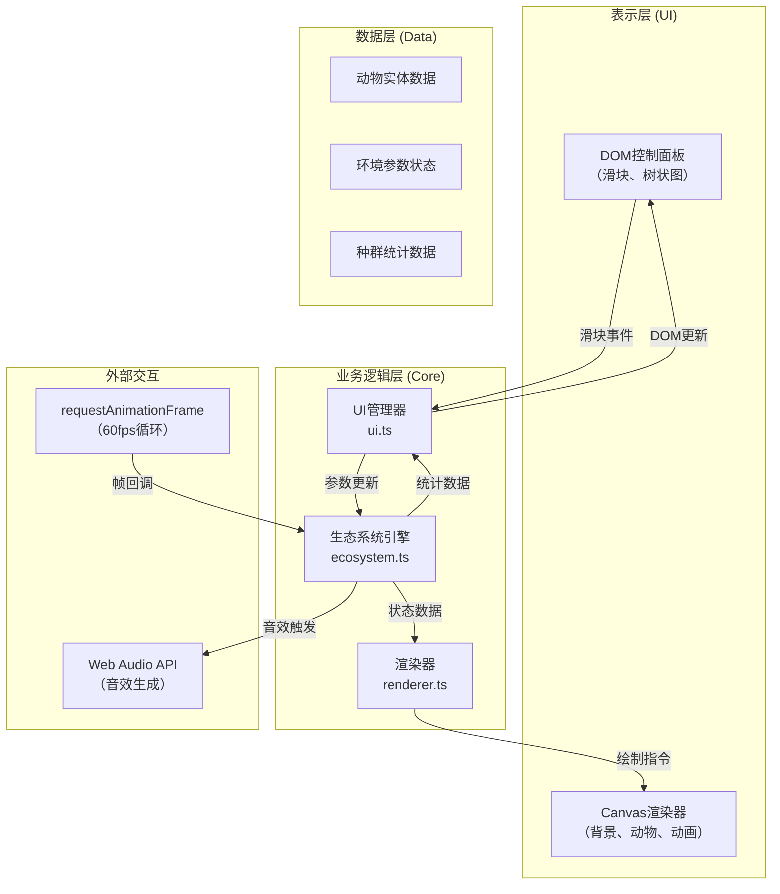

## 1. 架构设计



## 2. 技术选型

- **构建工具**：Vite 5.x + TypeScript 5.x
- **渲染技术**：HTML5 Canvas 2D API（无第三方游戏引擎）
- **UI框架**：原生DOM + CSS（无框架依赖，保持轻量）
- **音效**：Web Audio API（OscillatorNode 生成正弦波）
- **动画**：requestAnimationFrame + CSS transitions
- **开发依赖**：typescript、vite

## 3. 项目结构

```
auto37/
├── package.json          # 项目依赖与脚本
├── vite.config.js        # Vite构建配置
├── tsconfig.json         # TypeScript严格模式配置
├── index.html            # 入口HTML
└── src/
    ├── main.ts           # 应用入口，初始化各模块
    ├── ecosystem.ts      # 生态系统核心逻辑
    ├── renderer.ts       # Canvas渲染器
    ├── ui.ts             # UI控制面板管理
    └── types.ts          # 类型定义
```

## 4. 核心数据模型

### 4.1 类型定义

```typescript
// 动物类型
type AnimalType = 'rabbit' | 'sheep' | 'deer' | 'hamster' | 'squirrel' | 'wolf' | 'eagle' | 'snake';

// 食性
type Diet = 'herbivore' | 'carnivore';

// 动物实体
interface Animal {
  id: number;
  type: AnimalType;
  diet: Diet;
  x: number;
  y: number;
  vx: number;
  vy: number;
  hunger: number;        // 0-100，越高越饿
  maxHunger: number;
  energy: number;
  color: string;
  size: number;
  isDying: boolean;
  deathAnimation: number;
}

// 环境参数
interface EnvironmentParams {
  temperature: number;   // -10 ~ 50°C
  precipitation: number; // 0 ~ 500mm
  light: number;         // 0 ~ 100%
  pollution: number;     // 0 ~ 100%
}

// 捕食关系
const PREDATION_MAP: Record<AnimalType, AnimalType[]> = {
  wolf: ['rabbit', 'sheep', 'deer', 'hamster'],
  eagle: ['rabbit', 'squirrel', 'hamster'],
  snake: ['hamster', 'squirrel', 'rabbit'],
};

// 动物配置
const ANIMAL_CONFIG: Record<AnimalType, { diet: Diet; color: string; size: number; hungerRate: number }> = {
  rabbit: { diet: 'herbivore', color: '#ffffff', size: 12, hungerRate: 0.1 },
  sheep: { diet: 'herbivore', color: '#f5f5dc', size: 18, hungerRate: 0.08 },
  deer: { diet: 'herbivore', color: '#8b4513', size: 22, hungerRate: 0.06 },
  hamster: { diet: 'herbivore', color: '#ffa500', size: 8, hungerRate: 0.15 },
  squirrel: { diet: 'herbivore', color: '#a0522d', size: 10, hungerRate: 0.12 },
  wolf: { diet: 'carnivore', color: '#808080', size: 20, hungerRate: 0.05 },
  eagle: { diet: 'carnivore', color: '#1e3a5f', size: 16, hungerRate: 0.07 },
  snake: { diet: 'carnivore', color: '#228b22', size: 14, hungerRate: 0.09 },
};
```

### 4.2 数据流向

1. **初始化**：用户配置初始动物数量 → ecosystem.ts 生成随机位置的动物数组
2. **帧更新**：requestAnimationFrame 触发 → 每帧更新动物位置、饥饿度 → 碰撞检测 → 捕食逻辑
3. **参数更新**：滑块事件 → ui.ts → ecosystem.updateParams() → 影响植物密度 → 影响植食动物饥饿度
4. **渲染**：renderer.ts 从 ecosystem 获取状态 → Canvas 绘制背景、动物、动画、柱状图

## 5. 性能优化策略

- **空间分区**：将800x800地图划分为网格（50x50每格），碰撞检测只检测相邻格子
- **对象池**：捕食动画和能量数字使用对象池复用，避免频繁GC
- **批量绘制**：同类动物统一绘制路径，减少Canvas API调用
- **节流**：种群统计每10帧更新一次，UI更新与渲染解耦
- **离屏Canvas**：背景网格预先绘制到离屏Canvas缓存

## 6. API定义（内部模块接口）

### ecosystem.ts 暴露接口

```typescript
class Ecosystem {
  constructor(initialCount: number);
  update(deltaTime: number): void;
  setParams(params: Partial<EnvironmentParams>): void;
  getAnimals(): Animal[];
  getPopulationStats(): Record<AnimalType, number>;
  getPlantDensity(): number;
  getFloatingTexts(): FloatingText[];
}
```

### renderer.ts 暴露接口

```typescript
class Renderer {
  constructor(canvas: HTMLCanvasElement, ecosystem: Ecosystem);
  render(): void;
  resize(width: number, height: number): void;
}
```

### ui.ts 暴露接口

```typescript
class UIManager {
  constructor(container: HTMLElement, ecosystem: Ecosystem, audio: AudioManager);
  init(): void;
  updatePopulation(stats: Record<AnimalType, number>): void;
}
```
