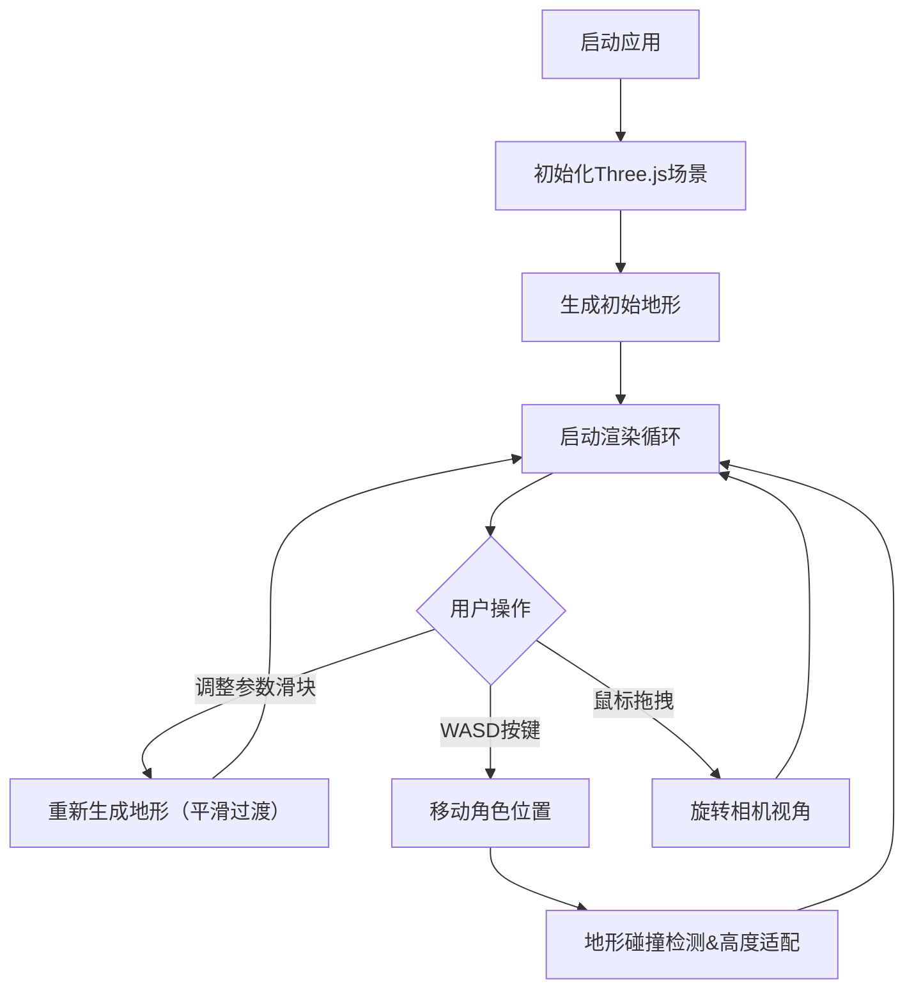

## 1. 产品概述
3D交互式地形生成与漫游应用，用户通过调整参数实时生成随机地形并在其中自由行走探索。
- 主要用途：提供沉浸式的3D地形探索体验，支持参数化地形生成
- 目标用户：对3D图形、地形生成算法感兴趣的开发者和爱好者
- 产品价值：直观展示柏林噪声地形生成原理，提供流畅的第一人称漫游体验

## 2. 核心功能

### 2.1 用户角色
| 角色 | 注册方式 | 核心权限 |
|------|----------|----------|
| 普通用户 | 无需注册 | 调整地形参数、自由漫游探索 |

### 2.2 功能模块
1. **3D场景渲染**：Three.js渲染引擎，实时渲染地形、光照、阴影效果
2. **地形生成系统**：基于柏林噪声算法的参数化地形生成，支持实时调整
3. **第一人称控制器**：WASD移动、鼠标视角控制、地形碰撞检测
4. **参数控制面板**：噪声缩放、高度幅度、地形尺寸、种子值滑块控制
5. **视觉效果系统**：雾效、渐变天空盒、帧率显示

### 2.3 页面详情
| 页面名称 | 模块名称 | 功能描述 |
|-----------|-------------|---------------------|
| 主页面 | 3D场景渲染 | 全屏渲染3D地形场景，支持交互控制 |
| 主页面 | 控制面板 | 左侧半透明面板，提供地形参数调节滑块 |
| 主页面 | 帧率显示 | 左上角实时显示当前帧率 |

## 3. 核心流程
用户打开应用后，自动生成初始绿色丘陵地形。用户可以：
1. 通过左侧控制面板调整地形参数，地形平滑过渡更新
2. 使用WASD键在地形上自由行走，相机高度自动适配地形起伏
3. 按住鼠标左键拖拽旋转视角，体验沉浸式漫游
4. 点击控制面板右上角箭头折叠/展开面板

## 4. 用户界面设计

### 4.1 设计风格
- 主色调：深色系，背景为黑色，控制面板采用深色半透明毛玻璃效果（rgba(20,20,30,0.8)）
- 强调色：渐变蓝紫色用于滑块轨道
- 字体：无衬线字体，扁平化风格
- 布局：全屏3D场景，左侧固定控制面板
- 交互反馈：滑块悬停亮度提升10%，点击下沉效果，过渡动画0.3秒

### 4.2 页面设计概述
| 页面名称 | 模块名称 | UI元素 |
|-----------|-------------|-------------|
| 主页面 | 3D场景 | 全屏黑色背景，渐变天空盒（深蓝到浅橙黄昏效果），雾效淡出，地形网格，光照辅助线（黄色箭头） |
| 主页面 | 控制面板 | 毛玻璃背景，圆角12px，四个参数滑块（带标签和数值显示），折叠箭头按钮 |
| 主页面 | 帧率显示 | 左上角白色半透明文字，每秒更新 |

### 4.3 响应性
- 桌面端优先设计，全屏自适应
- 控制面板固定宽度，不遮挡场景中心区域
- 支持窗口大小变化时自动调整渲染尺寸

### 4.4 3D场景指导
- 环境：黄昏渐变天空盒（顶部深蓝rgb(20,30,80)到底部浅橙rgb(255,180,120)）
- 光照：方向光从右上角照射（强度1.0），环境光（强度0.3）
- 阴影：方向光实时阴影，阴影贴图分辨率2048x2048
- 相机：第一人称视角，位置随WASD移动，俯仰角限制-60°到60°
- 交互：地形参数变化时顶点位置0.5秒平滑过渡，视角旋转阻尼0.9
- 后处理：雾效（起始30单位，结束80单位），地形顶点颜色插值
- 性能预算：128x128分段=16384顶点，目标帧率60fps
