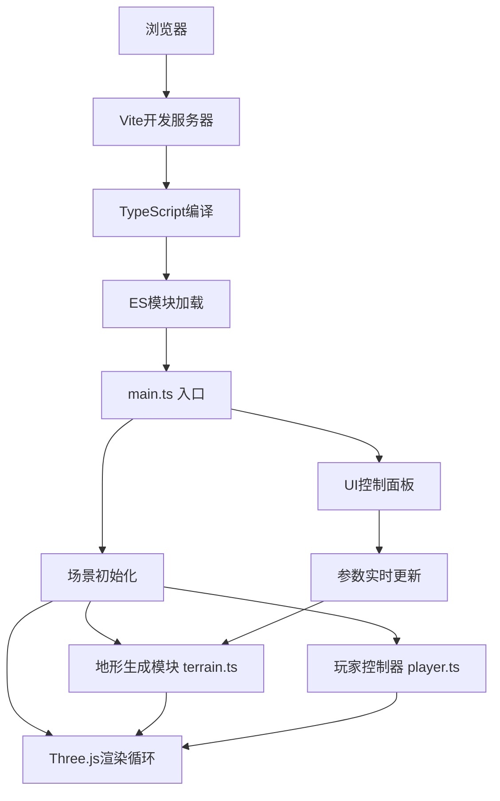

## 1. 架构设计



## 2. 技术描述

* **前端框架**: 原生TypeScript + Three.js，无额外UI框架

* **构建工具**: Vite 5.x，启用ES模块和TypeScript支持

* **3D引擎**: Three.js 0.160.x + OrbitControls（用于参考，实际使用自定义第一人称控制器）

* **类型定义**: @types/three

* **语言**: TypeScript 5.x，严格模式

* **无后端，纯前端应用**

## 3. 文件结构

| 文件路径              | 用途                                          |
| ----------------- | ------------------------------------------- |
| `/package.json`   | 项目依赖配置，包含three、@types/three、typescript、vite |
| `/vite.config.js` | Vite构建配置，启用ES模块和TypeScript支持                |
| `/tsconfig.json`  | TypeScript严格模式配置，ESNext模块解析                 |
| `/index.html`     | 入口页面，全屏黑色背景，加载Three.js渲染器                   |
| `/src/main.ts`    | 入口文件，初始化场景、相机、渲染器，创建GUI，启动动画循环              |
| `/src/terrain.ts` | 地形生成模块，柏林噪声算法，高度图生成，顶点位移和着色                 |
| `/src/player.ts`  | 第一人称控制器，WASD移动，鼠标视角，碰撞检测，相机跟随               |
| `/src/ui.ts`      | 控制面板，原生HTML/CSS，参数滑块，实时更新地形                 |

## 4. 核心模块设计

### 4.1 地形生成模块 (terrain.ts)

```typescript
// 柏林噪声实现
class PerlinNoise {
  constructor(seed: number) {}
  noise2D(x: number, y: number): number {}
}

// 地形生成器
class TerrainGenerator {
  constructor(params: TerrainParams) {}
  generateHeightMap(): Float32Array {}
  createMesh(): THREE.Mesh {}
  updateParams(newParams: Partial<TerrainParams>): void {}
  lerpVertices(targetPositions: Float32Array, duration: number): void {}
}

// 地形参数接口
interface TerrainParams {
  noiseScale: number;      // 0.5-3.0
  heightAmplitude: number; // 1-10
  size: number;            // 50-200
  segments: number;        // 128
  seed: number;            // 1-100
}
```

### 4.2 玩家控制器 (player.ts)

```typescript
class PlayerController {
  constructor(camera: THREE.PerspectiveCamera, terrain: TerrainGenerator) {}
  update(deltaTime: number): void {}
  getTerrainHeightAt(x: number, z: number): number {}
}

// 控制状态
interface ControlState {
  forward: boolean;
  backward: boolean;
  left: boolean;
  right: boolean;
  mouseDown: boolean;
  yaw: number;      // 水平旋转
  pitch: number;    // 俯仰角 -60°到60°
}
```

### 4.3 UI模块 (ui.ts)

```typescript
class ControlPanel {
  constructor(container: HTMLElement, onParamsChange: (params: any) => void) {}
  createSlider(config: SliderConfig): HTMLElement {}
  toggleCollapse(): void {}
}

interface SliderConfig {
  label: string;
  min: number;
  max: number;
  step: number;
  defaultValue: number;
  onChange: (value: number) => void;
}
```

### 4.4 主入口 (main.ts)

```typescript
// 场景初始化
const scene = new THREE.Scene();
const camera = new THREE.PerspectiveCamera(75, aspect, 0.1, 1000);
const renderer = new THREE.WebGLRenderer({ antialias: true });

// 光照设置
const ambientLight = new THREE.AmbientLight(0xffffff, 0.3);
const directionalLight = new THREE.DirectionalLight(0xffffff, 1.0);
directionalLight.castShadow = true;
directionalLight.shadow.mapSize.set(2048, 2048);

// 雾效
scene.fog = new THREE.Fog(0x444444, 30, 80);

// 动画循环
function animate() {
  requestAnimationFrame(animate);
  player.update(deltaTime);
  renderer.render(scene, camera);
}
```

## 5. 关键技术点

### 5.1 地形顶点平滑过渡

* 使用lerp（线性插值）算法在0.5秒内将顶点位置从旧值过渡到新值

* 存储目标位置数组，每一帧更新当前位置 = 当前位置 + (目标位置 - 当前位置) \* 0.1

* 颜色插值与位置插值同步进行

### 5.2 第一人称控制

* WASD按键监听，移动方向根据相机yaw角计算

* 鼠标拖拽计算deltaX/deltaY，更新yaw和pitch

* pitch限制在-60°到60°之间（弧度制：-π/3到π/3）

* 视角旋转阻尼：当前角速度 = 目标角速度 \* 0.1 + 当前角速度 \* 0.9

### 5.3 地形碰撞检测（高度适配）

* 根据玩家x,z坐标，使用双线性插值计算地形在该点的高度

* 玩家y坐标 = 地形高度 + 0.5（保持在地面上方0.5单位）

* 双线性插值使用周围4个顶点的高度值

### 5.4 地形着色

* 顶点颜色根据高度线性插值：

  * 最低处（0%）：深绿色 rgb(20, 80, 20)

  * 中低处（30%）：绿色 rgb(40, 120, 40)

  * 中高处（70%）：浅绿色 rgb(140, 160, 100)

  * 最高处（100%）：灰白色 rgb(220, 220, 210)

### 5.5 性能优化

* 地形分段数固定128x128，顶点数16384

* 仅在参数变化时重新计算高度图

* 使用BufferGeometry存储顶点数据，减少内存开销

* 阴影贴图分辨率2048x2048，平衡质量与性能

