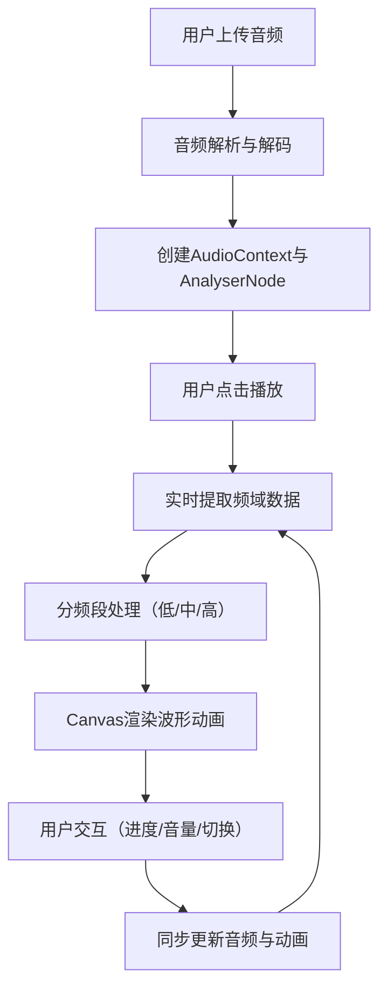

## 1. 产品概述

交互式音波可视化音乐播放器，让用户上传歌曲并在播放时实时查看音频频率动态波形图案，营造音画同步的沉浸式视听体验。

- 核心功能：音频上传、实时音波可视化、播放控制、进度交互、音量调节
- 目标用户：音乐爱好者、视觉艺术爱好者
- 产品价值：将抽象的音频转化为具象的视觉艺术，提升音乐欣赏体验

## 2. 核心功能

### 2.2 功能模块
1. **主播放器页面**：圆形可视化画布、进度条、控制面板、文件上传

### 2.3 页面详情
| 页面名称 | 模块名称 | 功能描述 |
|-----------|-------------|---------------------|
| 主播放器 | 圆形可视化画布 | 以同心圆/辐射状线条实时渲染频率分布，低频驱动内圈膨胀、中频驱动中环波动、高频驱动外圈粒子闪烁 |
| 主播放器 | 进度条 | 半透明进度条显示播放进度，支持拖拽跳转，拖动时显示大字号时间提示 |
| 主播放器 | 迷你控制台 | 播放/暂停按钮（带缩放动画）、上一首/下一首按钮、垂直音量滑块（显示百分比） |
| 主播放器 | 文件上传 | 支持用户上传本地音频文件 |

## 3. 核心流程

用户上传音频文件 → 系统解析音频并创建音频上下文 → 用户点击播放 → 实时提取频域数据 → 渲染波形动画 → 用户可拖动进度条跳转/调节音量/切换歌曲 → 动画与音乐保持同步

## 4. 用户界面设计

### 4.1 设计风格
- **主色调**：深色背景 `#0f0f23`，霓虹蓝紫渐变 `#4a00e0` → `#8e2de2`
- **控件样式**：半透明毛玻璃效果（背景模糊10px），鼠标悬停发光边框动画（0.3秒过渡）
- **按钮**：圆角设计，播放/暂停按钮点击时有0.1秒缩放弹性动画
- **字体**：现代无衬线字体，数字使用等宽字体确保时间显示对齐

### 4.2 页面设计概述
| 页面名称 | 模块名称 | UI元素 |
|-----------|-------------|-------------|
| 主播放器 | 圆形可视化画布 | 居中布局，占80%宽度，同心圆分层设计，粒子系统，60fps动画 |
| 主播放器 | 进度条 | 半透明底部进度条，圆形滑块，拖动时浮出时间提示（大字号） |
| 主播放器 | 迷你控制台 | 左下角横向排列（桌面）/底部横向（移动端），垂直音量滑块 |
| 主播放器 | 文件上传 | 隐藏式文件输入，点击画布区域或拖拽上传 |

### 4.3 响应式设计
- **桌面端（1366x768+）**：画布占80%宽度，左右留白均衡，控制台在左下角，进度条紧贴底部
- **移动端（竖屏）**：画布自动缩小到95%宽度，控制台变为横向排列在底部
- **触控优化**：按钮最小44x44px触控区域，滑块拖动有惯性缓冲

### 4.4 动画设计
- 内圈（低频）：根据低频能量膨胀收缩，呼吸感动画
- 中环（中频）：环形线条波动，模拟人声韵律
- 外圈（高频）：粒子系统，根据高频能量闪烁发射
- 全局：所有动画与音乐节拍同步，稳定60fps
