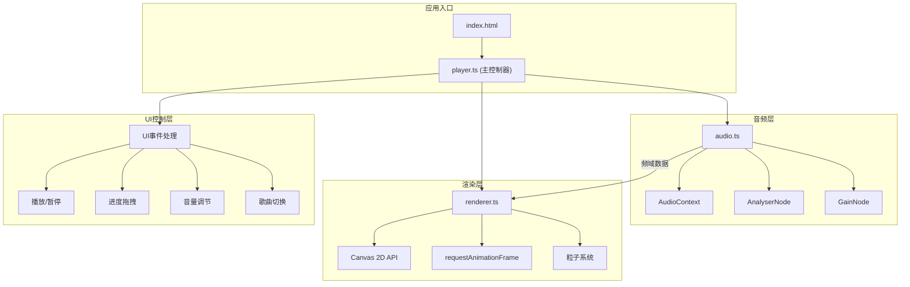

## 1. 架构设计

纯前端单页应用，采用模块化分层架构，音频处理、渲染、UI控制完全解耦。



## 2. 技术描述

* **前端框架**：原生 TypeScript + Vite（无额外UI框架）

* **构建工具**：Vite 5.x

* **语言**：TypeScript 5.x（严格模式）

* **核心API**：

  * Web Audio API（音频处理、频域分析）

  * HTML5 Canvas 2D API（波形渲染）

  * requestAnimationFrame（60fps动画循环）

## 3. 文件结构

| 文件路径              | 职责说明                                      |
| ----------------- | ----------------------------------------- |
| `package.json`    | 项目依赖配置，启动脚本                               |
| `vite.config.js`  | Vite构建配置，启用TypeScript                     |
| `tsconfig.json`   | TypeScript严格模式配置                          |
| `index.html`      | 入口页面，挂载Canvas和UI元素                        |
| `src/audio.ts`    | 音频加载、AudioContext管理、AnalyserNode连接、频域数据输出 |
| `src/renderer.ts` | Canvas渲染、帧循环、resize处理、同心圆波形绘制             |
| `src/player.ts`   | 主控制器、UI事件绑定、播放状态管理、调用audio/renderer接口     |

## 4. 核心接口定义

### audio.ts 接口

```typescript
interface AudioManager {
  loadFile(file: File): Promise<void>;
  start(): void;
  stop(): void;
  seek(time: number): void;
  getFrequencyData(): Uint8Array;
  getCurrentTime(): number;
  getDuration(): number;
  setVolume(volume: number): void;
  getVolume(): number;
  isPlaying(): boolean;
}
```

### renderer.ts 接口

```typescript
interface WaveformRenderer {
  init(canvas: HTMLCanvasElement): void;
  start(): void;
  stop(): void;
  resize(): void;
  setFrequencyDataProvider(provider: () => Uint8Array): void;
}
```

## 5. 性能优化策略

1. **渲染性能**：

   * 使用 `requestAnimationFrame` 确保60fps

   * Canvas分层绘制，避免全画布重绘

   * 离屏Canvas预渲染静态元素

   * 粒子对象池复用，避免频繁GC

2. **音频性能**：

   * AnalyserNode fftSize设为2048，平衡精度与性能

   * 频域数据分频段采样（低/中/高各取代表性频段）

   * 进度跳转时使用 `decodeAudioData` 预解码

3. **交互性能**：

   * 拖拽使用 `pointerdown`/`pointermove`/`pointerup` 统一事件

   * 进度更新节流，避免频繁seek

   * CSS transform硬件加速UI动画

## 6. 兼容性说明

* **浏览器支持**：Chrome 90+、Firefox 88+

* **Web Audio API**：使用 `AudioContext`，自动降级 `webkitAudioContext`

* **Canvas 2D**：标准API，无特殊依赖

