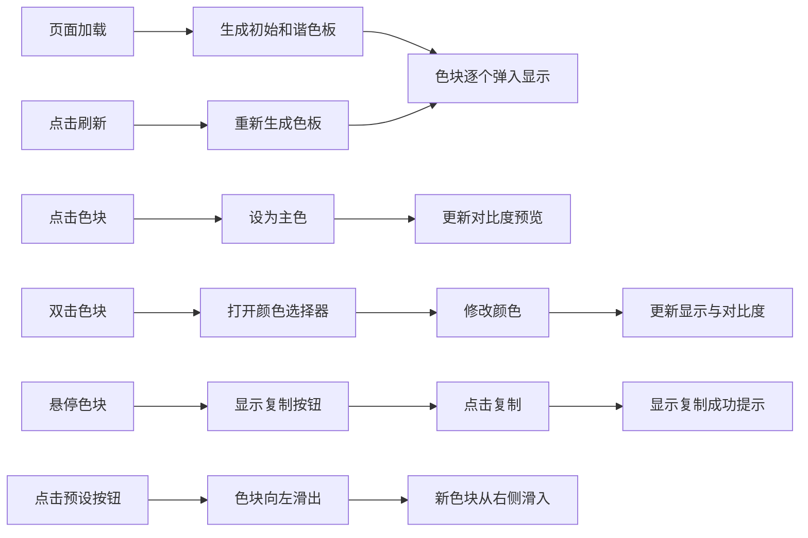

## 1. 产品概述

交互式配色探索面板，为前端工程师提供轻量级网页配色方案生成与预览工具，用于在项目初期快速试验和分享色彩搭配，避免在设计稿和代码间反复切换。

- 主要用途：快速生成和谐色板、预览对比度、复制颜色代码
- 目标用户：前端工程师、UI设计师
- 产品价值：提升配色决策效率，减少设计与开发之间的沟通成本

## 2. 核心功能

### 2.1 功能模块
1. **色板生成区**：5个横向排列的色卡，展示颜色及其十六进制代码
2. **工具栏**：刷新按钮、主题预设按钮组、对比度预览区域
3. **交互系统**：复制功能、主色选择、颜色修改、动画过渡

### 2.2 页面详情
| 页面名称 | 模块名称 | 功能描述 |
|-----------|-------------|---------------------|
| 主页面 | 色板生成区 | 展示5种颜色，支持逐个弹入动画、悬停放大、复制、设为主色、双击修改 |
| 主页面 | 工具栏-刷新按钮 | 随机生成新的和谐色板，带动画效果 |
| 主页面 | 工具栏-主题预设 | 提供4种预设主题（海洋蓝、森林绿、日落橙、极光紫），带滑入滑出动画 |
| 主页面 | 工具栏-对比度预览 | 显示主色与黑/白文字的WCAG对比度等级，带数字滚动效果 |

## 3. 核心流程

## 4. 用户界面设计

### 4.1 设计风格
- **背景**：浅灰白渐变（#f0f2f5 到 #ffffff）
- **圆角**：统一使用12px圆角
- **阴影**：柔和阴影效果
- **按钮交互**：hover时背景色加深10%，平滑过渡
- **动画风格**：流畅自然的微交互，缩放弹入、滑入滑出、脉动光环

### 4.2 字体
- 使用现代无衬线字体，如Inter或系统字体栈
- 颜色代码使用等宽字体显示
- 层级清晰的字体大小：标题16px，正文14px，代码13px

### 4.3 页面设计概述
| 页面名称 | 模块名称 | UI元素 |
|-----------|-------------|-------------|
| 主页面 | 色板生成区 | 5个色块矩形，十六进制代码，复制图标，主色金色光环动画 |
| 主页面 | 工具栏 | 刷新按钮（带图标），4个预设按钮，对比度预览区域（两个色块+等级评价+数值） |

### 4.4 响应式设计
- **桌面端**（≥768px）：5个色块横向排列，最大宽度1200px居中，按钮水平排列
- **移动端**（<768px）：色块分为两行（3+2）居中，按钮垂直堆叠

### 4.5 动画细节
- **初始加载**：色块逐个弹入（间隔100ms，scale缩放）
- **悬停**：色块scale 1.05 + 阴影增强
- **主色光环**：金色脉动循环动画
- **预设切换**：旧色块向左滑出，新色块从右侧滑入（0.4秒过渡）
- **复制提示**：1.5秒显示后淡出
- **数字滚动**：对比度数值变化时的滚动效果
