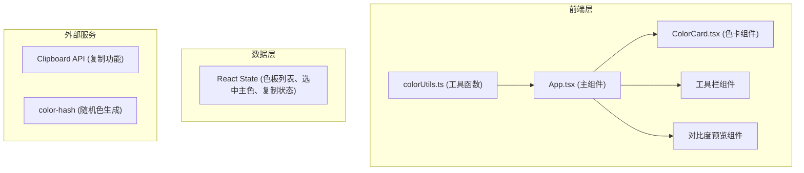

## 1. 架构设计



## 2. 技术描述

- **前端框架**：React 18 + TypeScript
- **构建工具**：Vite 5 + @vitejs/plugin-react
- **样式方案**：纯CSS/SCSS + CSS变量，不使用Tailwind（按用户要求的文件结构）
- **第三方库**：color-hash（生成和谐随机色板）
- **状态管理**：React useState/useCallback（轻量场景，无需Zustand）
- **性能优化**：React.memo 包裹子组件，避免不必要重渲染

## 3. 目录结构

```
.
├── index.html
├── package.json
├── tsconfig.json
├── vite.config.js
└── src/
    ├── App.tsx              # 主应用组件，全局状态管理
    ├── components/
    │   └── ColorCard.tsx    # 单个色卡组件（React.memo优化）
    └── utils/
        └── colorUtils.ts    # 颜色工具函数
```

## 4. 模块职责与数据流向

### 4.1 文件调用关系

```
colorUtils.ts
    ↓ (被调用)
App.tsx
    ↓ (传递props)
ColorCard.tsx
```

### 4.2 数据流向
1. **色板生成**：App.tsx → 调用 colorUtils.generateHarmoniousPalette() → 更新 palette 状态 → 传递给 ColorCard 组件
2. **颜色复制**：ColorCard → 触发 onCopy 回调 → App.tsx → 调用 navigator.clipboard.writeText() → 更新 copiedIndex 状态
3. **主色选择**：ColorCard → 触发 onSelect 回调 → App.tsx → 更新 selectedIndex 状态 → 触发对比度重新计算
4. **颜色修改**：ColorCard → 触发 onChange 回调 → App.tsx → 更新 palette 对应位置 → 重新计算对比度
5. **预设切换**：App.tsx → 调用 colorUtils.getPresetPalette() → 更新 palette → 触发滑入滑出动画

## 5. 性能优化策略

### 5.1 React.memo 优化
- ColorCard 组件使用 React.memo 包裹，仅当 color、isSelected、isCopied 变化时重渲染
- 使用 useCallback 包裹传递给子组件的回调函数，避免引用变化导致重渲染

### 5.2 计算优化
- 色板生成算法确保在5ms内完成
- 对比度计算使用缓存（仅当主色变化时重新计算）
- 避免在 render 中执行复杂计算

### 5.3 DOM 更新
- 单个颜色修改时仅更新对应 ColorCard 的 DOM 节点
- 列表渲染使用稳定的 key（颜色索引）

## 6. 核心类型定义

```typescript
interface ColorInfo {
  hex: string;
  role: 'primary' | 'secondary' | 'accent' | 'background' | 'text';
}

interface ContrastResult {
  ratio: number;
  level: 'AAA' | 'AA' | 'Fail';
}

type PresetName = 'ocean' | 'forest' | 'sunset' | 'aurora';
```

## 7. 性能指标

- 色板生成时间：< 5ms
- 对比度计算时间：< 1ms
- 帧率目标：≥ 55 FPS
- 首次交互时间：< 100ms
