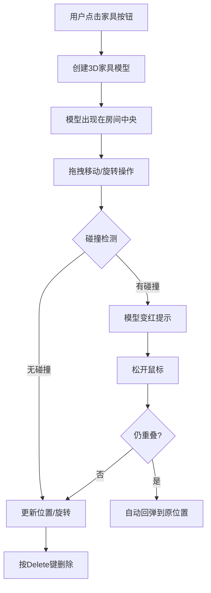

## 1. 产品概述

3D交互式家居空间规划应用，让用户在三维房间内自由添加、移动和旋转家具模型，实时预览室内布局效果。

- 主要用途：帮助用户可视化家居布局，快速尝试不同的家具摆放方案
- 目标用户：室内设计师、装修业主、家居爱好者
- 产品价值：降低空间规划的试错成本，提升家居布置决策效率

## 2. 核心功能

### 2.1 功能模块

1. **3D场景模块**：房间渲染、视角控制、光照阴影
2. **家具管理模块**：家具创建、拖拽移动、旋转、删除、碰撞检测
3. **用户交互模块**：工具栏操作、键盘快捷键、鼠标交互

### 2.2 页面详情

| 页面名称 | 模块名称 | 功能描述 |
|-----------|-------------|---------------------|
| 主场景页 | 3D房间渲染 | 浅灰色地面、白色墙壁构成房间容器 |
| 主场景页 | 视角控制 | 鼠标拖拽旋转视角、滚轮缩放、斜上方俯视默认视角 |
| 主场景页 | 左侧工具栏 | 半透明磨砂玻璃效果，提供5种家具按钮 |
| 主场景页 | 家具交互 | 点击添加、拖拽移动、R键旋转、Delete删除 |
| 主场景页 | 碰撞检测 | 家具不允许重叠，碰撞时变红提示，重叠自动回弹 |

## 3. 核心流程

用户点击左侧工具栏的家具按钮 → 3D家具模型出现在房间中央 → 鼠标拖拽移动家具（地面投影辅助定位） → 按R键旋转家具（每次45度，弹性动画） → 拖拽过程中实时碰撞检测 → 若碰撞则家具变红提示 → 松开鼠标若仍重叠则自动回弹 → 按Delete键删除选中家具

## 4. 用户界面设计

### 4.1 设计风格

- **主色调**：暖木色 (#D4A574) + 奶油白 (#FFF8E7)
- **辅助色**：浅灰 (#E8E8E8)、白色 (#FFFFFF)、碰撞红 (#FF6B6B)
- **按钮样式**：圆角矩形，悬停微缩放，点击凹陷效果
- **字体**：无衬线字体，清晰易读
- **布局风格**：左侧固定工具栏 + 右侧全屏3D场景
- **视觉效果**：磨砂玻璃工具栏、柔和阴影、边缘高光、微光晕跟随

### 4.2 页面设计概述

| 页面名称 | 模块名称 | UI Elements |
|-----------|-------------|-------------|
| 主场景页 | 左侧工具栏 | 半透明磨砂玻璃 (backdrop-filter: blur)、暖木色按钮图标、奶油白文字、垂直排列 |
| 主场景页 | 3D场景 | 浅灰色地面 (#D0D0D0)、白色墙壁 (#FFFFFF)、柔和环境光 + 方向光、阴影开启 |
| 主场景页 | 家具模型 | BoxGeometry 标准材质、边缘高光 (EdgesGeometry)、柔和阴影接收与投射 |
| 主场景页 | 交互反馈 | 拖拽时微光晕点光源跟随、旋转 0.2s ease-out 动画、碰撞 0.1s 闪烁效果 |

### 4.3 响应性

- 桌面端优先设计
- 3D画布自适应窗口大小
- 工具栏固定宽度，不随窗口缩放

### 4.4 3D场景指导

- **环境**：简洁明亮的室内空间，无多余装饰，突出家具本身
- **光照设置**：
  - AmbientLight (0xffffff, 0.6)：环境光提供基础照明
  - DirectionalLight (0xffffff, 0.8)：主光源，开启阴影投射，位置斜上方
  - PointLight 拖拽跟随：拖动时创建微光晕点光源
- **相机设置**：
  - PerspectiveCamera，初始位置 (8, 8, 8)
  - 默认看向原点 (0, 0, 0)
  - OrbitControls：开启阻尼，禁用平移，限制仰角
- **交互与动画**：
  - 拖拽移动：基于射线检测地面交点，带地面投影辅助
  - 旋转动画：0.2秒 ease-out 曲线，每次45度
  - 碰撞闪烁：0.1秒 变红/原色 交替
  - 回弹动画：0.3秒 ease-out 回到原位置
- **性能优化**：
  - 所有几何体使用 BoxGeometry，减少顶点数
  - 材质复用，避免重复创建
  - 碰撞检测使用 OBB 算法，高效精确
  - 阴影贴图大小限制在 1024x1024
