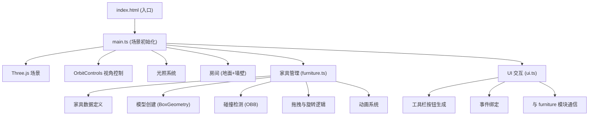

## 1. 架构设计



## 2. 技术描述

- **前端框架**：原生 TypeScript + Three.js（无React/Vue，按用户要求使用纯Three.js）
- **构建工具**：Vite 5.x
- **语言**：TypeScript 5.x（严格模式）
- **3D引擎**：Three.js 0.160.x
- **控制器**：OrbitControls（Three.js 内置）
- **无后端**：纯前端应用，所有状态在内存中管理

### 2.1 依赖说明

| 依赖包 | 版本 | 用途 |
|--------|------|------|
| three | ^0.160.0 | 3D渲染引擎 |
| @types/three | ^0.160.0 | Three.js TypeScript 类型定义 |
| typescript | ^5.3.0 | TypeScript 编译器 |
| vite | ^5.0.0 | 构建工具与开发服务器 |

## 3. 文件结构

```
auto6/
├── package.json          # 项目依赖与脚本
├── vite.config.js        # Vite 配置
├── tsconfig.json         # TypeScript 配置
├── index.html            # 入口HTML
└── src/
    ├── main.ts           # 场景初始化、光照、房间、OrbitControls
    ├── furniture.ts      # 家具数据、模型创建、碰撞检测、拖拽旋转
    └── ui.ts             # 工具栏按钮、事件绑定、模块通信
```

## 4. 核心模块设计

### 4.1 furniture.ts 模块

#### 类型定义

```typescript
interface FurnitureData {
  type: string;
  name: string;
  width: number;
  height: number;
  depth: number;
  color: number;
}

interface FurnitureItem {
  id: string;
  type: string;
  mesh: THREE.Group;
  position: THREE.Vector3;
  rotation: number;
  data: FurnitureData;
  originalPosition: THREE.Vector3;
  isDragging: boolean;
  isColliding: boolean;
}
```

#### 核心函数

| 函数名 | 功能 |
|--------|------|
| `createFurniture(type: string)` | 根据类型创建家具模型组 |
| `checkCollision(item: FurnitureItem, others: FurnitureItem[])` | OBB碰撞检测 |
| `startDrag(item: FurnitureItem, intersectPoint: THREE.Vector3)` | 开始拖拽 |
| `updateDrag(intersectPoint: THREE.Vector3)` | 更新拖拽位置 |
| `endDrag()` | 结束拖拽，处理回弹 |
| `rotateFurniture(item: FurnitureItem, direction: number)` | 旋转家具（带动画） |
| `deleteFurniture(item: FurnitureItem)` | 删除家具 |
| `animate(delta: number)` | 动画帧更新 |

### 4.2 ui.ts 模块

#### 核心函数

| 函数名 | 功能 |
|--------|------|
| `createToolbar(container: HTMLElement, onAddFurniture: (type: string) => void)` | 创建工具栏 |
| `bindKeyboardEvents(onRotate: () => void, onDelete: () => void)` | 绑定键盘事件 |
| `selectFurniture(item: FurnitureItem)` | 选中家具高亮 |
| `deselectFurniture()` | 取消选中 |

### 4.3 main.ts 模块

#### 核心流程

1. 初始化场景、相机、渲染器
2. 设置光照（环境光 + 方向光）
3. 创建房间（地面 + 墙壁）
4. 初始化 OrbitControls
5. 初始化家具管理器 (furniture.ts)
6. 创建 UI 工具栏 (ui.ts)
7. 绑定事件监听器
8. 启动动画循环

## 5. 碰撞检测算法

使用 **OBB (Oriented Bounding Box)** 碰撞检测：

1. 每个家具维护一个 OBB，包含中心点、半轴长度、旋转矩阵
2. 拖拽时实时更新被拖动家具的 OBB
3. 与其他所有家具的 OBB 进行分离轴检测（SAT）
4. 若检测到重叠，标记为碰撞状态，改变材质颜色
5. 结束拖拽时若仍碰撞，执行回弹动画

## 6. 动画系统

### 6.1 旋转动画
- 时长：0.2秒
- 缓动：ease-out 曲线 `1 - Math.pow(1 - t, 3)`
- 每次旋转：45度 (π/4 弧度)

### 6.2 回弹动画
- 时长：0.3秒
- 缓动：ease-out 弹性曲线
- 从碰撞位置平滑过渡到原位置

### 6.3 碰撞闪烁
- 周期：0.1秒
- 效果：红色 / 原色 交替
- 持续：拖拽碰撞期间持续

## 7. 性能优化

1. **几何体复用**：相同类型家具共享 BoxGeometry
2. **材质复用**：相同颜色家具共享 MeshStandardMaterial
3. **阴影优化**：限制阴影贴图大小 1024x1024，只为方向光开启阴影
4. **碰撞优化**：仅在拖拽时进行碰撞检测，使用 OBB 而非精确网格检测
5. **渲染优化**：requestAnimationFrame 驱动，使用 deltaTime 保证动画速度一致

## 8. 构建配置

### Vite 配置要点
- 使用 ES 模块
- 支持 TypeScript
- 开发服务器端口：5173
- 热更新支持

### TypeScript 配置要点
- 严格模式 (strict: true)
- ESNext 模块系统
- 目标：ES2020
- 类型检查包含 src 目录
