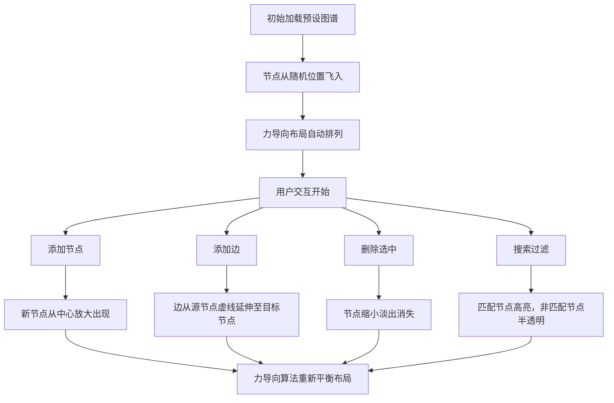

## 1. 产品概述

交互式知识图谱编辑器是一款面向在线教育平台课程讲师的可视化工具，用于创建动态的交互式知识图谱，展示概念之间的关联关系，帮助学生直观理解知识结构，替代传统的静态PDF思维导图。

- **核心目标**：提供直观、流畅的知识图谱创建和编辑体验
- **目标用户**：在线教育平台的课程讲师、教学设计人员
- **市场价值**：提升教学内容的可视化呈现质量，增强学生学习体验

## 2. 核心功能

### 2.1 用户角色
| 角色 | 注册方式 | 核心权限 |
|------|----------|----------|
| 课程讲师 | 无需注册（本地工具） | 创建、编辑、删除知识图谱节点和边 |

### 2.2 功能模块
1. **图谱编辑器主界面**：力导向图可视化展示、节点拖拽交互
2. **控制面板**：添加节点、添加边、删除选中、搜索过滤
3. **动画系统**：节点入场动画、添加/删除动画、交互反馈动画

### 2.3 页面详情
| 页面名称 | 模块名称 | 功能描述 |
|----------|----------|----------|
| 知识图谱编辑器 | 力导向图可视化 | 使用D3.js渲染节点和边，支持力导向自动布局，节点拖拽交互 |
| 知识图谱编辑器 | 侧边控制面板 | 节点管理（增删）、边管理、搜索过滤功能 |
| 知识图谱编辑器 | 动画交互系统 | 平滑入场动画、添加/删除过渡动画、悬停/选中反馈 |

## 3. 核心流程

用户主要操作流程：
1. 页面加载后展示预设的6个节点、8条边的示例知识图谱
2. 用户可通过控制面板添加新节点（输入名称，自动分配颜色）
3. 用户可选择两个节点后添加有向边
4. 用户可选中节点并删除（同时删除关联边）
5. 用户可通过搜索框实时过滤节点

## 4. 用户界面设计

### 4.1 设计风格
- **主色调**：深色侧边栏（#2c3e50），浅灰主区域（#f5f6fa）
- **节点色板**：8种明亮柔和色（#3498db、#e74c3c、#2ecc71、#f39c12、#9b59b6、#1abc9c、#e91e63、#00bcd4）
- **按钮样式**：圆角矩形，悬停背景变浅，点击轻微下沉
- **字体**：清晰易读的无衬线字体，节点首字白色加粗
- **布局风格**：左右分栏，左侧固定200px控制面板，右侧自适应图谱区域

### 4.2 页面设计概述
| 页面名称 | 模块名称 | UI元素 |
|----------|----------|--------|
| 知识图谱编辑器 | 力导向图可视化 | SVG画布、圆形节点（半径20px）、带箭头有向边、发光高亮效果、半透明过滤效果、Tooltip提示 |
| 知识图谱编辑器 | 侧边控制面板 | 输入框、功能按钮、节点选择器、搜索框、间距宽松的控件布局 |
| 知识图谱编辑器 | 动画交互 | 1秒入场动画、缩放过渡、虚线延伸动画、淡出动画、悬停放大1.2倍、选中青色虚线环 |

### 4.3 响应式
- **桌面优先**：左右分栏布局，左侧固定200px，右侧自适应
- **窗口适配**：图谱区域自动适配窗口大小，整体页面无滚动条
- **性能保证**：30节点、60边时帧率≥30 FPS，拖拽响应≤50ms

### 4.4 交互细节
- 节点悬停：放大1.2倍，连接线变粗（2px），显示Tooltip（节点全名、关联边数量）
- 节点选中：外圈2px宽青色虚线环
- 搜索匹配：外圈发光光晕，非匹配节点opacity 0.2
