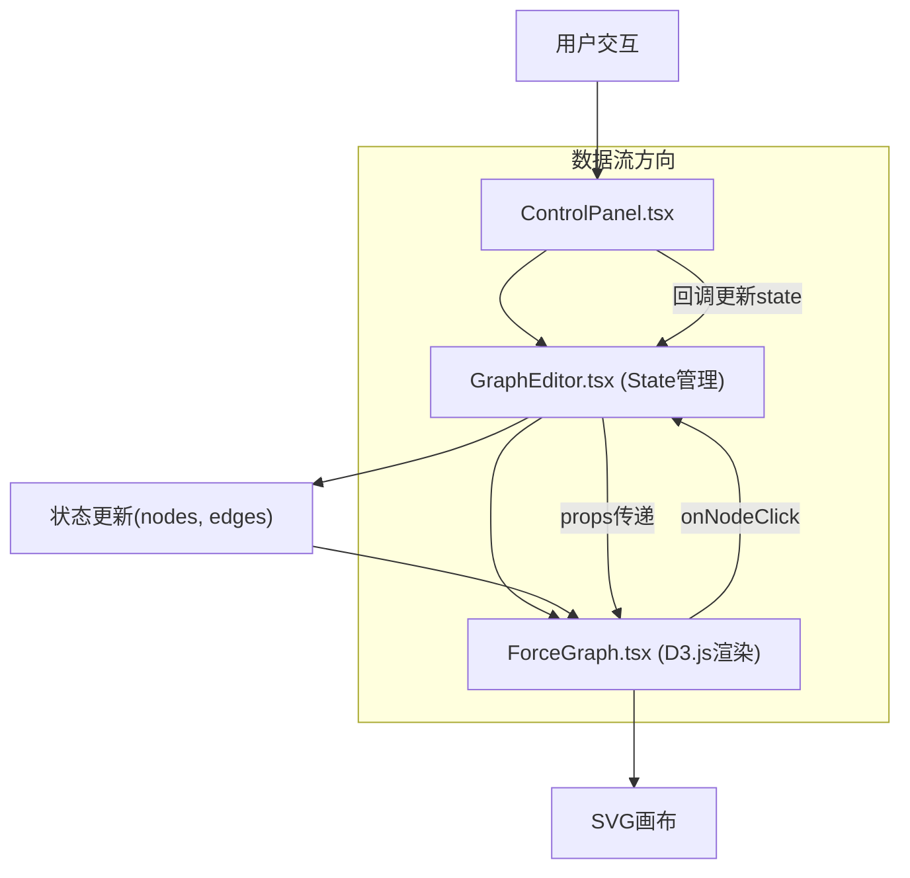

## 1. 架构设计



整体架构采用React组件化设计，状态集中管理在GraphEditor主组件，通过props向下传递给ForceGraph和ControlPanel子组件，通过回调函数向上传递用户交互事件。

## 2. 技术描述

* **前端框架**：React 18 + TypeScript

* **构建工具**：Vite 5 + @vitejs/plugin-react

* **可视化引擎**：D3.js v7（力导向图布局与渲染）

* **类型定义**：@types/d3

* **状态管理**：React useState（本地组件状态）

* **初始化方式**：vite-init react-ts模板

## 3. 文件结构与职责

| 文件路径                   | 职责描述                    | 调用关系                                      |
| ---------------------- | ----------------------- | ----------------------------------------- |
| `package.json`         | 项目依赖配置，启动脚本             | 被npm读取                                    |
| `vite.config.js`       | Vite构建配置，React插件        | 被Vite读取                                   |
| `tsconfig.json`        | TypeScript编译配置（严格模式）    | 被TSC读取                                    |
| `index.html`           | 入口HTML页面，挂载React根节点     | 被浏览器加载                                    |
| `src/main.tsx`         | React渲染入口，加载GraphEditor | 调用GraphEditor组件                           |
| `src/GraphEditor.tsx`  | 主编辑器组件，管理nodes/edges状态  | 调用ForceGraph、ControlPanel                 |
| `src/ForceGraph.tsx`   | 力导向图可视化组件，D3.js渲染       | 接收nodes/edges props，触发onNodeClick         |
| `src/ControlPanel.tsx` | 侧边控制面板，用户交互入口           | 触发onAddNode、onAddEdge、onDelete、onSearch回调 |

## 4. 数据模型

### 4.1 类型定义

```typescript
interface GraphNode {
  id: string;
  name: string;
  color: string;
  x?: number;
  y?: number;
  fx?: number | null;
  fy?: number | null;
  vx?: number;
  vy?: number;
}

interface GraphEdge {
  id: string;
  source: string;
  target: string;
}

interface GraphState {
  nodes: GraphNode[];
  edges: GraphEdge[];
  selectedNodeId: string | null;
  sourceNodeId: string | null;
  searchKeyword: string;
}
```

### 4.2 初始数据

预设示例图谱包含6个节点、8条边：

* 节点：数据结构、算法、数组、链表、排序、查找

* 边：表示概念之间的依赖和关联关系

### 4.3 常量配置

```typescript
const COLOR_PALETTE = [
  '#3498db', '#e74c3c', '#2ecc71', '#f39c12',
  '#9b59b6', '#1abc9c', '#e91e63', '#00bcd4'
];

const NODE_RADIUS = 20;
const ANIMATION_DURATION = 1000;
const MAX_NODES = 30;
const MAX_EDGES = 60;
```

## 5. 核心模块设计

### 5.1 GraphEditor 主组件

* 状态管理：nodes、edges、selectedNodeId、sourceNodeId、searchKeyword

* 回调函数：onAddNode、onAddEdge、onDelete、onSearch、onNodeClick

* 数据流：用户输入 → ControlPanel回调 → 更新state → ForceGraph重新渲染

### 5.2 ForceGraph 可视化组件

* 使用D3 forceSimulation创建力导向布局

* SVG渲染：节点圆圈、连接线、箭头标记、Tooltip

* 动画效果：入场动画、添加/删除过渡、悬停/选中反馈

* 交互处理：节点拖拽、点击选中、悬停提示

### 5.3 ControlPanel 控制面板组件

* 添加节点表单：输入名称，自动分配颜色

* 添加边功能：选择源节点和目标节点

* 删除功能：删除选中节点及关联边

* 搜索过滤：实时关键词匹配高亮

## 6. 性能优化

* **力导向模拟优化**：设置合理的alphaDecay和velocityDecay参数

* **DOM操作优化**：使用D3的enter/update/exit模式，减少重排重绘

* **动画优化**：使用CSS transition和D3 transition结合

* **事件节流**：搜索输入使用防抖处理

* **约束上限**：节点≤30，边≤60，确保帧率≥30 FPS

