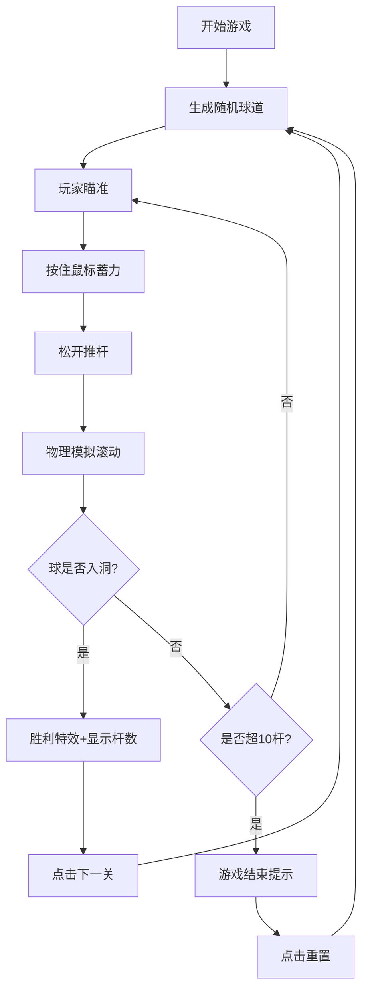

## 1. 产品概述

迷你高尔夫推杆小游戏，玩家在不同地形的球道上通过控制力度和角度将高尔夫球推进洞中，模拟真实的物理推杆体验。

- 主要目的：提供休闲娱乐的物理模拟游戏体验
- 目标用户：休闲游戏爱好者，所有年龄段
- 产品价值：轻松上手、具有物理真实感的迷你高尔夫体验

## 2. 核心功能

### 2.1 用户角色
无需角色区分，单玩家游戏。

### 2.2 功能模块
1. **游戏主界面**：俯视球道、蓄力条、计分板、控制按钮
2. **物理系统**：球的滚动、碰撞反弹、地形影响（沙坑减速、坡度加速）
3. **关卡系统**：随机生成球道、多关卡切换
4. **特效系统**：入洞粒子特效、胜利/失败提示动画

### 2.3 页面详情

| 页面名称 | 模块名称 | 功能描述 |
|-----------|-------------|---------------------|
| 游戏主界面 | 球道渲染 | 绘制草地、沙坑、坡度区域、木质围栏、球洞 |
| 游戏主界面 | 蓄力系统 | 鼠标按住蓄力，松开推杆，蓄力条绿到红渐变 |
| 游戏主界面 | 物理模拟 | 球的滚动速度、方向受地形影响，围栏碰撞反弹 |
| 游戏主界面 | 计分系统 | 记录击球次数，最多10杆，超杆游戏结束 |
| 游戏主界面 | 特效系统 | 入洞金色粒子喷射、球缩小消失、胜利/失败文字 |
| 游戏主界面 | 关卡切换 | 随机生成新球道，下一关按钮切换 |

## 3. 核心流程

玩家进入游戏 → 显示随机生成的球道 → 鼠标瞄准方向 → 按住左键蓄力（蓄力条增长）→ 松开左键推杆 → 球滚动（受地形影响）→ 球入洞 → 显示胜利特效和击球次数 → 点击下一关 → 生成新球道

## 4. 用户界面设计

### 4.1 设计风格
- **主色调**：清新草地绿 (#4CAF50)、天空蓝 (#87CEEB)
- **辅助色**：沙坑浅黄 (#F5DEB3)、围栏木纹色 (#8B4513)、白色高尔夫球
- **按钮风格**：圆角矩形，柔和阴影，悬停微放大效果
- **字体**：现代无衬线字体，清晰易读
- **布局风格**：全屏Canvas游戏区，底部蓄力条，顶部计分板，居中弹窗提示
- **视觉细节**：俯视带轻微倾斜角，沙坑细沙纹理动画，球带高光

### 4.2 页面设计概览

| 页面名称 | 模块名称 | UI元素 |
|-----------|-------------|-------------|
| 游戏主界面 | 球道区域 | 草地绿背景、柔和弧线划分区域、浅黄色沙坑带纹理、木纹色围栏、黑色球洞 |
| 游戏主界面 | 蓄力条 | 屏幕底部，从绿色渐变到红色，松开时回弹动画 |
| 游戏主界面 | 计分板 | 左上角，显示当前杆数/最大杆数 |
| 游戏主界面 | 控制按钮 | 重置按钮（左下角）、下一关按钮（胜利后显示） |
| 游戏主界面 | 特效层 | 入洞金色粒子、"进洞！"文字、"超杆数！"红色提示 |

### 4.3 响应性
- 桌面端优先，全屏Canvas自适应窗口大小
- 鼠标操作：按住左键蓄力，移动瞄准
- 性能目标：60FPS流畅动画，无卡顿

### 4.4 2D场景指导
- 摄像机：固定俯视带15度倾斜角
- 光照：柔和顶光，球有高光和阴影
- 地形起伏通过颜色渐变和阴影表现
- 粒子特效：入洞时金色粒子向上喷射，带重力下落
