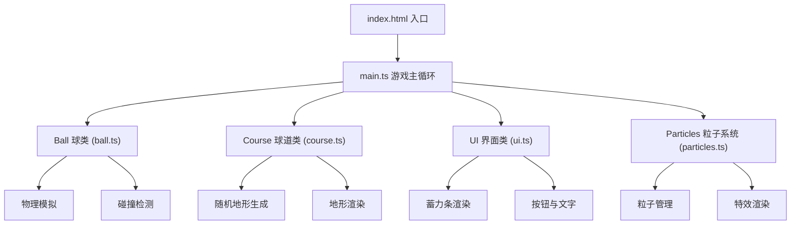

## 1. 架构设计



## 2. 技术描述

- **前端**：TypeScript + HTML5 Canvas (无外部游戏引擎)
- **构建工具**：Vite
- **开发语言**：TypeScript (严格模式, ES模块)
- **性能优化**：requestAnimationFrame 60FPS主循环，对象池管理粒子

## 3. 模块定义

| 模块文件 | 核心类/函数 | 职责描述 |
|----------|------------|----------|
| src/main.ts | Game | 游戏主循环、事件监听、模块协调 |
| src/ball.ts | Ball | 位置速度管理、物理模拟、碰撞检测 |
| src/course.ts | Course | 随机地形生成、地形渲染、地形查询 |
| src/ui.ts | UI | 蓄力条、计分板、按钮、提示文字渲染 |
| src/particles.ts | ParticleSystem | 粒子创建、更新、渲染、对象池 |

## 4. 核心数据结构

### 4.1 向量类型
```typescript
interface Vector2 {
  x: number;
  y: number;
}
```

### 4.2 球道区域类型
```typescript
type TerrainType = 'grass' | 'sand' | 'uphill' | 'downhill';

interface TerrainZone {
  type: TerrainType;
  bounds: Path2D;
  center: Vector2;
  radius: number;
  slopeAngle?: number;  // 坡度角度
  slopeDirection?: Vector2;  // 坡度方向
}
```

### 4.3 围栏类型
```typescript
interface Fence {
  start: Vector2;
  end: Vector2;
  normal: Vector2;  // 法线方向用于反弹
}
```

### 4.4 粒子类型
```typescript
interface Particle {
  position: Vector2;
  velocity: Vector2;
  life: number;
  maxLife: number;
  color: string;
  size: number;
  active: boolean;
}
```

## 5. 物理计算规则

### 5.1 基础物理
- 摩擦力：草地 0.985，沙坑 0.92
- 重力加速度：根据坡度调整
- 最小速度阈值：低于0.1停止滚动

### 5.2 碰撞检测
- 球与围栏：线段与圆的碰撞检测，反射公式计算反弹速度
- 球与球洞：距离检测，小于洞半径则入洞

### 5.3 坡度影响
- 上坡：沿坡度反方向施加减速力
- 下坡：沿坡度方向施加加速力
- 坡度越陡，方向偏差越大（添加随机扰动）
