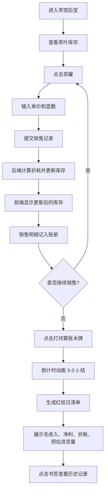

## 1. 产品概述

明代徽州茶馆日清月结与茶叶库存核算模拟器，让用户化身账房先生，在虚拟的茶馆后堂中进行茶叶销售记账、库存管理、日清结算等操作，体验古代徽商的经营智慧。

- **核心价值**：通过沉浸式的古风界面和真实的商业逻辑，让用户体验古代账房先生的日常工作
- **目标用户**：对中国传统文化、历史、商业模拟感兴趣的用户

## 2. 核心功能

### 2.1 用户角色

| 角色 | 注册方式 | 核心权限 |
|------|----------|----------|
| 账房先生 | 直接进入 | 销售记账、库存查看、日清结算、历史查询 |

### 2.2 功能模块

1. **主场景界面**：明代徽州茶馆后堂，包含货架、账桌、油灯、毛笔等元素
2. **销售记账**：点击青花瓷罐选择茶品，输入单价和壶数进行销售登记
3. **库存管理**：根据折耗率自动更新库存，低于三成时显示裂纹动画
4. **日清结算**：打烊后生成红纸日清单，展示毛收入、净利、折耗、预估进货量
5. **历史查询**：通过书签查看近七日的销售记录
6. **行情显示**：实时显示茶品市价波动，每30秒更新一次

### 2.3 页面详情

| 页面名称 | 模块名称 | 功能描述 |
|----------|----------|----------|
| 主界面 | 茶馆后堂场景 | CSS绘制青砖地面、木梁柱、货架、账桌、油灯等场景元素 |
| 主界面 | 茶品选择区 | 三只青花瓷罐（岩、龙、普），点击弹出销售输入框 |
| 主界面 | 红木账册 | 显示当日销售明细，日清结果以打印动画展示 |
| 主界面 | 行情木牌 | 实时显示市价波动，毛笔字动画更新价格 |
| 主界面 | 历史书签 | 七枚竖排书签，点击切换历史日期数据 |
| 主界面 | 打烊木牌 | 点击触发日清结算，倒计时动画后生成日清单 |

## 3. 核心流程

用户进入茶馆后堂 → 查看货架上的三种茶叶库存 → 点击茶罐进行销售登记（输入单价、壶数）→ 系统自动扣减库存并计入销售明细 → 重复销售操作 → 点击"打烊算账"木牌 → 倒计时动画 → 生成红纸日清单（墨水扩散动画、数字滚动）→ 可通过书签查看历史记录

## 4. 用户界面设计

### 4.1 设计风格

- **主色调**：深褐色#5d3a1a、红木色#8b2500、米黄色#f5e6c8、朱砂红#b22222、青铜色#b87333
- **字体**：毛笔书法字体用于标题，衬线字体用于正文，竖排文字用于古风元素
- **布局风格**：对称式传统布局，货架在右，账桌居中，左侧行情牌
- **视觉效果**：CSS径向渐变模拟瓷面光泽，大漆质感渐变，烛火跳动动画，墨水扩散动画，毛笔书写动画

### 4.2 页面设计概览

| 页面名称 | 模块名称 | UI元素 |
|----------|----------|--------|
| 主界面 | 茶馆后堂 | 青砖地面#6b7b6b、木梁柱#5d3a1a、暖色调灯光渐变 |
| 主界面 | 青花瓷罐 | 径向渐变瓷面光泽、贴"岩""龙""普"标签、库存低于三成时裂纹动画 |
| 主界面 | 红木账桌 | #8b2500深红大漆渐变、桌上油灯（烛火跳动动画）、可拖拽狼毫笔 |
| 主界面 | 红木账册 | 深褐边框#5d3a1a、米黄纸页#f5e6c8、朱砂竖排文字#b22222、线装书纹理 |
| 主界面 | 红纸日清单 | 红色背景、墨水扩散动画、数字滚动动画（1.5秒）、净利大号加粗朱砂红 |
| 主界面 | 行情木牌 | 白漆木牌#f0e6d3、毛笔字体#1a1a1a、价格笔画动画更新 |
| 主界面 | 历史书签 | 竖排七枚书签、点击旧纸泛黄动画过渡 |

### 4.3 响应式设计

- **桌面端**（≥768px）：货架在右侧，账桌居中，水平布局
- **移动端**（<768px）：货架和账桌垂直排列，账册字体缩小至12px，触摸优化

### 4.4 动画与交互细节

1. **烛火跳动**：油灯火焰从金黄色#ffa500到橙红色#ff4500的渐变动画
2. **墨水扩散**：日清单条目以径向渐变扩散方式出现
3. **数字滚动**：日清结算时数值从0滚动到最终值，1.5秒完成，60fps
4. **毛笔书写**：行情价格更新时以笔画动画方式显示
5. **裂纹动画**：库存低于三成时，茶罐使用clip-path和stroke-dasharray显示裂纹
6. **打印动画**：账册条目逐行显示，模拟书写效果
7. **狼毫笔拖拽**：可拖拽的毛笔，拖拽时留下墨迹轨迹
