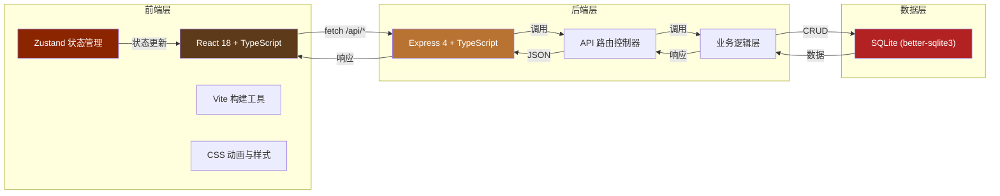
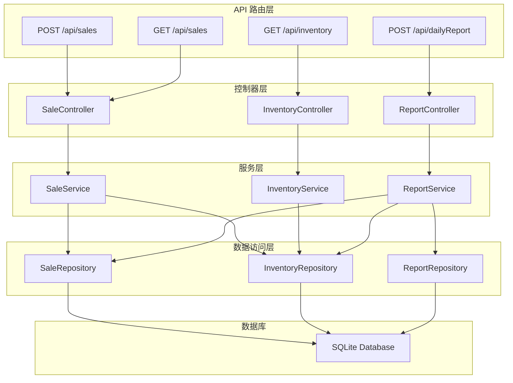
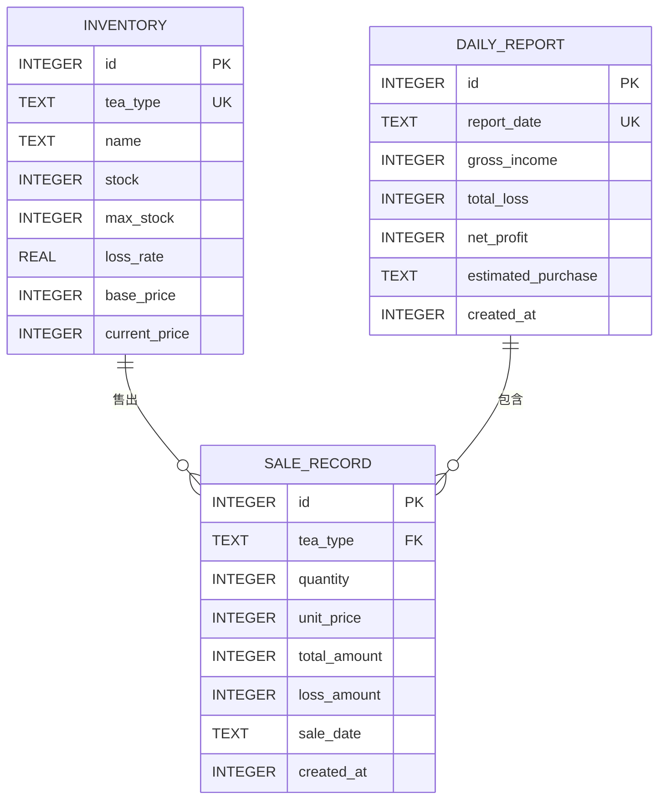

## 1. 架构设计



## 2. 技术描述

- **前端**：React@18 + TypeScript@5 + Vite@5 + Zustand@4
- **构建工具**：Vite@5
- **状态管理**：Zustand@4
- **后端**：Express@4 + TypeScript@5
- **数据库**：SQLite (better-sqlite3@11)
- **开发服务器**：Vite dev server (前端端口5173) + Express (后端端口3001)
- **代理配置**：Vite 代理 /api 请求至后端 3001 端口

## 3. 路由定义

| 路由 | 方法 | 用途 |
|------|------|------|
| / | GET | 前端入口页面 |
| /api/sales | POST | 提交销售记录 |
| /api/sales | GET | 获取销售记录（支持?date=YYYY-MM-DD参数） |
| /api/inventory | GET | 获取当前库存 |
| /api/inventory | PUT | 更新库存（内部调用） |
| /api/dailyReport | POST | 生成日清单报告 |

## 4. API 定义

### 4.1 类型定义

```typescript
// 茶品类型
type TeaType = 'wuyi' | 'longjing' | 'puer';

// 销售记录
interface SaleRecord {
  id: number;
  teaType: TeaType;
  quantity: number;      // 壶数
  unitPrice: number;     // 单价（文/壶）
  totalAmount: number;   // 总价（文）
  lossAmount: number;    // 折耗银两
  date: string;          // YYYY-MM-DD
  createdAt: number;     // 时间戳
}

// 库存信息
interface Inventory {
  id: number;
  teaType: TeaType;
  name: string;          // 茶品名称
  stock: number;         // 库存量（钱，1斤=160钱）
  maxStock: number;      // 最大库存量
  lossRate: number;      // 折耗率（如 0.012 表示1.2%）
  basePrice: number;     // 基准价（文/壶）
  currentPrice: number;  // 当前市价
}

// 日清单报告
interface DailyReport {
  id: number;
  date: string;
  grossIncome: number;   // 毛收入（文）
  totalLoss: number;     // 总折耗（文）
  netProfit: number;     // 净利（文）
  estimatedPurchase: {
    teaType: TeaType;
    amount: number;      // 建议进货量（斤）
  }[];
  createdAt: number;
}

// 茶品价格行情
interface MarketPrice {
  teaType: TeaType;
  basePrice: number;
  currentPrice: number;
  fluctuation: number;   // 涨跌幅百分比
  season: 'guyu' | 'meiyu' | 'normal';  // 季节溢价/降价
}
```

### 4.2 请求/响应示例

#### POST /api/sales 请求
```json
{
  "teaType": "wuyi",
  "quantity": 3,
  "unitPrice": 120
}
```

#### POST /api/sales 响应
```json
{
  "success": true,
  "data": {
    "saleId": 1,
    "updatedInventory": {
      "teaType": "wuyi",
      "stock": 1420,
      "maxStock": 1600
    }
  }
}
```

#### GET /api/inventory 响应
```json
{
  "success": true,
  "data": [
    { "teaType": "wuyi", "name": "武夷岩茶", "stock": 1420, "maxStock": 1600, "lossRate": 0.012, "currentPrice": 120 },
    { "teaType": "longjing", "name": "龙井茶", "stock": 1500, "maxStock": 1600, "lossRate": 0.008, "currentPrice": 100 },
    { "teaType": "puer", "name": "普洱茶", "stock": 1550, "maxStock": 1600, "lossRate": 0.005, "currentPrice": 80 }
  ]
}
```

## 5. 服务器架构图



## 6. 数据模型

### 6.1 ER 图



### 6.2 DDL 语句

```sql
-- 库存表
CREATE TABLE IF NOT EXISTS inventory (
  id INTEGER PRIMARY KEY AUTOINCREMENT,
  tea_type TEXT UNIQUE NOT NULL,
  name TEXT NOT NULL,
  stock INTEGER NOT NULL DEFAULT 1600,
  max_stock INTEGER NOT NULL DEFAULT 1600,
  loss_rate REAL NOT NULL,
  base_price INTEGER NOT NULL,
  current_price INTEGER NOT NULL
);

-- 销售记录表
CREATE TABLE IF NOT EXISTS sale_records (
  id INTEGER PRIMARY KEY AUTOINCREMENT,
  tea_type TEXT NOT NULL,
  quantity INTEGER NOT NULL,
  unit_price INTEGER NOT NULL,
  total_amount INTEGER NOT NULL,
  loss_amount INTEGER NOT NULL,
  sale_date TEXT NOT NULL,
  created_at INTEGER NOT NULL,
  FOREIGN KEY (tea_type) REFERENCES inventory(tea_type)
);

-- 日清单表
CREATE TABLE IF NOT EXISTS daily_reports (
  id INTEGER PRIMARY KEY AUTOINCREMENT,
  report_date TEXT UNIQUE NOT NULL,
  gross_income INTEGER NOT NULL,
  total_loss INTEGER NOT NULL,
  net_profit INTEGER NOT NULL,
  estimated_purchase TEXT NOT NULL,
  created_at INTEGER NOT NULL
);

-- 初始数据
INSERT OR IGNORE INTO inventory (tea_type, name, stock, max_stock, loss_rate, base_price, current_price) 
VALUES 
  ('wuyi', '武夷岩茶', 1600, 1600, 0.012, 100, 100),
  ('longjing', '龙井茶', 1600, 1600, 0.008, 80, 80),
  ('puer', '普洱茶', 1600, 1600, 0.005, 60, 60);

-- 索引
CREATE INDEX IF NOT EXISTS idx_sale_records_date ON sale_records(sale_date);
CREATE INDEX IF NOT EXISTS idx_daily_reports_date ON daily_reports(report_date);
```

## 7. 文件结构与调用关系

```
project/
├── package.json                 # 项目依赖配置
├── vite.config.js              # Vite构建配置，代理/api到3001端口
├── tsconfig.json               # TypeScript严格模式配置
├── index.html                  # 前端入口HTML
├── server/
│   └── index.ts               # Express后端入口
│       ├── 路由定义: /api/sales, /api/inventory, /api/dailyReport
│       ├── 数据库初始化 (better-sqlite3)
│       └── 业务逻辑处理
└── src/
    ├── App.tsx                 # 主组件
    │   ├── 渲染茶馆后堂场景
    │   ├── 调用 Zustand store
    │   └── fetch 与后端通信
    ├── store.ts                # Zustand 状态管理
    │   ├── state: sales[], inventory[], dailyReport
    │   └── actions: addSale, fetchInventory, generateDailyReport
    ├── AccountBook.tsx         # 红木账册子组件
    │   └── 展示销售明细和日清结果
    └── components/             # 子组件目录
        ├── TeaJar.tsx          # 青花瓷罐组件
        ├── MarketBoard.tsx     # 行情木牌组件
        ├── DailyReport.tsx     # 日清单组件
        ├── HistoryBookmark.tsx # 历史书签组件
        ├── OilLamp.tsx         # 油灯组件
        └── Brush.tsx           # 狼毫笔组件
```

### 数据流向

1. **用户点击茶罐** → `TeaJar.tsx` 触发 → 弹窗输入销售信息 → `store.addSale()` → `fetch POST /api/sales` → `server/index.ts` 处理 → 数据库扣减库存 → 返回更新后库存 → `store` 更新状态 → `App.tsx` 重新渲染

2. **页面加载** → `App.tsx` 调用 `store.fetchInventory()` → `fetch GET /api/inventory` → `server/index.ts` 查询数据库 → 返回库存数据 → `store` 更新 → `TeaJar.tsx` 显示库存

3. **点击打烊算账** → `App.tsx` 调用 `store.generateDailyReport()` → `fetch POST /api/dailyReport` → `server/index.ts` 统计当日销售 → 计算毛利、净利、折耗 → 生成报告存入数据库 → 返回报告数据 → `store` 更新 → `DailyReport.tsx` 展示日清单

## 8. 性能约束实现方案

### 8.1 销售记录300ms内响应

- 使用 `better-sqlite3` 同步API，避免异步开销
- 数据库操作使用预编译语句 (Prepared Statements)
- 后端逻辑精简，直接在路由层处理不超过50行代码

### 8.2 数字滚动动画60fps

- 使用 `requestAnimationFrame` 实现平滑滚动
- 动画时长精确控制为1.5秒
- 使用 CSS `will-change: transform` 优化渲染性能
- 避免在动画期间进行DOM操作和重排

### 8.3 前端性能优化

- Zustand 状态分片更新，避免不必要的重渲染
- 使用 React.memo 包装纯组件
- CSS 动画使用 transform 和 opacity，触发GPU加速
