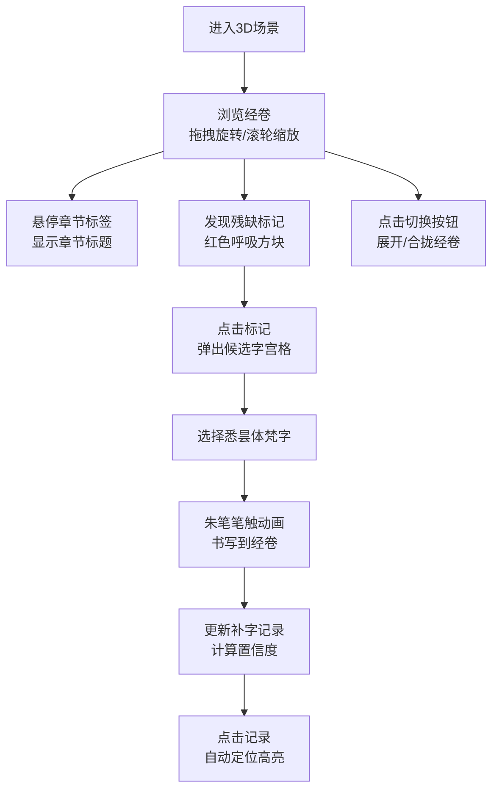

## 1. 产品概述

本产品是一款沉浸式3D交互可视化应用，模拟唐代西明寺译经场景，让用户化身梵文校勘僧，在虚拟经卷前识别残缺区域并完成梵文补字。通过Three.js构建的3D经卷模型，结合丰富的交互动画，重现古代佛经校勘的文化体验。

- 核心价值：将传统文化与现代3D技术结合，提供沉浸式的佛经校勘体验
- 目标用户：文化爱好者、佛教研究者、对3D交互感兴趣的用户
- 解决问题：通过数字化方式保护和展示古代贝叶经文化，提供可交互的学习体验

## 2. 核心功能

### 2.1 用户角色
| 角色 | 注册方式 | 核心权限 |
|------|----------|----------|
| 校勘僧用户 | 无需注册，直接进入 | 浏览3D经卷、识别残缺标记、补写梵文字符、查看补字记录、切换经卷形态 |

### 2.2 功能模块
1. **3D经卷浏览模块**：50片贝叶组成的卷轴，支持旋转、缩放、章节锚定
2. **残缺标记与补字模块**：残缺区域识别、候选字选择、朱笔书写动画
3. **补字记录面板**：历史补字列表、置信度统计、快速定位
4. **经卷形态切换模块**：展开/合拢模式切换、平滑过渡动画

### 2.3 页面详情
| 页面名称 | 模块名称 | 功能描述 |
|----------|----------|----------|
| 主场景页 | 3D经卷画布 | Three.js渲染的50片贝叶经卷，支持拖拽旋转、滚轮缩放、悬停高亮 |
| 主场景页 | 章节标签系统 | 5个彩色章节标签，悬停显示章节标题tooltip |
| 主场景页 | 残缺标记系统 | 8-12个呼吸动画的残缺标记，点击触发补字流程 |
| 主场景页 | 候选字宫格 | 4x4悉昙体梵文字符选择器，选中后触发朱笔动画 |
| 主场景页 | 补字记录面板 | 右侧半透明卷轴，显示补字历史、坐标、置信度 |
| 主场景页 | 形态切换按钮 | 右上角圆形按钮，切换经卷展开/合拢形态 |

## 3. 核心流程

用户进入场景后，首先看到昏暗佛殿中的3D经卷。可通过拖拽旋转浏览经卷内容，滚轮缩放观察细节。当鼠标悬停在彩色标签上时显示章节名称。发现红色残缺标记后点击，弹出候选字宫格，选择合适的梵文字符后，朱笔动画书写到经卷上，同时补字记录面板更新。用户可随时切换经卷展开/合拢形态，或点击补字记录快速定位到对应贝叶。

## 4. 用户界面设计

### 4.1 设计风格
- **主色调**：暗棕色 #3e2723（佛殿背景）、米白色 #faf0e6（纸质UI）、朱红色 #990000（补字）、金色 #ffd700（高亮）
- **配色方案**：暖色调为主，辅以烛光色 #ffbb33 营造温馨氛围
- **字体**：楷体风格用于中文，Siddham字体用于悉昙体梵文
- **UI风格**：仿纸质卷轴风格，圆角6px，细黑边框 #8b7355，水墨晕染纹理
- **动效**：所有交互带有微动画，点击有咔哒音效，过渡平滑自然

### 4.2 页面设计概述
| 页面名称 | 模块名称 | UI元素 |
|----------|----------|--------|
| 主场景页 | 3D经卷 | 50片贝叶 #d4c9a8，细密横纹，60度扇形展开，暖黄灯光从右上方45度照射 |
| 主场景页 | 章节标签 | 5种彩色标签（蜜色#e0b0ff、粉蓝#b0e0e6、淡绿#98fb98、杏色#ffb07c、梅色#dda0dd） |
| 主场景页 | 残缺标记 | 红色半透明方块 #990000，大小0.08单位，2秒周期呼吸动画 |
| 主场景页 | 候选字宫格 | 4x4网格，米白底，细黑边，悬停上浮2px，投影加深，选中变金色放大1.2倍 |
| 主场景页 | 补字记录面板 | 宽200px，半透明 #f5f0e0 卷轴，水墨纹理，纵向列表 |
| 主场景页 | 形态切换按钮 | 右上角圆形，直径32px，展开/合拢图标 |

### 4.3 响应式设计
- **桌面端（>1024px）**：正常显示，候选字宫格4x4布局
- **平板端（768-1024px）**：候选字宫格调整为3x5布局
- **移动端（<768px）**：经卷缩小至80%宽度，候选字宫格改为横向滚动列表

### 4.4 3D场景指导
- **环境**：昏暗唐代佛殿内景，暗棕色主调，烛光色温热区点缀
- **光照**：暖黄聚光灯从右上方45度照射，产生柔和阴影投射在桌面木纹上
- **相机**：PerspectiveCamera，初始位置(0, 2, 5)，fov=50
- **交互**：OrbitControls支持拖拽旋转（Y轴0-360度）、滚轮缩放（0.5-3.0倍）
- **材质**：贝叶使用MeshStandardMaterial，带细密横纹纹理，粗糙度0.8
- **后处理**：Bloom效果增强发光边缘，轻微vignette营造氛围感
- **性能**：50片贝叶 + 12个动画标记，目标帧率≥40fps

## 5. 交互细节

### 5.1 经卷交互
- 拖拽旋转：沿Y轴旋转经卷，范围0-360度
- 滚轮缩放：缩放因子0.5-3.0
- 悬停贝叶：金色发光边缘 #ffd700 高亮
- 章节标签悬停：显示章节标题tooltip

### 5.2 补字交互
- 点击残缺标记：屏幕中央弹出候选字宫格
- 选择梵字：朱笔笔触动画（0.8s）从宫格飞向经卷
- 笔迹效果：宽度从2px渐变至0.5px
- 显示补字：梵文字符 #990000 显示在经卷上

### 5.3 音效反馈
- 所有点击动作：Web Audio API生成短脉冲咔哒音效
- 补字完成：轻微的书写音效
