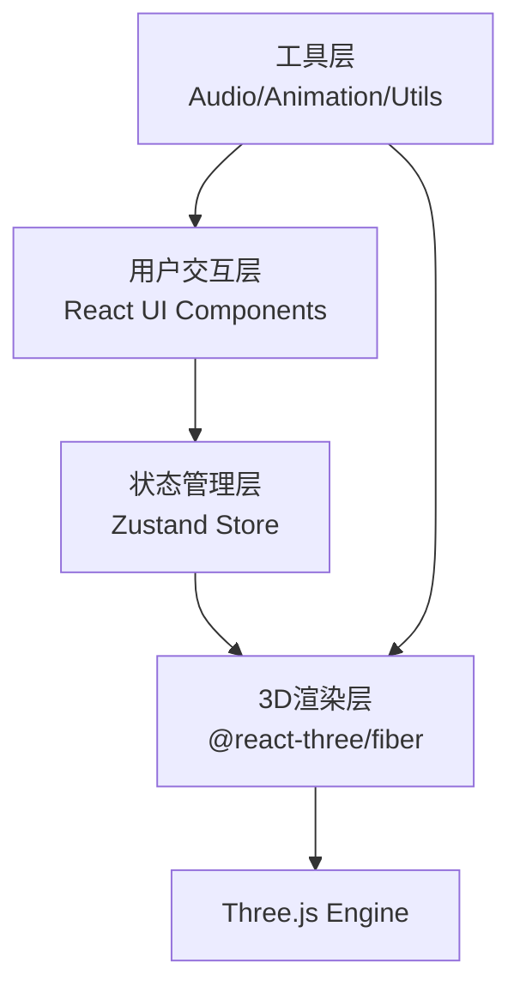

## 1. 架构设计



## 2. 技术描述

- **前端框架**：React@18 + TypeScript@5
- **构建工具**：Vite@5 + @vitejs/plugin-react@4
- **3D引擎**：Three@0.160 + @react-three/fiber@8 + @react-three/drei@9
- **状态管理**：Zustand@4
- **样式方案**：CSS Modules + 内联样式（React Three Fiber组件）
- **字体方案**：Google Fonts - Noto Serif SC（楷体风格）+ Siddham字体（悉昙体）

## 3. 项目结构

```
src/
├── App.tsx                    # 场景根组件，Canvas + UI叠加层
├── main.tsx                   # 应用入口
├── index.css                  # 全局样式
├── store/
│   └── useSutraStore.ts       # Zustand状态管理
├── components/
│   ├── SutraScroll.tsx        # 经卷3D模型组件
│   ├── CharInlay.tsx          # 残缺字识别与补字交互组件
│   ├── RecordPanel.tsx        # 补字记录面板
│   ├── CandidateGrid.tsx      # 候选字宫格
│   ├── ChapterLabel.tsx       # 章节标签
│   ├── DefectMarker.tsx       # 残缺标记
│   └── ToggleButton.tsx       # 形态切换按钮
├── hooks/
│   ├── useAudio.ts            # 音效Hook
│   ├── useAnimation.ts        # 动画Hook
│   └── useResponsive.ts       # 响应式Hook
├── utils/
│   ├── sutraData.ts           # 经卷数据与置信度计算
│   ├── geometry.ts            # 3D几何计算工具
│   └── constants.ts           # 常量定义
└── types/
    └── index.ts               # TypeScript类型定义
```

## 4. 数据模型

### 4.1 类型定义

```typescript
// 补字记录
interface CharRecord {
  id: string;
  char: string;           // 悉昙体梵文字符
  leafIndex: number;      // 贝叶序号 (0-49)
  positionX: number;      // 贝叶上X位置
  positionY: number;      // 贝叶上Y位置
  x: number;              // 3D世界坐标X
  y: number;              // 3D世界坐标Y
  z: number;              // 3D世界坐标Z
  confidence: number;     // 置信度 0-1
  chapter: number;        // 章节序号 (1-5)
  timestamp: number;
}

// 残缺标记
interface DefectMarker {
  id: string;
  leafIndex: number;
  positionX: number;
  positionY: number;
  filled: boolean;
}

// 章节信息
interface Chapter {
  index: number;
  title: string;
  color: string;
  startLeaf: number;
}

// 经卷状态
interface ScrollState {
  isExpanded: boolean;
  rotationY: number;
  zoom: number;
  currentLeaf: number;
  selectedChapter: number;
}
```

### 4.2 Store状态结构

```typescript
interface SutraStore {
  // 经卷状态
  scrollState: ScrollState;
  currentSutraIndex: number;
  selectedChapter: number;
  
  // 数据
  charRecords: CharRecord[];
  defectMarkers: DefectMarker[];
  chapters: Chapter[];
  
  // UI状态
  activeMarkerId: string | null;
  showCandidateGrid: boolean;
  highlightedRecordId: string | null;
  
  // Actions
  setScrollState: (state: Partial<ScrollState>) => void;
  selectChapter: (index: number) => void;
  addCharRecord: (record: Omit<CharRecord, 'id' | 'timestamp'>) => void;
  fillDefectMarker: (markerId: string, char: string) => void;
  setActiveMarker: (markerId: string | null) => void;
  setShowCandidateGrid: (show: boolean) => void;
  setHighlightedRecord: (recordId: string | null) => void;
  toggleScrollMode: () => void;
  calculateConfidence: (char: string, leafIndex: number) => number;
}
```

## 5. 核心实现方案

### 5.1 3D经卷实现
- **几何结构**：50个PlaneGeometry，每片宽1.2、高2.0单位
- **排列方式**：展开模式沿Z轴扇形排列，角度范围60度，间距0.05单位；闭合模式卷成圆柱形
- **贝叶纹理**：Canvas动态生成细密横纹纹理
- **动画过渡**：使用@react-three/drei的useSpring实现贝叶位置平滑过渡

### 5.2 交互系统
- **旋转控制**：OrbitControls限制Y轴旋转，范围0-360度
- **缩放控制**：OrbitControls限制距离，缩放因子0.5-3.0
- **悬停检测**：useHover检测鼠标悬停，触发金色发光边缘
- **点击检测**：useCursor + onClick处理残缺标记点击

### 5.3 置信度计算
- 基于前10页字符共现频率表模拟语义模型
- 计算候选字符与上下文字符的匹配度
- 置信度分级：高(>0.7, 绿色)、中(0.4-0.7, 黄色)、低(<0.4, 红色)

### 5.4 性能优化
- 贝叶材质复用，减少Draw Call
- 使用InstancedMesh优化50片贝叶渲染
- 动画使用requestAnimationFrame，避免布局抖动
- 残缺标记动画使用CSS动画而非JS轮询

## 6. 性能指标

| 指标 | 目标值 |
|------|--------|
| 交互帧率 | ≥40fps |
| 候选字宫格响应 | ≤100ms |
| 经卷切换动画 | 1.5s平滑过渡 |
| 内存占用 | <500MB |
| 首次加载时间 | <3s |
